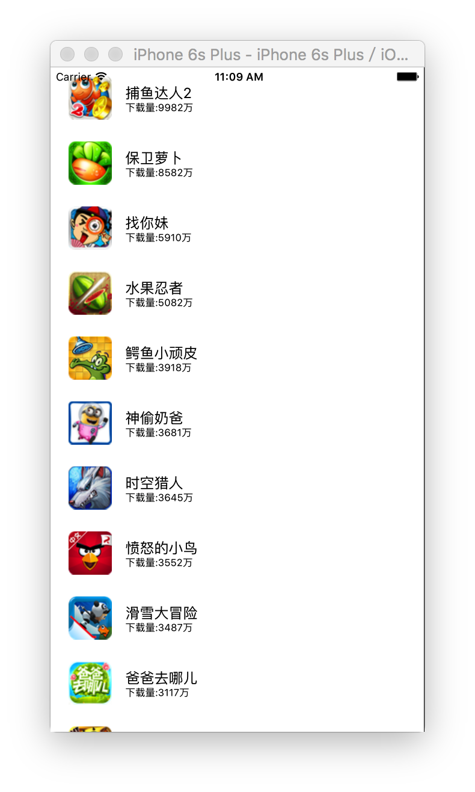
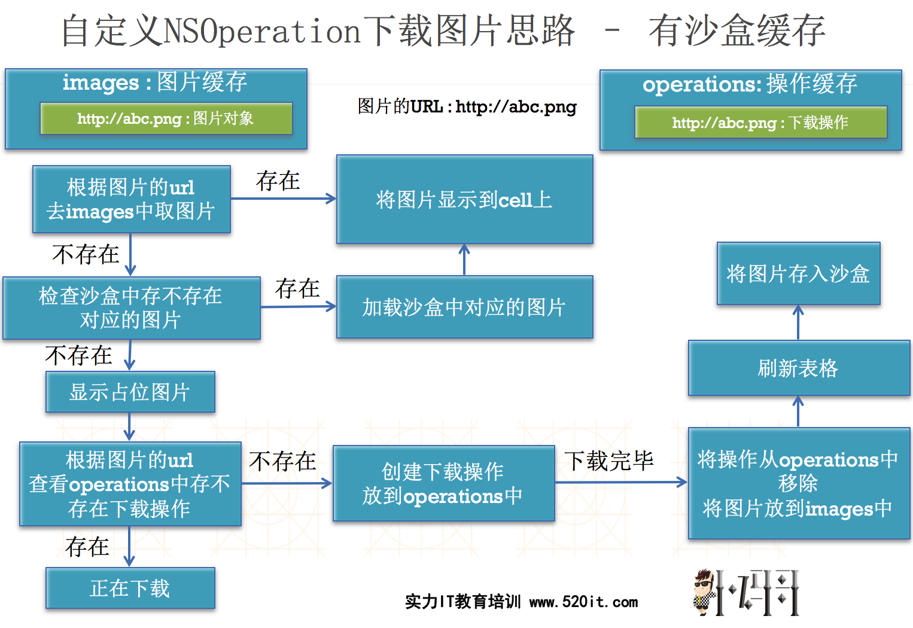

# 多图下载综合示例程序

---

##0. 实现效果





---


##1. 涉及知识点
- **1. 字典转模型**
- **2. 图片重复下载---》内存缓存 和 沙盒缓存处理**
- **3. UI不流畅---》开子线程下载图片（注意线程间通信, 下载完成之后回到主线程刷新 UI）**
- **4. 图片下载任务被添加到队列中多次---》操作缓存处理**
- **5. 图片下载后不显示问题---》主动刷新指定行**
- **6. 图片加载中出现数据错乱问题---》设置占位图片**
- **7. 在程序开发过程中的一些容错处理**

---

##2. 思路分析



```
1. 使用 tableViewController 完成基本数据的展示
	问题1：UI不流畅, 解决办法在子线程中下载图片
	问题2：重复下载图片
2. 解决重复下载问题
	对图片进行内存缓存以解决重复下载问题
	对图片做磁盘缓存，进行离线缓存
		分析磁盘缓存的位置
			Documents
				该目录下面的数据在连接手机时会备份
				苹果官方不允许把下载的数据存放于该目录下
                如果存储在这里会被拒绝上架
			Libriary
				caches (只要这个文件夹才是给我们存储文件的)
                    一般要将用户要保存的下载文件放在这个文件夹
				perference
					该目录用来存放偏好设置如登录名密码等等
			Tmp
				会随时被随机删除 (这个文件夹一般都是系统自己用, 我们结合系统的在用)
3. 解决UI不流畅问题
	解决思路
		把下载图片的操作放在子线程中处理
	新的问题
		①图片不显示
            因为 cell 的图片的尺寸是根据图片的大小, 然而一开始没有图片, 所有 frame 的 大小是 0 ,
            图片下载是在子线程下载, 异步执行, 在下载图片完成之前已经设置了图片的 frame , 
            而且没有进行数据刷新
            解决办法, 只要再次刷新指定的行即可

		②线程间的通信
			在子线程下载图片写入沙盒等，回到主线程刷新UI
		③重复开启下载线程, 导致重复下载问题
			需要对操作进行缓存
		④数据错乱问题
			本例中如果需要显示的图片还没下载完成, 则对应的 cell 的图片是空的, 
            然而对应要显示 cell 是复用上面之前有图片的 cell 这时就会显示复用 cell 的图片造成数据错乱，
            解决办法, 通过设置占位图片解决该问题(一般占位图是公司的 log)
	注意点
		图片下载完成之后把操作从缓存中移除
		图片下载完成后，做容错处理
		发生内存警告后的处理
			①移除内存缓存中的所有元素
			②取消下载图片队列中所有的操作
        做容错处理: 
            1. 如果 url 错误, 导致图片下载为 nil , 会导致图片设置失败, 程序闪退, 
                解决办法: 判断 image 是否为空, 为空则直接返回, 不做图片设置, 就不会导致程序闪退
                    if (image == nil) {
                        [self.operations removeObjectForKey:appM.icon];
                        return ;
                    }

            2. 有可能下载网络超时
            3. 内存警告的时候 清空缓存即可


4. 框架应用
	可以使用SDWebImage框架来下载图片，一行代码解决上面所有的问题
    注意: 在刷新的时候 cell 的 image 可能会出现图片缩放情况
    解决办法:自定义一个 cell 管理 storyboard/ xib 的 cell 
    重写相应的layoutSubview 方法, 给图片设置尺寸即可解决缩放情况
    (在实际开发中一般不需要设置这个尺寸, 美工提供的图片基本都是合标准的)
    SDWebImage做了容错处理
    如果传入的是 NSString 类型而不是 url 类型的数据, 只会报警告, 
    并且内部会将字符串转为 url 类型
```    

---


##3. 代码实现

```objc
//
//  ViewController.m
//  11-掌握-多图下载综合案例-数据展示
//
//  Created by apple on 16/6/20.
//  Copyright © 2016年 CDH. All rights reserved.
//

#import "ViewController.h"
#import "CDHApp.h"

@interface ViewController ()
@property (nonatomic,strong) NSArray *apps;
@property (strong, nonatomic) NSMutableDictionary*images;
@property (strong, nonatomic) NSMutableDictionary*operations;
@property (strong, nonatomic) NSOperationQueue *queue;
@end

@implementation ViewController

#pragma mark -------------------
#pragma mark lazy Loading
-(NSMutableDictionary *)images
{
    if (_images ==nil) {
        _images = [NSMutableDictionary dictionary];
    }
    return _images;
}
-(NSArray *)apps
{
    if (_apps == nil) {
        
        NSArray *apps = [NSArray arrayWithContentsOfFile:[[NSBundle mainBundle] pathForResource:@"apps.plist" ofType:nil]];
        
        NSMutableArray *arrayM = [NSMutableArray arrayWithCapacity:apps.count];
        //字典转模型  字典数组--->模型数组
        for (NSDictionary *dict in apps) {
            [arrayM addObject:[CDHApp appWithDict:dict]];
        }
        _apps = arrayM;
    }
    return _apps;
}

-(NSOperationQueue *)queue
{
    if (_queue == nil) {
        _queue = [[NSOperationQueue alloc]init];
        _queue.maxConcurrentOperationCount = 5; //设置最大并发数, 注意: 最大并发数最多不要大于6
    }
    return _queue;
}

-(NSMutableDictionary *)operations
{
    if (_operations == nil) {
        _operations  = [NSMutableDictionary dictionary];
    }
    return _operations;
}

#pragma mark -------------------
#pragma mark UITableDataSource
-(NSInteger)numberOfSectionsInTableView:(UITableView *)tableView
{
    return 1;
}

-(NSInteger)tableView:(UITableView *)tableView numberOfRowsInSection:(NSInteger)section
{
    return self.apps.count;
}


-(UITableViewCell *)tableView:(UITableView *)tableView cellForRowAtIndexPath:(NSIndexPath *)indexPath
{
    //1.创建cell
    static NSString *ID = @"app";
    
    UITableViewCell *cell = [tableView dequeueReusableCellWithIdentifier:ID];
    
    //2.设置数据
    //2.0 先拿到该行cell对应的数据
    CDHApp *appM = self.apps[indexPath.row];
    
    //2.1 设置标题
    cell.textLabel.text = appM.name;
    
    //2.2 设置子标题
    cell.detailTextLabel.text = [NSString stringWithFormat:@"下载量:%@",appM.download];
    
    //2.3 设置图片
    //当图片下载完成之后显示图片,& 保存到字典中去(保证 KEY 唯一性, 名称可能会相关, 但下载的网络路径是唯一的)
    //当该图片需要显示的时候,先检查内存缓存,如果有那么就直接使用内存缓存,否则在下载
    UIImage *image = [self.images objectForKey:appM.icon];
    if(image)
    {
        cell.imageView.image = image;
        NSLog(@"%zd---内存缓存",indexPath.row);
    }else
    {
        //拼接caches路径
        NSString *cachesPath = [NSSearchPathForDirectoriesInDomains(NSCachesDirectory, NSUserDomainMask, YES) lastObject];
        
        //拼接文件的全路径
        // 1. 先拿到icon 路径的最后一个节点(最后一个 / 后面的内容)
        NSString *fileName = [appM.icon lastPathComponent];
        // 2. 拼接文件的全路径,
        //    stringByAppendingString: 方法不能自动添加 '/'
        //    stringByAppendingPathComponent: 方法会添加有 '/'
        NSString *fullPath = [cachesPath stringByAppendingPathComponent:fileName];
        
        //检查磁盘缓存
        NSData *data = [NSData dataWithContentsOfFile:fullPath];
        //为了演示方便 先清空缓存
        data = nil;
        if (data) {
                //设置
            UIImage *image = [UIImage imageWithData:data];
            cell.imageView.image = image;
            
                //保存到内存缓存
            [self.images setObject:image forKey:appM.icon];
            
              NSLog(@"%zd---磁盘缓存",indexPath.row);
        }else
        {
            
            //处理image
            //cell.imageView.image = nil;
            
            //设置占位图片
            cell.imageView.image = [UIImage imageNamed:@"Snip20200808_29"];
            //检查该图片的下载操作是否已经存在,如果存在,那么什么都不做,等待
            NSBlockOperation *download = [self.operations objectForKey:appM.icon];
            
            if (download) {
                
            }else
            {
                //封装操作
                download = [NSBlockOperation blockOperationWithBlock:^{
                    
                    NSURL *url = [NSURL URLWithString:appM.icon];
                    NSData *data = [NSData dataWithContentsOfURL:url];
                    // 用个 for 循环模拟下载(高清/大)图片耗时操作
                    for (NSInteger i = 0; i<1000000000; i++) {
                        
                    }
                    
                    UIImage *image = [UIImage imageWithData:data];
                    
                     NSLog(@"%zd---开始下载-----",indexPath.row);
                    
                    if (image == nil) {
                        [self.operations removeObjectForKey:appM.icon];
                        return ;
                    }
                    //保存到内存缓存
                    [self.images setObject:image forKey:appM.icon];
                    
                    //保存到磁盘缓存
                    [data writeToFile:fullPath atomically:YES];
                   
                    
                    //回到主线程设置图片
                    [[NSOperationQueue mainQueue] addOperationWithBlock:^{
                        //cell.imageView.image = image;
                        // 注意: 这个方法第一个参数接收的是数组所以要写成数组格式 @[indexPath]
                        [tableView reloadRowsAtIndexPaths:@[indexPath] withRowAnimation:UITableViewRowAnimationMiddle];
                        NSLog(@"%zd---下载结束++++++",indexPath.row);
                        //NSLog(@"UI---%@",[NSThread currentThread]);
                    }];
                    
                }];
                
                //做操作缓存
                [self.operations setObject:download forKey:appM.icon];
                //添加操作到队列中
                [self.queue addOperation:download];
            }
        }
    }
    //3.返回cell
    return cell;
}

-(void)didReceiveMemoryWarning
{
    [self.images removeAllObjects];
     self.images = nil;
    
    [self.queue cancelAllOperations];
}
//磁盘缓存的路径
/*
 Documents :会备份&不允许保存下载文件 (X) , 一般图片这样的下载文件都比较大
 Library
    caches 一般要将用户要保存的下载文件放在这个文件夹
    perference  偏好设置
 tmp :临时数据
 
 */
/*
 1)UI卡顿 --->开子线程下载图片
        图片不显示(fram=0)--->刷新指定的行
        重复下载的问题(因为图片下载操作需要花费时间,在该时间段内部此image又需要显示)
        对图片的下载操作进行缓存--->操作缓存
 2)重复下载的问题-->内存缓存
 */
//二级缓存
/*
 显示--> 内存缓存 -->下载
 显示--> 内存缓存 -->磁盘缓存 -->下载
 */
@end
```
