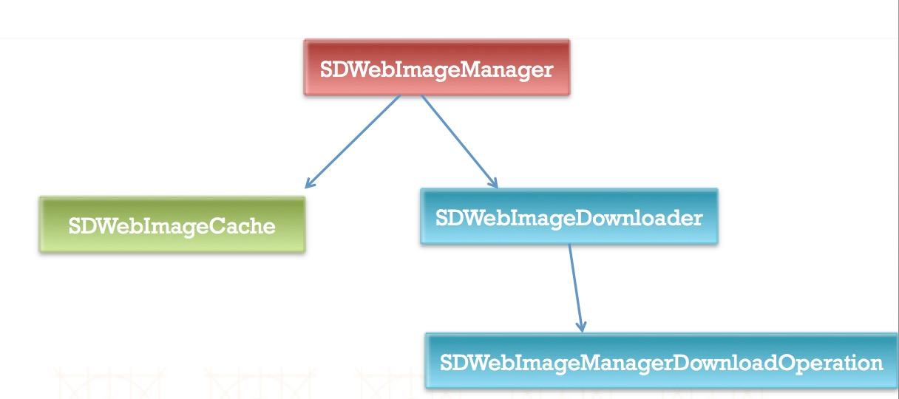
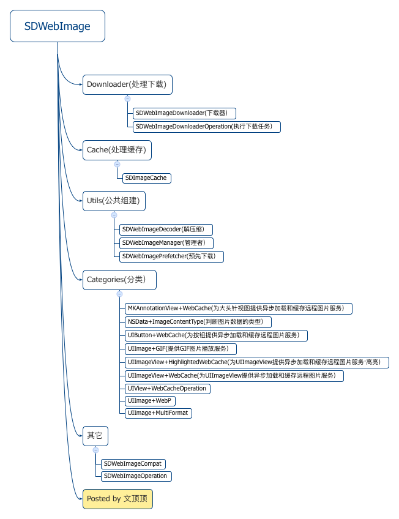
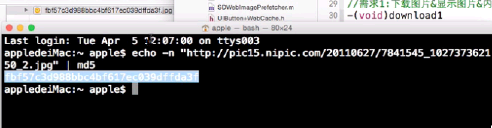

# SDWebImage框架
---

##0. 本节知识点:
1. 简单介绍
2. 基本使用
3. 框架细节

--- 

##1. 简单介绍
- **框架的使用**
    - 如何下载框架
    - 如何查看框架的历史版本
    - 如何建立自己的分支FORK
    - 可以对框架作出贡献
    - **注意**: 第三方框架的新框架和老的框架的区别, 新框架都有添加了前缀 

  
  

- **直接使用框架还是自己写？**

--- 

##2. 基本使用
- **1. 下载图片并显示（内存缓存&磁盘缓存）**
- **2. 下载图片且显示并监听下载进度（内存缓存&磁盘缓存）**
- **3. 下载图片不显示（内存缓存&磁盘缓存）**
- **4. 下载图片不显示也不做任何缓存（注意线程）**
- **5. 内存警告相关**
    - (1)取消当前正在进行的所有下载操作
    - (2)清除缓存数据
        - `clear`:直接删除文件，重新创建新的文件夹
        - `clean`:删除过期的文件数据，计算当前未过期的已经下载的文件数据的大小，如果发现该数据大小大于我们设置的最大缓存数据大小，那么程序内部会按照按文件数据缓存的时间从远到近删除，直到小于最大缓存数据为止。
    - (3)默认缓存周期为1周


- **6. 播放GIF图片**
    - (1)把用户传入的gif图片->NSData
    - (2)根据该Data创建一个图片数据源（NSData->CFImageSourceRef）
    - (3)计算该数据源中一共有多少帧，把每一帧数据取出来放到图片数组中
    - (4)根据得到的数组+计算的动画时间-》可动画的image


- **7. 判断图片的类型**
    - `+ (NSString *)sd_contentTypeForImageData:(NSData *)data`


- **相关代码**

  ```objectivec

  //1）下载图片并显示（内存缓存&磁盘缓存）
  #import "UIImageView+WebCache.h"
  /*
     第一个参数：图片的url地址
     第二个参数：设置的占位图片
      */
  [self.imageView sd_setImageWithURL:[NSURL URLWithString:@"http://www.chinanews.com/cr/2014/0108/1576296051.jpg"] placeholderImage:[UIImage imageNamed:@"Snip20160112_4"]];
  ```
  ```objectivec
  //需求2:下载图片&显示图片&内存缓存&磁盘缓存 & 监听图片的下载进度

  #import "UIImageView+WebCache.h"

  //如果不做磁盘缓存处理 SDWebImageCacheMemoryOnly & 渐进式的显示图片 SDWebImageProgressiveDownload
  -(void)download2{
      /*
         第一个参数:要下载的图片的url地址
         第二个参数:占位图片
         第三个参数:下载图片的策略
         第四个参数:进度回调
         第五个参数:completed 完成回调
         */
        [self.imageView sd_setImageWithURL:[NSURL URLWithString:@"http://pic15.nipic.com/20110627/7841545_102737362150_2.jpg"]  placeholderImage:[UIImage imageNamed:@"Snip20200808_29"] options:SDWebImageCacheMemoryOnly | SDWebImageProgressiveDownload progress:^(NSInteger receivedSize, NSInteger expectedSize) {
                // 注意: 在计算的时候, 要用乘以 1.0 做隐式的类型转换处理,
                NSLog(@"%f",1.0 * receivedSize/expectedSize);

            // 下面是等上面的代码执行完成时回调, 其中的一些参数, 都不用给我们设置, 是回调掉告诉我们的数据
        } completed:^(UIImage *image, NSError *error, SDImageCacheType cacheType, NSURL *imageURL) {
        switch (cacheType) {
                        case SDImageCacheTypeNone:
                                NSLog(@"下载该图片");
                                break;
                        case SDImageCacheTypeMemory:
                                NSLog(@"从内存缓存中取出来");
                                break;
                        case SDImageCacheTypeDisk:
                                NSLog(@"从磁盘缓存中取出来");
                                break;
                        default:
                                break;
                }
        }];
  }
  ```
  ```objectivec
  //3）下载图片不显示并监听下载进度（内存缓存&磁盘换次&下载进度）

  #import "UIImageView+WebCache.h"
  #import "SDWebImageManager.h"

  -(void)download3{
      //使用管理者下载图片
      [[SDWebImageManager sharedManager] downloadImageWithURL:[NSURL URLWithString:@"http://www.chinanews.com/cr/2014/0108/1576296051.jpg"] options:0 progress:^(NSInteger receivedSize, NSInteger expectedSize) {
           NSLog(@"%f",1.0 * receivedSize/expectedSize);

      } completed:^(UIImage *image, NSError *error, SDImageCacheType cacheType, BOOL finished, NSURL *imageURL) {
          NSLog(@"+++++%@",[NSThread currentThread]);
          self.imageView.image = image;

          switch (cacheType) {
              case SDImageCacheTypeNone:
                  NSLog(@"直接下载");
                  break;
              case SDImageCacheTypeDisk:
                  NSLog(@"磁盘缓存");
                  break;
              case SDImageCacheTypeMemory:
                  NSLog(@"内存缓存");
                  break;
              default:
                  break;
          }
      }];
  }
  ```
  ```objectivec
  //4）下载图片不显示且不做任何的缓存处理
  -(void)download4
  {
      [[SDWebImageDownloader sharedDownloader] downloadImageWithURL:[NSURL URLWithString:@"http://img3.3lian.com/2006/013/08/20051103121420947.gif"] options:0 progress:^(NSInteger receivedSize, NSInteger expectedSize) {
           NSLog(@"%f",1.0 * receivedSize/expectedSize);
          NSLog(@"%@",[NSThread currentThread]);
      } completed:^(UIImage *image, NSData *data, NSError *error, BOOL finished) {

          NSLog(@"%@",[NSThread currentThread]);
          //注意点!!!该回调在子线程中执行
          [[NSOperationQueue mainQueue] addOperationWithBlock:^{
              self.imageView.image = [UIImage sd_animatedGIFWithData:data];
          }];

  //        NSLog(@"%@----",[NSThread currentThread]);
  //        //注意点!!!该回调在子线程中执行
  //        dispatch_async(dispatch_get_main_queue(), ^{
  //             self.imageView.image = image;
  //        });
      }];
  }

  ```
  ```objectivec
  //5）接收到系统级内存警告时如何处理（面试）
  //（1）取消当前正在进行的所有下载操作
  [[SDWebImageManager sharedManager] cancelAll];

  //（2）清除缓存数据
  //cleanDisk：删除过期的文件数据，计算当前未过期的已经下载的文件数据的大小，如果发现该数据大小大于我们设置的最大缓存数据大小，那么程序内部会按照按文件数据缓存的时间从远到近删除，知道小于最大缓存数据为止。
  //clearMemory:直接删除文件，重新创建新的文件夹
  //[[SDWebImageManager sharedManager].imageCache cleanDisk];
  [[SDWebImageManager sharedManager].imageCache clearMemory];

  ```
  ```objectivec
  //6）播放gif图片

  #import "UIImage+GIF.h"

  //（1）播放GiF图片部分过程解析
  /*
      a.把用户传入的gif图片->NSData
      b.根据该Data创建一个图片数据源（NSData->CFImageSourceRef）
      c.计算该数据源中一共有多少帧，把每一帧数据取出来放到图片数组中
      d.根据得到的数组+计算的动画时间-》可动画的image
      e.[UIImage animatedImageWithImages:images duration:duration];
  */
  //（2）如何使用
  -(void)gif
  {
      //self.imageView.image = [UIImage imageNamed:@"123"];  不可用
      UIImage *image = [UIImage sd_animatedGIFNamed:@"123"];
      self.imageView.image = image;
  }
  ```

--- 

##3. 框架细节

1. clear 先把之前的缓存文件夹删除,然后重新创建一个新的文件夹   
    clean 先删除过期的文件,然后计算剩余缓存文件的大小(currrentSize)>maxSize,继续删除(按照缓存文件创建的时间顺序来删除的),直到currrentSize <= maxSize
2. 默认过期时间:1个星期
3. 缓存策略：默认情况下既做内存缓存又做磁盘缓存，下载图片前先检查内存缓存，再检查磁盘缓存
3. 内存缓存机制(用什么来做内存缓存?是字典吗?) NSCache是专门用来做缓存处理的
4. 最大并发数量 maxConcurrentOperationCount = 6
5. 队列中任务的执行方式:  
    SDWebImageDownloaderExecutionOrder  
    SDWebImageDownloaderFIFOExecutionOrder(FIFO) 默认   先进先出(first-in-first-out)
    SDWebImageDownloaderLIFOExecutionOrder(LIFO)(通过设置依赖来实现)  后进先出(last-in-first-out)
6. 默认的缓存路径:~/Library/Caches/default/com.hackemist.SDWebImageCache.default/...
7. 图片保存的名称处理方式:url进行MD5加密  echo -n "url" | md5
9. 如何判断图片的类型:得到图片的二进制数据的第一个字节
10. 该框架内部通过NSURLConnection建立网络连接发送请求下载图片
11. 默认的请求超时的时间是 `_downloadTimeout = 15`
12. 该框架内部对内存警告的处理方式:内部会监听系统发出的系统警告通知,然后清理内存缓存
13. NSCache 使用方法和可变的字典类似(80%),线程安全 & 可以自动的清理缓存数据
14. 计算图片的成本:`image.size.height * image.size.width * image.scale * image.scale`(缩放比例乘两次, 是宽和高都要缩放,即是平方的关系)
15. 保证错误url不被反复尝试下载 ? 内部设置了一个url黑名单 NSMutableSet (与数组的区别是无序的, 内部算法有区别效率比数组高)
16. 播放gif图片，用到了库：`<ImageIO/ImageIO.h>` , 播放原理：
    - 把用户传入的gif图片->NSData
    - 根据该Data创建一个图片数据源（NSData->CFImageSourceRef）
    - 计算该数据源中一共有多少帧，把每一帧数据取出来放到图片数组中
    - 根据得到的数组+计算的动画时间-》可动画的image
    - [UIImage animatedImageWithImages:images duration:duration];

---
8 图片保存的名称处理方式:url进行MD5加密  echo -n "url" | md5



