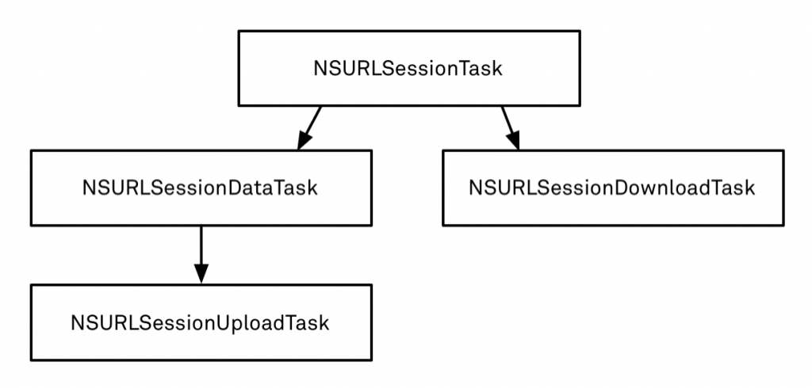

# NSURLSession的基本使用

<br/>
##0. 本节知识点:


1. NSURLSession 的基础知识
2. NSURLSession 的基本使用    
    2.1 发送 get 请求1   
    2.2 发送 get 请求2   
    2.3 get 请求1 和 get 请求2 比较:    
    2.4 发送 post 请求   
    2.5 NSURLSession 代理   


---
<br/>
##1. NSURLSession 的基础知识

- **NSURLSession**

  ```objc
  //获得共享的Session, 单例
  + (NSURLSession *)sharedSession;
  ```
  ```objc
  // 自定义Session
  + (NSURLSession *)sessionWithConfiguration:(NSURLSessionConfiguration *)configuration delegate:(id <NSURLSessionDelegate>)delegate delegateQueue:(NSOperationQueue *)queue;
  ```


- **关于task**
    - NSURLSessionTask是一个抽象类，本身不能使用，只能使用它的子类
        - NSURLSessionDataTask
        - NSURLSessionUploadTask
        - NSURLSessionDownloadTask



- **NSURLSessionTask常见方法**

```objc
- (void)suspend; // 暂停
- (void)resume; // 恢复
- (void)cancel; // 取消
@property (readonly, copy) NSError *error; // 错误
@property (readonly, copy) NSURLResponse *response; // 响应

```

- **NSURLSessionDownloadTask常见方法**

```objc
- (void)cancelByProducingResumeData:(void (^)(NSData *resumeData))completionHandler; // 取消任务
```

<br/>

- **使用步骤**：
    - 确定请求路径
    - 创建请求对象
    - 修改请求方法为POST, 不修则默认是 get 请求方法
    - 设置请求体(参数) , 如果是 get 请求方法这里就不用设置
    - 创建NSURLSession对象（获取单例对象）
    - **使用NSURLSession创建task,然后执行task**
    - 接收到服务器的响应后，解析响应体


---
<br/>
##2. NSURLSession 的基本使用

####2.1 发送 get 请求1
- 设置请求路径 NSURL
- 创建请求对象 NSURLRequest
    - **注意**: 默认是GET请求，且已经默认包含了请求头, 并且不可修改
    - **注意**:发送请求的方法是在子线程中异步执行
- 创建一个会话对象 NSURLSession (获取共享单例)
- 使用NSURLSession 对象创建一个 NSURLSessionDataTask 的 task 对象 
- 执行 task 任务
- 回调解析: 接收到服务器的响应后，解析响应体(data)
    - **注意**: completionHandler 是在子线程中执行的

####2.2 发送 get 请求2
- 设置请求路径 NSURL
- 创建一个会话对象 NSURLSession (获取单例)
- 创建 task
    - 使用NSURLSession 对象 根据 url 创建一个 NSURLSessionDataTask 的 task 对象 
    - **注意: **这种写法将不能修改或者设置请求头信息, 只能默认是 get 请求
    - **注意**:发送请求的方法是在子线程中异步执行
- 执行 task 任务
- 回调解析: 接收到服务器的响应后，解析响应体
    - **注意**: completionHandler 是在子线程中执行的


####2.3 get 请求1 和 get 请求2 比较:
- get2 相对于 get1 少了请求对象NSURLRequest
- get2 是直接使用 NSURLSession 对象通过 NSURL 对象创建了 task 任务
- get2 相对于 get1 的缺陷是不能修改或设置请头部信息
- get1 可以对请求对象设置或修改请求头部信息

- **相关代码**

```objc
// 1）发送get1请求, 方法一
-(void)get1
{
    //1.确定请求路径
    NSURL *url = [NSURL URLWithString:@"http://120.25.226.186:32812/login?username=520&pwd=520it&type=JSON"];
    
    //2.创建请求对象
    NSURLRequest *request = [NSURLRequest requestWithURL:url];
    
    //3.创建会话对象
    NSURLSession *session = [NSURLSession sharedSession];
    
    //4.创建task
    /*
     注意：该block是在子线程中调用的，如果拿到数据之后要做一些UI刷新操作，那么需要回到主线程刷新
     第一个参数：需要发送的请求对象
     第二个参数:completionHandler 完成(成功|失败)后的回调
             block:当请求结束拿到服务器响应的数据时调用block
             block-NSData:该请求的响应体
             block-NSURLResponse:存放本次请求的响应信息，响应头，真实类型为NSHTTPURLResponse
             block-NSErroe:请求错误信息
     */
    //注意!!!completionHandler 是在子线程中执行的
    NSURLSessionDataTask *dataTask = [session dataTaskWithRequest:request completionHandler:^(NSData * _Nullable data, NSURLResponse * _Nullable response, NSError * _Nullable error) {
        
        //6.解析数据
        NSLog(@"%@",[[NSString alloc]initWithData:data encoding:NSUTF8StringEncoding]);
        NSLog(@"%@",[NSThread currentThread]);
    }];
    
    //5.执行Task
    [dataTask resume];
}
```

```objc
// 2）发送get请求的第二种方式
-(void)get2{
    //1.确定请求路径
    NSURL *url = [NSURL URLWithString:@"http://120.25.226.186:32812/login?username=520&pwd=520it&type=JSON"];
    
    //2.创建会话对象
    NSURLSession *session = [NSURLSession sharedSession];
    
    //3.创建task
    //不能修改或者设置请求头信息
    //注意：该方法内部默认会把URL对象包装成一个NSURLRequest对象（默认是GET请求）
    //- **注意**:发送请求的方法是在子线程中异步执行
    NSURLSessionDataTask *dataTask = [session dataTaskWithURL:url completionHandler:^(NSData * _Nullable data, NSURLResponse * _Nullable response, NSError * _Nullable error) {
        
        //5.解析数据
        NSLog(@"%@",[[NSString alloc]initWithData:data encoding:NSUTF8StringEncoding]);
    }];
    
    //4.执行Task
    [dataTask resume];
}
```

```objc
// get2简写
-(void)get3{
    NSURL *url = [NSURL URLWithString:@"http://120.25.226.186:32812/login?username=520&pwd=520it&type=JSON"];

    //不能修改或者设置请求头信息
    //- **注意**:发送请求的方法是在子线程中异步执行
    [[[NSURLSession sharedSession] dataTaskWithURL:url completionHandler:^(NSData * _Nullable data, NSURLResponse * _Nullable response, NSError * _Nullable error) {
        
        //.解析数据
        NSLog(@"%@",[[NSString alloc]initWithData:data encoding:NSUTF8StringEncoding]);
    }] resume];
}
```


---
<br/>
####2.4 发送post请求
- 确定请求路径
- 创建请求对象 NSMutableURLRequest
    - **注意**: 一定是可变类型, 才能修改请求方法 
    - 修改请求方法为POST
- 设置请求体(参数)
- 创建NSURLSession对象（获取单例对象）
- 根据NSURLSession对象创建一个Task, 并执行Task
    - **注意**:发送请求的方法是在子线程中异步执行
- 在 task 任务回调中解析数据
    

- **相关代码**

```objc
//3）发送POST请求
-(void)post{
    //1.确定请求路径
    NSURL *url = [NSURL URLWithString:@"http://120.25.226.186:32812/login"];    
    //2.创建请求对象
    NSMutableURLRequest *request = [NSMutableURLRequest requestWithURL:url];  
    //3.修改请求方法为POST
    request.HTTPMethod =@"POST";
    //4.设置请求体(参数)
    request.HTTPBody = [@"username=520it&pwd=520it&type=JSON" dataUsingEncoding:NSUTF8StringEncoding];
    //5.创建会话对象
    NSURLSession *session = [NSURLSession sharedSession];
    //6.创建task,并且执行
    //- **注意**:发送请求的方法是在子线程中异步执行
    [[session dataTaskWithRequest:request completionHandler:^(NSData * _Nullable data, NSURLResponse * _Nullable response, NSError * _Nullable error) {
        //7.解析数据
        NSLog(@"%@",[[NSString alloc]initWithData:data encoding:NSUTF8StringEncoding]);
    }] resume];
    //注意：刚创建出来的task默认是挂起状态的，需要调用该方法来启动任务（执行任务）
    // 注意这里一定要调用 rusume 方法
}
```

---
<br/>
####2.5 NSURLSession代理
- **NSURLSession通过代理实现通信任务的步骤**
    - 确定请求路径
    - 创建请求对象
    - 创建session,设置代理, 遵循协议
        - `sessionWithConfiguration:delegate:delegateQueue:`类方法创建
        - 第一参数: 配置信息 一般是选择默认配置 defaultSessionConfiguration
        - 第二参数: 设置代理 一般是 self 成为代理
        - 第三参数: 队列 控制的是代理方法在哪个线程中调用
        - 遵循协议, 实现代理方法
            - 代理方法默认是在子线程中执行
    - 使用 session 对象创建 task 任务, 并执行 task 
        - **注意**:发送请求的方法是在子线程中异步执行


- **NSURLSession 3 个常用的代理方法**
    - **`-(void)URLSession: dataTask: didReceiveResponse: completionHandler:`**
        - **注意**: 这个方法最后一个参数 block 块只有类型没有参数, 需要我们告诉系统如何处理服务器返回的数据, 为后面的代理方法会被调用
    - **`-(void)URLSession: dataTask: didReceiveData:`**
    - **`-(void)URLSession: task: didCompleteWithError:`**


- **相关代码**

```objc
// 注意这里只是简单的发送请求 所以选择 Datadelegate 协议
@interface ViewController ()<NSURLSessionDataDelegate>
```
```objc
-(void)touchesBegan:(NSSet<UITouch *> *)touches withEvent:(UIEvent *)event{
    //1.确定请求路径
    NSURL *url = [NSURL URLWithString:@"http://120.25.226.186:32812/login?username=520it&pwd=520it&type=JSON"];
    //2.创建请求对象
    NSMutableURLRequest *request = [NSMutableURLRequest requestWithURL:url];
    request.timeoutInterval = 0.00001;
    //3.创建session,设置代理
    /*
     第一个参数:配置信息 一般是选择默认配置 defaultSessionConfiguration
     第二个参数:self 成为代理
     第三个参数:队列 控制的是代理方法在哪个线程中调用
     */
    //delegateQueue nil 代理方法默认是在子线程执行的
    NSURLSession *session = [NSURLSession sessionWithConfiguration:[NSURLSessionConfiguration defaultSessionConfiguration] delegate:self delegateQueue:nil];
    //4.创建task
    //- **注意**:发送请求的方法是在子线程中异步执行
    NSURLSessionDataTask *dataTask = [session dataTaskWithRequest:request];
    //5.执行tak
    [dataTask resume];
}
```

- **NSURLSession的代理方法**


```objc
//1.当接收到服务器响应的时候调用
//  注意: 当看到回调的方法 只有类型没有参数的时候, 则不是系统自动帮忙回调, 而是需要我们自己手动回调
-(void)URLSession:(NSURLSession *)session dataTask:(NSURLSessionDataTask *)dataTask didReceiveResponse:(NSURLResponse *)response completionHandler:(void (^)(NSURLSessionResponseDisposition))completionHandler{
    NSLog(@"didReceiveResponse--%@",[NSThread currentThread]);   
    //需要我们告诉系统应该如何处理服务器返回的数据
    /*
     NSURLSessionResponseCancel = 0,   取消请求,默认做法 如果是默认则下面的第二第三个代理方法是不会被调用
     NSURLSessionResponseAllow = 1,   接收数据
     NSURLSessionResponseBecomeDownload = 2,   编程下载请求
     NSURLSessionResponseBecomeStream 变成流
     */
    // 这里就是我们告诉系统回调, 允许接收数据
    completionHandler(NSURLSessionResponseAllow);
}
```
```objc
//2.当接收到服务器返回数据的时候调用 可能会被调用多次
-(void)URLSession:(NSURLSession *)session dataTask:(NSURLSessionDataTask *)dataTask didReceiveData:(NSData *)data{
    NSLog(@"didReceiveData");
    // 拼接数据
    [self.resultData appendData:data];
}
```
```objc
//3.当请求完成或者是失败的时候调用
-(void)URLSession:(NSURLSession *)session task:(NSURLSessionTask *)task didCompleteWithError:(NSError *)error{
     NSLog(@"didCompleteWithError"); 
    // 完成或者是失败 都会调用, 所以这里要先做判断
    if(error){
        NSLog(@"%@",error);
        return;
    }
    //解析数据
    // NSLog(@"%@",[[NSString alloc]initWithData:self.resultData encoding:NSUTF8StringEncoding]);
}
```

---
<br/>