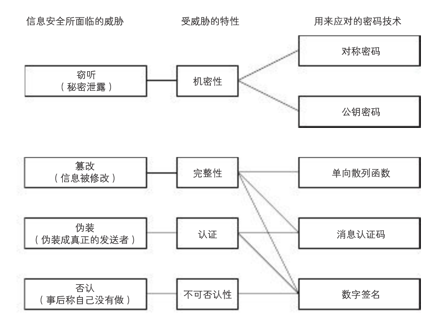
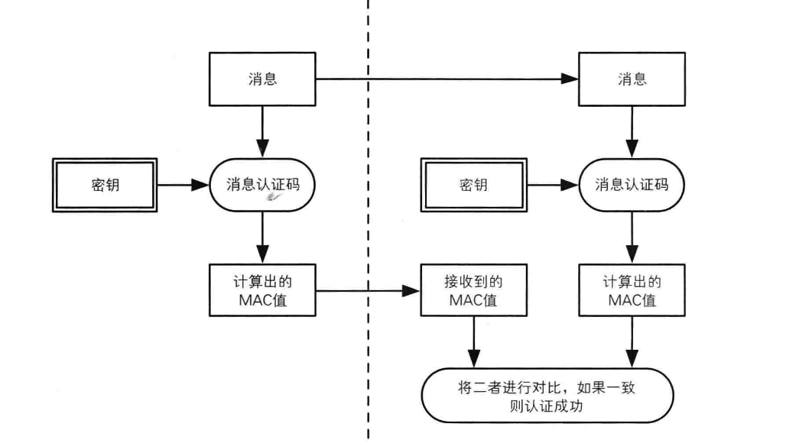
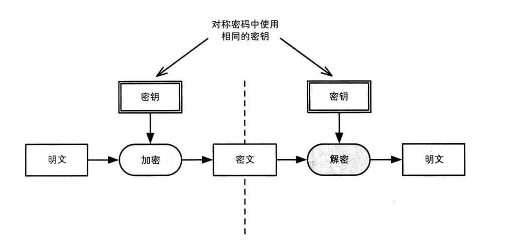
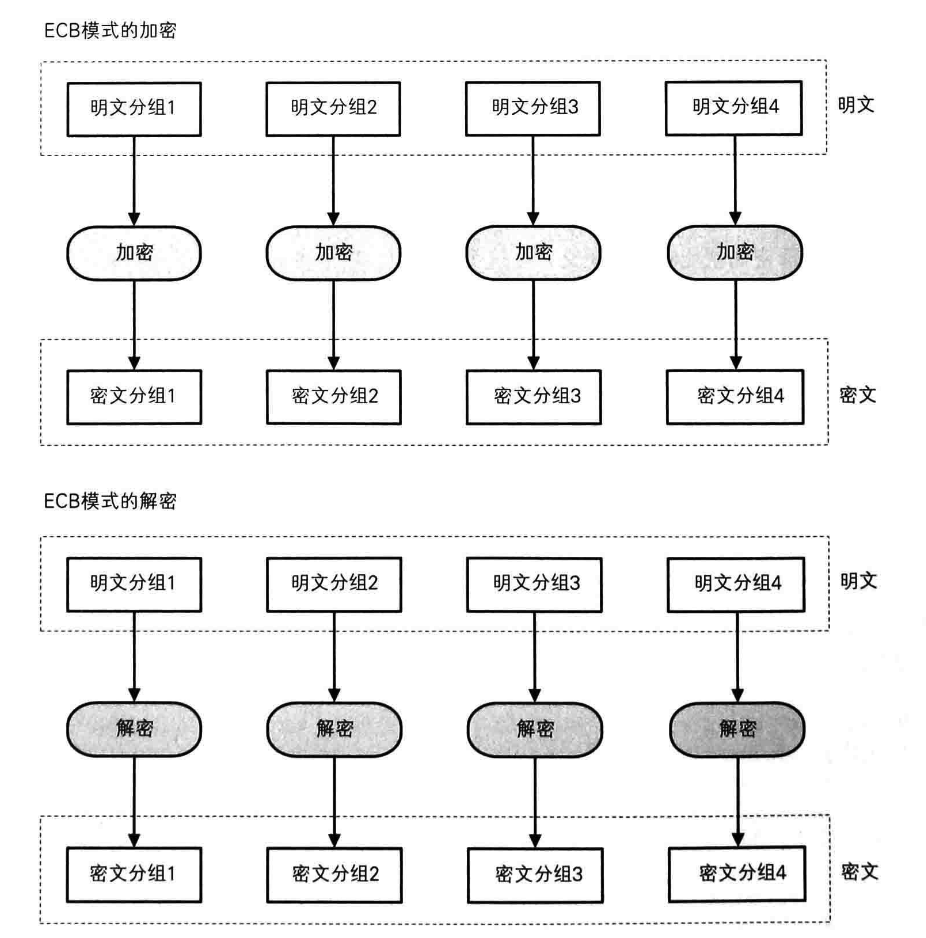
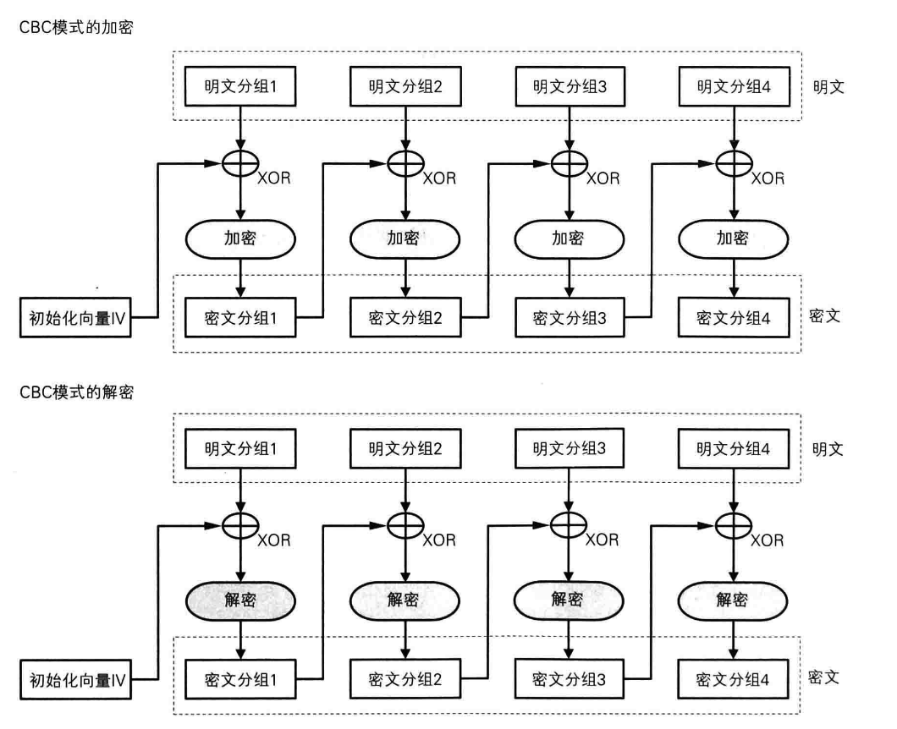
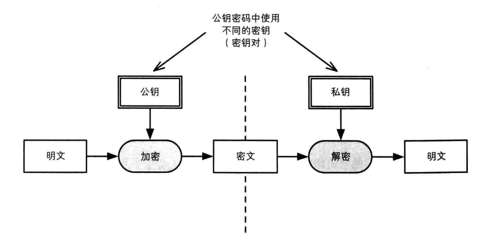
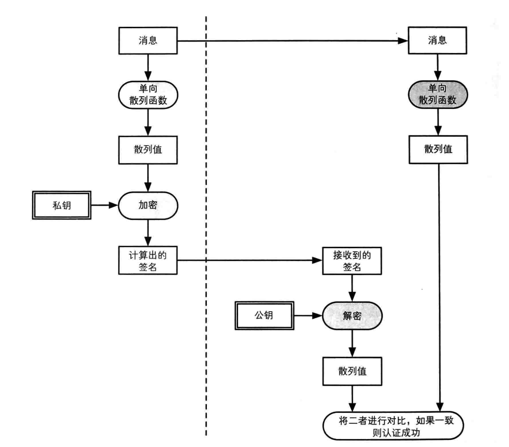

# 数据安全--加密
<br/>
##本节知识点:
1. 数据安全
2. 常见的加密算法和其它
3. Base64
4. 单向散列函数
5. 对称加密
6. 非对称加密
7. 数字签名
8. 数字证书
9. HTTPS的基本使用


---
<br/>

##1. 数据安全

- **攻城利器**：Charles（公司中一般都使用该工具来抓包，并做网络测试）
    - **注意**：Charles在使用中的乱码问题，可以显示包内容，然后打开info.plist文件，找到java目录下面的VMOptions，在后面添加一项：-Dfile.encoding=UTF-8


- **数据安全的原则**
    - 在网络上"不允许"传输用户隐私数据的"明文"
    - 在本地"不允许"保存用户隐私数据的"明文"


- **数据加密的方式和规范一般公司会有具体的规定**，不必多花时间。




---
<br/>
##2. 常见的加密算法和其它

1. base64 编码格式
2. 密码学演化 "秘密本"-->RSA
3. 常见的加密算法
    - 消息摘要（单向散列函数）
    - 对称加密
    - 非对称加密
    - 证书等


---
<br/>
##3. Base64

- **Base64简单说明**
    - 描述：Base64可以成为密码学的基石，非常重要。
    - 特点：可以将任意的二进制数据进行Base64编码
    - 结果：所有的数据都能被编码为并只用65个字符就能表示的文本文件。
        - 65字符：A~Z a~z 0~9 + / =
    - 对文件进行base64编码后文件数据的变化：编码后的数据~=编码前数据的4/3，会大1/3左右。


- **命令行进行Base64编码和解码**
    - 编码：base64 123.png -o 123.txt
    - 解码：base64 123.txt -o test.png -D


- **Base64编码原理**
    - 1)将所有字符转化为ASCII码；
    - 2)将ASCII码转化为8位二进制；
    - 3)将二进制3个归成一组(不足3个在后边补0)共24位，再拆分成4组，每组6位；
    - 4)统一在6位二进制前补两个0凑足8位；
    - 5)将补0后的二进制转为十进制；
    - 6)从Base64编码表获取十进制对应的Base64编码；


- **处理过程说明**：
    - 转换的时候，将三个byte的数据，先后放入一个24bit的缓冲区中，先来的byte占高位。
    - 数据不足3byte的话，于缓冲区中剩下的bit用0补足。然后，每次取出6个bit，按照其值选择查表选择对应的字符作为编码后的输出。
    - 不断进行，直到全部输入数据转换完成。
    - 如果最后剩下两个输入数据，在编码结果后加1个“=”；
    - 如果最后剩下一个输入数据，编码结果后加2个“=”；
    - 如果没有剩下任何数据，就什么都不要加，这样才可以保证资料还原的正确性。


- **实现说明**
    - 从iOS7.0 开始，苹果就提供了base64的编码和解码支持
    - 如果是老项目，则还能看到base64编码和解码的第三方框架，如果当前不再支持iOS7.0以下版本，则建议替换。
    - 终端测试命令
        - $ echo -n A | base64
        - $ echo -n QQ== |base64 -D


- **相关代码**：

  ```objc
  - (void)touchesBegan:(NSSet<UITouch *> *)touches withEvent:(UIEvent *)event{
      // base64Encodeing转码
      NSLog(@"%@",[self base64Encodeing:@"chendehao"]);
      // 注意: 解码并不是随便输入一个字符串都会解译出相对应的东西,
      NSLog(@"%@",[self base64Decodeing:@"Y2hlbmRlaGFv"]);
      // 注意: 由于这里解码时发现数据长度不够, 导致解码不成功, 导致也不会出现打印, 此处的打印也被直接跳过
      NSLog(@"%@",[self base64Decodeing:@"23fjafjsdfj"]);
      // 注意: 这里没有对应的原码, 会打印为空 ( null )
      NSLog(@"%@",[self base64Decodeing:@"d23fjafjsdfj"]);
  }
  ```
  ```objc
  // 给定一个字符串，对该字符串进行Base64编码，然后返回编码后的结果
  - (NSString *)base64Encodeing:(NSString *)string{
      // 1. 把字符串转为二进制数据
          //    NSData *data = [string dataUsingEncoding:NSUTF8StringEncoding];
      NSData *data = [string dataUsingEncoding:NSUTF8StringEncoding allowLossyConversion:YES];

      // 2. base64 编码, 编码后把字符串返回
      return [data base64EncodedStringWithOptions:0];

  }
  ```
  ```objc
  // 对base64编码后的字符串进行解码
  - (NSString *)base64Decodeing:(NSString *)string{
      //1.将base64编码后的字符串『解码』为二进制数据
      NSData *decodeData = [[NSData alloc] initWithBase64EncodedString:string options:0];
      //2.将二进制数据转换为字符串
      return [[NSString alloc] initWithData:decodeData encoding:NSUTF8StringEncoding];

  }
  ```

---
<br/>

##4. 单向散列函数


- **1.单向散列函数的特点：**
    - 加密后密文的长度是定长的
    - 如果明文不一样，那么散列后的结果一定不一样
    - 如果明文一样，那么加密后的密文一定一样（对相同数据加密，加密后的密文一样）
    - 所有的加密算法是公开的
    - 不可以逆推反算

    

- **2.经典加密算法**
    - MD5加密
    - SHA1
    - SHA512


- **3.MD5加密算法简单说明**
    - 对字符串进行MD5加密可以得到一个32个字符的密文
    - 加密之后不能根据密文逆推出明文
    - MD5已经被破解（暴力破解|碰撞检测）


- **4.MD5加密进阶**
    - 先加盐，然后再进行MD5
    - 先乱序，再进行MD5加密
    - 乱序|加盐，多次MD5加密等
    - 使用消息认证机制，即HMAC-MD5-先对密钥进行加密，加密之后进行两次MD5散列
    - 加密命令行
        - MD5加密-字符串    $ echo -n "520it" |md5
        - MD5加密-文件1     $ md5 abc.png
        - SHA1加密：       $ echo -n "520it" |openssl sha -sha1
        - SHA256          $ echo -n "520it" |openssl sha -sha256
        - SHA512          $ echo -n "520it" |openssl sha -sha512
        - hmacMD5加密      $ echo -n "520it" |openssl dgst -md5 -hmac "123"
	- 总之宗旨就是：黑客就算攻破了数据库，也无法解密出正确的明文


- **5.散列函数应用领域**
    - 搜索 多个关键字，先对每个关键字进行散列，然后多个关键字进行或运算，如果值一致则搜索结果一致
    - 版权 对文件进行散列判断该文件是否是正版或原版的
    - 文件完整性验证 对整个文件进行散列，比较散列值判断文件是否完整或被篡改


- **6.消息认证机制（HMAC）简单说明**
    - **原理**
        - 消息的发送者和接收者有一个共享密钥
        - 发送者使用共享密钥对消息加密计算得到MAC值（消息认证码）
        - 消息接收者使用共享密钥对消息加密计算得到MAC值
        - 比较两个MAC值是否一致
    - **使用**
        - 客户端需要在发送的时候把（消息）+（消息·HMAC）一起发送给服务器
        - 服务器接收到数据后，对拿到的消息用共享的KEY进行HMAC，比较是否一致，如果一致则信任


- **代码示例**

  ```objc
  #import "NSString+Hash.h"
  ```
  ```objc
  NSLog(@"---------MD5 加密---------");
  // 简单 MD5加密
  NSString *str = @"chendehao";
  NSLog(@"%@",str);
  NSLog(@"%@",[str md5String]);
  ```
  ```objc
  NSLog(@"---------加密加盐---------");
  NSString *salt = @"salt";
  NSString *str2 = @"chendehao";
  NSString *strSalt  = [str2 stringByAppendingString:salt];
  NSLog(@"%@",strSalt);
  NSLog(@"%@",[strSalt md5String]);
  ```
  ```objc
  NSLog(@"---------乱序加密---------");
  NSString *str3 = @"chendehao";
  NSString *lastStr = [str3 substringFromIndex:4];
  NSString *firstStr = [str3 substringToIndex:4];
  str3 = [lastStr stringByAppendingString:firstStr];
  NSLog(@"%@",str3);
  NSLog(@"%@",[str3 md5String]);
  ```
  ```objc
  NSLog(@"---------消息摘要认证---------");
  NSString *string = @"chendehao";
  //key 是一个秘钥(服务器发送过来的随机数)
  NSString *key = @"abc";
  NSLog(@"%@",[string hmacMD5StringWithKey:key]);
  ```

---
<br/>
##5. 对称加密

- **1.对称加密的特点**
    - 加密/解密使用相同的密钥
    - 加密和解密的过程是可逆的（明文-->>密文-->>明文）


  


- **2.经典算法**
    - DES 数据加密标准;
    - 3DES 使用3个密钥，对消息进行（密钥1·加密）+（密钥2·解密）+（密钥3·加密）;
    - AES 高级加密标准;


- **3.分组密码简单说明**
    - 密码算法可以分为分组密码和流密码两种。
    - **分组密码**：每次只能处理特定长度的一zu数据的一类密码算法。一个分组的比特数量就称之为分组长度。
        - **ex**:DES和3DES的分组长度都是64比特。即每次只能加密64比特的明文，并生成64比特的密文。AES的分组长度有128比特、192比特和256比特可以选择。
    - **流密码**：对数据流进行连续处理的一类算法。流密码中一般以1比特、8比特或者是32比特等作为单位俩进行加密和解密。


- **4.ECB分组模式**
    - ECB模式的全称为Electronic CodeBook模式。又成为电子密码本模式。
    - **特点**：
        - 使用ECB模式加密的时候，相同的明文分组会被转换为相同的密文分组。
        - 类似于一个巨大的明文分组-》密文分组的对照表。
    - **终端测试命令**：
        - **加密** $ openssl enc -des-ecb -K 616263 -nosalt -in 123.txt -out 123.bin 
        - **解密** $ openssl enc -des-ecb -K 616263 -nosalt -in 123.bin -out 1231.txt -d


  


- **5.CBC分组模式**
    - CBC模式全称为Cipher Block Chainning模式（密文分组链接模式|电子密码链条）
    - **特点：**
        - 在CBC模式中，首先将明文分组与前一个密文分组进行XOR运算，然后再进行加密。
    - **终端命令：**
        - **加密** $ openssl enc -des-cbc -K 616263 -iv 0102030405060708 -nosalt -in a.txt -out a.bin
        - **解密** $ openssl enc -des-cbc -K 616263 -iv 0102030405060708 -nosalt -in a.bin -out a1.txt -d


  

- **代码示例**

  ```objc
  // 包含加密分类
  #import "EncryptionTools.h"
  ```
  ```objc
  NSLog(@"----------原码-----------");
  NSString *key = @"abc";
  NSString *string = @"chendehao";
  NSLog(@"%@",string);
  ```
  ```objc
  /*
   第一个参数:要加密的明文(字符串)
   第二个参数:共享密钥
   第三个参数:初始向量
   [[EncryptionTools sharedEncryptionTools] encryptString:string keyString:key iv:nil]
   */
  ```
  ```objc
  NSLog(@"AES - ECB 加密 ---------");// 不需要初始向量
  string = [[EncryptionTools sharedEncryptionTools] encryptString:string keyString:key iv:nil];
  NSLog(@"%@ ",string);
  ```
  ```objc
  NSLog(@"AES - ECB 解密 ---------");
  string = [[EncryptionTools sharedEncryptionTools] decryptString:string keyString:key iv:nil];
  NSLog(@"%@",string);
  ```
  ```objc
  NSLog(@"AES - CBC 加密 ---------");// 需要初始向量
  uint8_t iv[8] = {1,2,3,4,5,6,7,8};
  NSData *data = [NSData dataWithBytes:iv length:sizeof(iv)];
  //$ echo -n "520it" |openssl enc -aes-128-cbc -K 616263 -nosalt -iv 0102030405060708 |base64
  string = [[EncryptionTools sharedEncryptionTools] encryptString:string keyString:key iv:data];
  NSLog(@"%@",string);
  ```
  ```objc
  NSLog(@"AES - CBC 解密 ---------");
  //$ echo -n "520it" |openssl enc -aes-128-cbc -K 616263 -nosalt -iv 0102030405060708 |base64
  string = [[EncryptionTools sharedEncryptionTools] decryptString:string keyString:key iv:data];
  NSLog(@"%@",string);
  ```
  ```objc
  NSLog(@"DES - ECB 加密 ---------");// 不需要初始向量
  // 需要修改加密方式为 kCCAlgorithmDES
  [EncryptionTools sharedEncryptionTools].algorithm = kCCAlgorithmDES;
  string = [[EncryptionTools sharedEncryptionTools] encryptString:string keyString:key iv:nil];
  NSLog(@"%@",string);
  ```
  ```objc
  NSLog(@"DES - ECB 解密 ---------");
  // 上面已经修改过加密方式 则这里也就是这种解密方式
  string = [[EncryptionTools sharedEncryptionTools] decryptString:string keyString:key iv:nil];
  NSLog(@"%@",string);
  ```

---
<br/>
##6. 非对称加密

- **1.非对称加密的特点**
    - 使用公钥加密，使用私钥解密
    - 公钥是公开的，私钥保密
    - 加密处理安全，但是性能极差


  

- **2.经典算法---RSA**
    - **RSA 原理**
        - （1）求N，准备两个质数p和q,N = p x q
        - （2）求L,L是p-1和q-1的最小公倍数。L = lcm（p-1,q-1）
        - （3）求E，E和L的最大公约数为1（E和L互质）
        - （4）求D，E x D mode L = 1
    - **RSA加密小实践**
        - （1）p = 17,q = 19 =>N = 323
        - （2）lcm（p-1,q-1）=>lcm（16，18）=>L= 144
        - （3）gcd（E,L）=1 =>E=5
        - （4）E乘以几可以mode L =1? D=29可以满足
        - （5）得到公钥为：E=5,N=323
        - （6）得到私钥为：D=29,N=323
        - （7）加密 明文的E次方 mod N = 123的5次方 mod 323 = 225（密文）
        - （8）解密 密文的D次方 mod N = 225的29次方 mod 323 = 123（明文）
    - **openssl生成密钥命令**
        - 生成强度是 512 的 RSA 私钥：$ openssl genrsa -out private.pem 512
        - 以明文输出私钥内容：$ openssl rsa -in private.pem -text -out private.txt
        - 校验私钥文件：$ openssl rsa -in private.pem -check
        - 从私钥中提取公钥：$ openssl rsa -in private.pem -out public.pem -outform PEM -pubout
        - 以明文输出公钥内容：$ openssl rsa -in public.pem -out public.txt -pubin -pubout -text
        - 使用公钥加密小文件：$ openssl rsautl -encrypt -pubin -inkey public.pem -in msg.txt -out msg.bin
        - 使用私钥解密小文件：$ openssl rsautl -decrypt -inkey private.pem -in msg.bin -out a.txt
        - 将私钥转换成 DER 格式：$ openssl rsa -in private.pem -out private.der -outform der
        - 将公钥转换成 DER 格式：$ openssl rsa -in public.pem -out public.der -pubin -outform der


- **代码示例**

  ```objc
  // 包含加密工具类
  #import "RSACryptor.h"
  ```
  ```objc
  // 先加载公钥
  [[RSACryptor sharedRSACryptor] loadPublicKey:[[NSBundle mainBundle] pathForResource:@"rsacert.der" ofType:nil]];

  // 1.加密
  NSData *data = [@"chendehao" dataUsingEncoding:NSUTF8StringEncoding];
  NSData *newData = [[RSACryptor sharedRSACryptor] encryptData:data];

  // base64加密
  NSLog(@"%@",[data base64EncodedDataWithOptions:0]);
  NSString *string = [newData base64EncodedStringWithOptions:0];
  NSLog(@"%@",string);

  // 2. 解密
  // 加载私钥
  [[RSACryptor sharedRSACryptor] loadPrivateKey:[[NSBundle mainBundle] pathForResource:@"p.p12" ofType:nil] password:@"123456"];
  NSData *dataM = [[RSACryptor sharedRSACryptor] decryptData:newData];
  NSLog(@"%@",[[NSString alloc] initWithData:dataM encoding:NSUTF8StringEncoding]);
  ```


---
<br/>
##7. 数字签名

- **1.数字签名的应用场景**
    - 答：需要严格验证发送方身份信息情况


- **2.数字签名原理**
    - **客户端处理**
        - 对"消息"进行 HASH 得到 "消息摘要"
        - 发送方使用自己的私钥对"消息摘要" 加密(数字签名)
        - 把数字签名附着在"报文"的末尾一起发送给接收方
    - **服务端处理**
        - 对"消息" HASH 得到 "报文摘要"
        - 使用公钥对"数字签名" 解密
        - 对结果进行匹配


  


---
<br/>
##8. 数字证书

- **1.简单说明**
    - 证书和驾照很相似，里面记有姓名、组织、地址等个人信息，以及属于此人的公钥，并有认证机构施加数字签名,只要看到公钥证书，我们就可以知道认证机构认证该公钥的确属于此人


- **2.数字证书的内容**
    - 公钥
    - 认证机构的数字签名


- **3.证书的生成步骤**
    - 生成私钥 openssl genrsa -out private.pem 1024
    - 创建证书请求 openssl req -new -key private.pem -out rsacert.csr
    - 生成证书并签名，有效期10年 openssl x509 -req -days 3650 -in rsacert.csr -signkey private.pem -out rsacert.crt
    - 将 PEM 格式文件转换成 DER 格式 openssl x509 -outform der -in rsacert.crt -out rsacert.der
    - 导出P12文件 openssl pkcs12 -export -out p.p12 -inkey private.pem -in rsacert.crt


- **4.iOS开发中的注意点**
    - 在iOS开发中，不能直接使用 PEM 格式的证书，因为其内部进行了Base64编码，应该使用的是DER的证书，是二进制格式的
    - OpenSSL默认生成的都是PEM格式的证书


---
<br/>
##9. HTTPS的基本使用

- **1.https简单说明**
    - HTTPS（全称：Hyper Text Transfer Protocol over Secure Socket Layer），是以安全为目标的HTTP通道，简单讲是HTTP的安全版。
    - 即HTTP下加入SSL层，HTTPS的安全基础是SSL，因此加密的详细内容就需要SSL。 它是一个URI scheme（抽象标识符体系），句法类同http:体系。用于安全的HTTP数据传输。
    - https: URL表明它使用了HTTP，但HTTPS存在不同于HTTP的默认端口及一个加密/身份验证层（在HTTP与TCP之间）。


- **2.HTTPS和HTTP的区别主要为以下四点：**
    - 一、https协议需要到ca申请证书，一般免费证书很少，需要交费。
    - 二、http是超文本传输协议，信息是明文传输，https 则是具有安全性的ssl加密传输协议。
    - 三、http和https使用的是完全不同的连接方式，用的端口也不一样，前者是80，后者是443。
    - 四、http的连接很简单，是无状态的；HTTPS协议是由SSL+HTTP协议构建的可进行加密传输、身份认证的网络协议，比http协议安全。


- **3.简单说明**
    - HTTPS的主要思想是在不安全的网络上创建一安全信道，并可在使用适当的加密包和服务器证书可被验证且可被信任时，对窃听和中间人攻击提供合理的保护。
    - HTTPS的信任继承基于预先安装在浏览器中的证书颁发机构（如VeriSign、Microsoft等）（意即“我信任证书颁发机构告诉我应该信任的”）。
    - 因此，一个到某网站的HTTPS连接可被信任，如果服务器搭建自己的https 也就是说采用自认证的方式来建立https信道，这样一般在客户端是不被信任的。
    - 所以我们一般在浏览器访问一些https站点的时候会有一个提示，问你是否继续。


- **4.对开发的影响。**
    - 如果是自己使用NSURLSession来封装网络请求，涉及代码如下。

  ```objc
  - (void)touchesBegan:(NSSet *)touches withEvent:(UIEvent *)event
  {
      NSURLSession *session = [NSURLSession sessionWithConfiguration:[NSURLSessionConfiguration defaultSessionConfiguration] delegate:self delegateQueue:[NSOperationQueue mainQueue]];

      NSURLSessionDataTask *task =  [session dataTaskWithURL:[NSURL URLWithString:@"https://www.apple.com"] completionHandler:^(NSData *data, NSURLResponse *response, NSError *error) {
          NSLog(@"%@", [[NSString alloc] initWithData:data encoding:NSUTF8StringEncoding]);
      }];
      [task resume];
  }

  /*
   只要请求的地址是HTTPS的, 就会调用这个代理方法
   我们需要在该方法中告诉系统, 是否信任服务器返回的证书
   Challenge: 挑战 质问 (包含了受保护的区域)
   protectionSpace : 受保护区域
   NSURLAuthenticationMethodServerTrust : 证书的类型是 服务器信任
   */
  - (void)URLSession:(NSURLSession *)session didReceiveChallenge:(NSURLAuthenticationChallenge *)challenge completionHandler:(void (^)(NSURLSessionAuthChallengeDisposition, NSURLCredential *))completionHandler
  {
      //    NSLog(@"didReceiveChallenge %@", challenge.protectionSpace);
      NSLog(@"调用了最外层");
      // 1.判断服务器返回的证书类型, 是否是服务器信任
      if ([challenge.protectionSpace.authenticationMethod isEqualToString:NSURLAuthenticationMethodServerTrust]) {
          NSLog(@"调用了里面这一层是服务器信任的证书");
          /*
           NSURLSessionAuthChallengeUseCredential = 0,                     使用证书
           NSURLSessionAuthChallengePerformDefaultHandling = 1,            忽略证书(默认的处理方式)
           NSURLSessionAuthChallengeCancelAuthenticationChallenge = 2,     忽略书证, 并取消这次请求
           NSURLSessionAuthChallengeRejectProtectionSpace = 3,            拒绝当前这一次, 下一次再询问
           */
  //        NSURLCredential *credential = [NSURLCredential credentialForTrust:challenge.protectionSpace.serverTrust];

          NSURLCredential *card = [[NSURLCredential alloc]initWithTrust:challenge.protectionSpace.serverTrust];
          completionHandler(NSURLSessionAuthChallengeUseCredential , card);
      }
  }
  ```


- **5.ATS**
    - iOS9中新增App Transport Security（简称ATS）特性, 让原来请求时候用到的HTTP，全部都转向TLS1.2协议进行传输。
    - 这意味着所有的HTTP协议都强制使用了HTTPS协议进行传输。
    - 如果我们在iOS9下直接进行HTTP请求是会报错。系统会告诉我们不能直接使用HTTP进行请求，需要在Info.plist中控制ATS的配置。
        - "NSAppTransportSecurity"是ATS配置的根节点，配置了节点表示告诉系统要走自定义的ATS设置。
        - "NSAllowsAritraryLoads"节点控制是否禁用ATS特性，设置YES就是禁用ATS功能。
    - 有两种解决方法，一种是修改配置信息继续使用以前的设置。
        - 另一种解决方法是所有的请求都基于基于"TLS 1.2"版本协议。（该方法需要严格遵守官方的规定，如选用的加密算法、证书等）

    - **使用AFNetworking框架**
        - AFSecurityPolicy，内部有三个重要的属性，如下：
            - AFSSLPinningMode SSLPinningMode; 该属性标明了AFSecurityPolicy是以何种方式来验证
            - BOOL allowInvalidCertificates; 是否允许不信任的证书通过验证，默认为NO
            - BOOL validatesDomainName; 是否验证主机名，默认为YES


- **注意:如果HTTPS服务器满足ATS默认的条件，而且SSL证书是通过权威的CA机构认证过的，那么什么都不用做。如果上面的条件中有任何一个不成立，那么都只能修改ATS配置。**

  ```objc
  /*
   ATS默认的条件
   1)服务器TLS版本至少是1.2版本
   2)连接加密只允许几种先进的加密
   3)证书必须使用SHA256或者更好的哈希算法进行签名，要么是2048位或者更长的RSA密钥，要么就是256位或更长的ECC密钥。
   */
  AFSecurityPolicy，内部有三个重要的属性，如下：

  AFSSLPinningMode SSLPinningMode;    //该属性标明了AFSecurityPolicy是以何种方式来验证
  BOOL allowInvalidCertificates;      //是否允许不信任的证书通过验证，默认为NO
  BOOL validatesDomainName;           //是否验证主机名，默认为YES

  "AFSSLPinningMode"枚举类型有三个值，分别是AFSSLPinningModeNone、AFSSLPinningModePublicKey、AFSSLPinningModeCertificate。

  "AFSSLPinningModeNone"代表了AFSecurityPolicy不做更严格的验证，"只要是系统信任的证书"就可以通过验证，不过，它受到allowInvalidCertificates和validatesDomainName的影响；

  "AFSSLPinningModePublicKey"是通过"比较证书当中公钥(PublicKey)部分"来进行验证，通过SecTrustCopyPublicKey方法获取本地证书和服务器证书，然后进行比较，如果有一个相同，则通过验证，此方式主要适用于自建证书搭建的HTTPS服务器和需要较高安全要求的验证；

  "AFSSLPinningModeCertificate"则是直接将本地的证书设置为信任的根证书，然后来进行判断，并且比较本地证书的内容和服务器证书内容是否相同，来进行二次判断，此方式适用于较高安全要求的验证。

  如果HTTPS服务器满足ATS默认的条件，而且SSL证书是通过权威的CA机构认证过的，那么什么都不用做。如果上面的条件中有任何一个不成立，那么都只能修改ATS配置。
  ```
  ```objc
  - (void)viewDidLoad {
      [super viewDidLoad];

      AFHTTPSessionManager *manager = [AFHTTPSessionManager  manager];

      // 设置请求方式
      // 设置响应
      manager.responseSerializer = [AFHTTPResponseSerializer serializer];
      // 允许接收无效的证书, 默认是 NO
      manager.securityPolicy.allowInvalidCertificates = YES;
      // 不验证域名
      manager.securityPolicy.validatesDomainName = NO;

      // 注意: 这个链接有SSL 证书, 但没有通过权威的 CA认证, 所以除了上面要写上两行代码配置之外, 还要修改 info.plist 文件
      [manager GET:@"https://kyfw.12306.cn/otn" parameters:nil progress:nil success:^(NSURLSessionDataTask * _Nonnull task, id  _Nullable responseObject) {
          NSLog(@"%@",[[NSString alloc]initWithData:responseObject encoding:NSUTF8StringEncoding]);
          NSLog(@"%@",[[NSString alloc]initWithData:responseObject encoding:NSUTF8StringEncoding]);

      } failure:^(NSURLSessionDataTask * _Nullable task, NSError * _Nonnull error) {
          NSLog(@"%@",error);
          NSLog(@"-------------");
      }];
  }
  ```

---
<br/>
