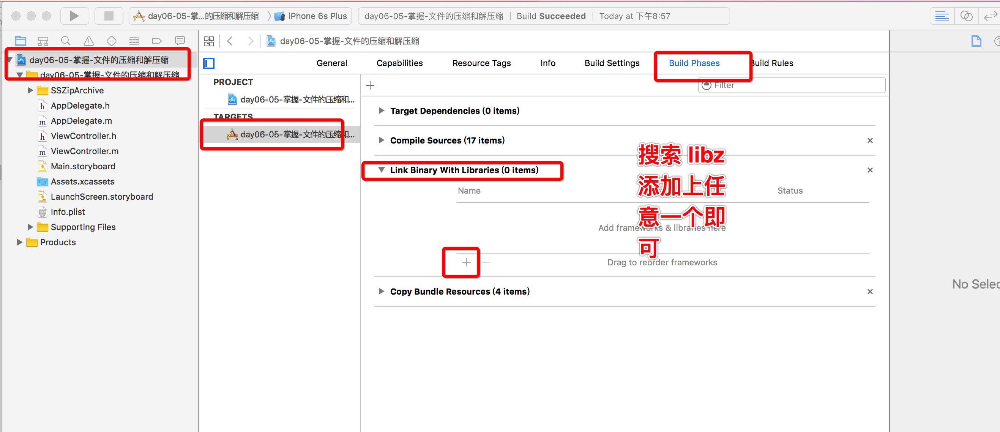
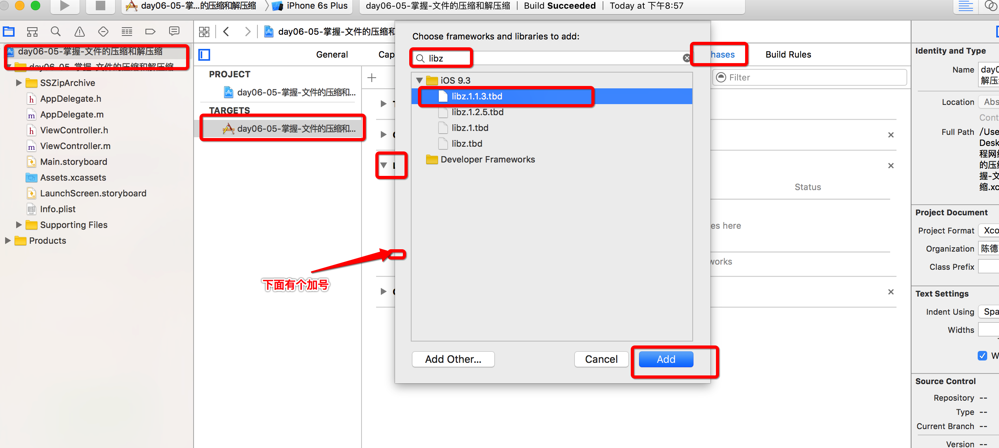

# 文件压缩和解压缩


- **1）说明**
>使用ZipArchive来压缩和解压缩文件需要添加依赖库（libz）,使用需要包含SSZipArchive文件，如果使用cocoaPoads来安装框架，那么会自动的配置框架的使用环境


<br/>

- **2）相关代码**

  ```objc
  //压缩文件的第一种方式
  /*
   第一个参数：压缩文件要保存的位置
   第二个参数：要压缩哪几个文件
   */
  [SSZipArchive createZipFileAtPath:fullpath withFilesAtPaths:arrayM];
  ```
  ```objc
  //压缩文件的第二种方式
  /*
   第一个参数：文件压缩到哪个地方
   第二个参数：要压缩文件的全路径
   */
  [SSZipArchive createZipFileAtPath:fullpath withContentsOfDirectory:zipFile];
  ```
  ```objc
  //如何对压缩文件进行解压
  /*
   第一个参数：要解压的文件
   第二个参数：要解压到什么地方
   */
  [SSZipArchive unzipFileAtPath:unZipFile toDestination:fullpath];
  ```

<br/><br/>


- **3）实例代码**

  ```objc
  - (void)touchesBegan:(NSSet<UITouch *> *)touches withEvent:(UIEvent *)event{
  //    [self zip];
      [self unZip];

      // 注意: 如果报错, 运行不起来, 要包含一些库就可以 libz
  }
  ```
  ```objc
  // 文件压缩
  - (void)zip{
      /*
      /Users/chendehao/Desktop/videos.plist
       */
      // 压缩多个文件
      NSArray *arr = @[
                       @"/Users/chendehao/Desktop/Snip20160627_11.png",
                       @"/Users/chendehao/Desktop/Snip20160627_8.png"
                       ];
      /*
       第一个参数:压缩文件的目标路径
       第二个参数:要压缩的所有文件的路径(数组)要压缩哪几个文件
       */
      [SSZipArchive createZipFileAtPath:@"/Users/chendehao/Desktop/CHENDEHAO.zip" withFilesAtPaths:arr];
      NSLog(@"---");

      // 注意: 这个方法不能直接压缩一个文件, 如果是直接压缩一个文件会造成无法解压, 永远只有是压缩包,一层一层...全都是压缩包
      //[SSZipArchive createZipFileAtPath:@"/Users/chendehao/Desktop/text.zip" withContentsOfDirectory:@"/Users/chendehao/Desktop/Snip20160627_2.png"];
      NSLog(@"2+++");

      //压缩文件的第二种方式(只能压缩文件夹)
      /*
       第一个参数：文件压缩到哪个地方
       第二个参数：要压缩文件的全路径
       */

      // 压缩一个文件夹中的内容,
      // 注意不包括文件夹, 只包含文件夹中的内容
      [SSZipArchive createZipFileAtPath:@"/Users/chendehao/Desktop/text3.zip"  withContentsOfDirectory:@"/Users/chendehao/Desktop/images"];
  }
  ```
  ```objc
  // 文件解压缩
  - (void)unZip{
      /*
       第一个参数:要解压的文件在哪里
       第二个参数:目的地
       */
      [SSZipArchive unzipFileAtPath:@"/Users/chendehao/Desktop/cdh.zip" toDestination:@"/Users/chendehao/Desktop"];
      // 注意: 这里会同时出现两文件夹 一个是 压缩包的名称的文件夹 另一个是 __MACOSX 名称的文件夹
  }
  ```

  
  