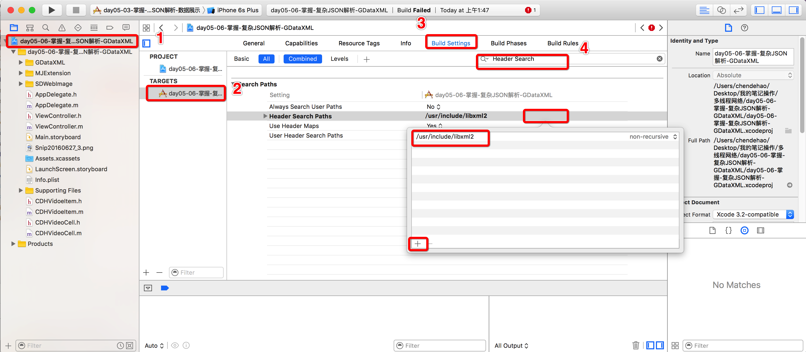
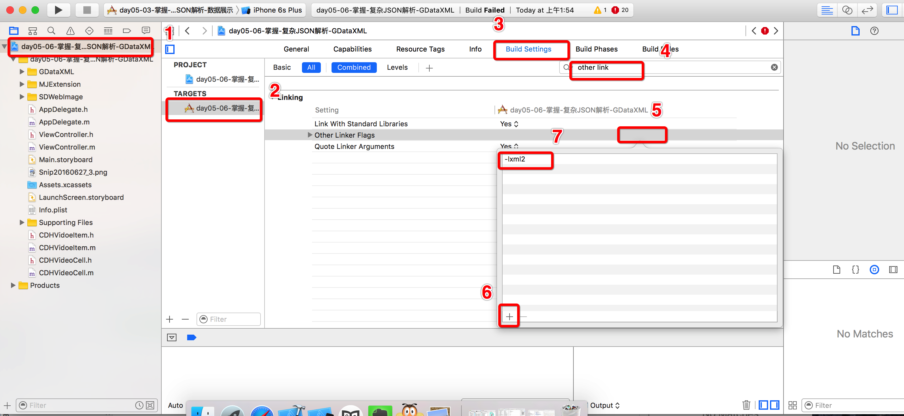
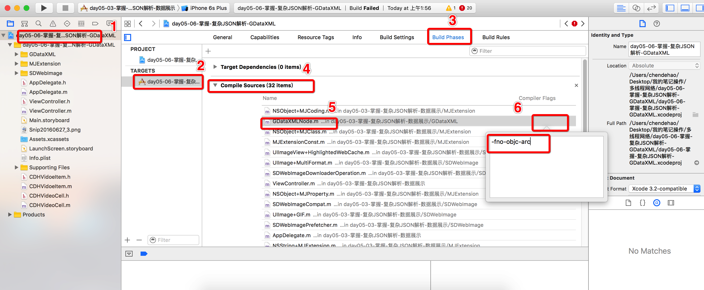

# XML解析
<br/>
##本节知识点:
1. XML简单介绍
2. XML解析
    1. 使用NSXMLParser解析XML步骤和代理方法
    2. 使用GDataParser解析XML的步骤和方法


---
<br/>

##1. XML简单介绍
- **XML：可扩展标记语言**
    - 语法
    - XML文档的三部分（声明、元素和属性）
    - 其它注意点（**注意: **不能交叉包含、空行换行、XML文档只能有一个根元素等）


- **XML解析**
    - XML解析的两种方式
        - SAX:从根元素开始，按顺序一个元素一个元素的往下解析，可用于解析大、小文件
        - DOM:一次性将整个XML文档加载到内存中，适合较小的文件
    - 解析XML的工具
        - 苹果原生NSXMLParser: 使用SAX方式解析，使用简单
        - 第三方框架
            - libxml2:纯C语言的，默认包含在iOS SDK中，同时支持DOM和SAX的方式解析
            - GDataXML:采用DOM方式解析，该框架由Goole开发，是基于xml2的


##2. XML解析
- **使用NSXMLParser解析XML步骤和代理方法**

  ```objc
  //解析步骤：
  //4.1 创建一个解析器
  NSXMLParser *parser = [[NSXMLParser alloc]initWithData:data];
  //4.2 设置代理
  parser.delegate = self;
  //4.3 开始解析
  [parser parse];
  ```

  ```objc
  //1.开始解析XML文档
  -(void)parserDidStartDocument:(nonnull NSXMLParser *)parser{}

  //2.开始解析XML中某个元素的时候调用，比如<video>
  -(void)parser:(nonnull NSXMLParser *)parser didStartElement:(nonnull NSString *)elementName namespaceURI:(nullable NSString *)namespaceURI qualifiedName:(nullable NSString *)qName attributes:(nonnull NSDictionary<NSString *,NSString *> *)attributeDict{
      if ([elementName isEqualToString:@"videos"]) {
          return;
      }
      //字典转模型
      CDHVideo *video = [CDHVideo objectWithKeyValues:attributeDict];
      [self.videos addObject:video];
  }

  //3.当某个元素解析完成之后调用，比如</video>
  -(void)parser:(nonnull NSXMLParser *)parser didEndElement:(nonnull NSString *)elementName namespaceURI:(nullable NSString *)namespaceURI qualifiedName:(nullable NSString *)qName{}

  //4.XML文档解析结束
  -(void)parserDidEndDocument:(nonnull NSXMLParser *)parser{}
  ```


- **使用GDataParser解析XML的步骤和方法**
    - 先导入框架，然后按照框架使用注释配置环境
    - GDataXML框架是MRC的，所以还需要告诉编译器以MRC的方式处理GDataXML的代码

  
  
  


- **代码实现部分**
  
  ```objc
  // 000 配置环境
  // 001 先导入框架，然后按照框架使用注释配置环境
  // 002 GDataXML框架是MRC的，所以还需要告诉编译器以MRC的方式处理GDataXML的代码

  //  1 加载XML文档（使用的是DOM的方式一口气把整个XML文档都吞下）
  GDataXMLDocument *doc = [[GDataXMLDocument alloc]initWithData:data options:kNilOptions error:nil];

  //  2 获取XML文档的根元素，根据根元素取出XML中的每个子元素
  NSArray * elements = [doc.rootElement elementsForName:@"video"];

  //  3 取出每个子元素的属性并转换为模型
  for (GDataXMLElement *ele in elements) {

      CDHVideo *video = [[CDHVideo alloc]init];
      video.name = [ele attributeForName:@"name"].stringValue;
      video.length = [ele attributeForName:@"length"].stringValue.integerValue;
      video.url = [ele attributeForName:@"url"].stringValue;
      video.image = [ele attributeForName:@"image"].stringValue;
      video.ID = [ele attributeForName:@"id"].stringValue;

      //  4 把转换好的模型添加到tableView的数据源self.videos数组中
      [self.videos addObject:video];
  }
  ```
