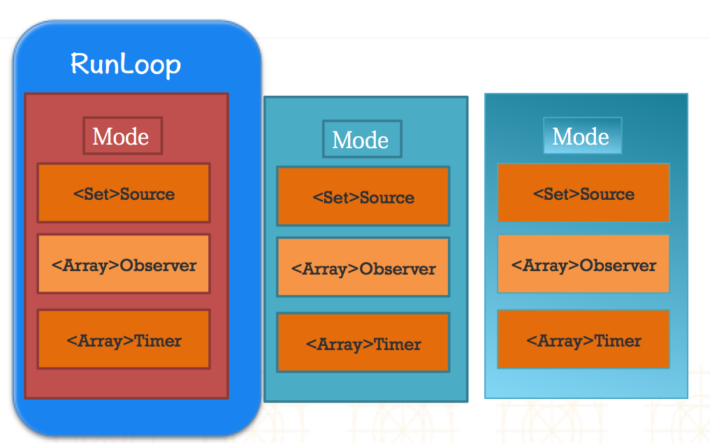

# Runloop相关类


##0. 五个相关的类

1. CFRunloopRef【Runloop对象】
2. CFRunloopModeRef【Runloop的运行模式】
3. CFRunloopTimerRef【Timer事件】
4. CFRunloopSourceRef【Runloop要处理的事件源】
5. CFRunloopObserverRef【Runloop的观察者（监听者）】


- **Runloop和相关类之间的关系图**

     


---
<br/>

##1. 获得Runloop对象
- 获得当前Runloop对象
- 拿到当前应用程序的主Runloop（主线程对应的Runloop）
- **注意: **
    - 主线程的 runloop 默认已经开启, 并且一直存在, 直到程序退出位置
    - 开一个子线程创建runloop,不是通过alloc init方法创建，而是直接通过调用currentRunLoop方法来创建，它本身是一个懒加载的。
    - 在子线程中，如果不主动获取Runloop的话，那么子线程内部是不会创建Runloop的。可以下载CFRunloopRef的源码，搜索 CFRunloopGet0,查看代码。
    - Runloop对象是利用字典来进行存储，而且key是对应的线程Value为该线程对应的Runloop。


- **子线程RunLoop如何创建**
    - 直接通过调用currentRunLoop方法来创建，它本身是一个懒加载的
    - 在子线程中，如果不主动获取Runloop的话，那么子线程内部是不会创建Runloop的
    - 验证：下载CFRunloopRef的源码，搜索 CFRunloopGet0,说明Runloop对象是利用字典来进行存储


- **相关代码**

  ```objc
  // 获得当前Runloop对象    
  //01 NSRunloop
  NSRunLoop * runloop1 = [NSRunLoop currentRunLoop];
  //02 CFRunLoopRef
  CFRunLoopRef runloop2 =   CFRunLoopGetCurrent();
  ```
  ```objc
  // 拿到当前应用程序的主Runloop
  //01 NSRunloop
  NSRunLoop * runloop1 = [NSRunLoop mainRunLoop];
  //02 CFRunLoopRef
  CFRunLoopRef runloop2 = CFRunLoopGetMain();
  ```

  ```objc
  //1.子线程对应的runloop需要手动创建和开启
  //1.1 在子线程中创建子线程对应的runloop
  NSRunLoop *runloop = [NSRunLoop currentRunLoop];

  //1.2 添加source
  //[runloop addPort:[NSPort port] forMode:NSDefaultRunLoopMode];
  NSTimer *timer = [NSTimer timerWithTimeInterval:2.0 target:self selector:@selector(run) userInfo:nil repeats:YES];
  [runloop addTimer:timer forMode:NSDefaultRunLoopMode];
  // 注意: 一定要给 Runloop 添加一个 source 或 Timer Runloop 才不会退出, 如果 source 和 Timer 都没有则 Runloop 会马上退出

  //1.3 开启runloop
  [runloop run];
  // 如果直接使用 run 启动 没有另外设置运行模式, 则是默认模式 NSDefaultRunLoopMode
  //[runloop runUntilDate:[NSDate dateWithTimeIntervalSinceNow:10]];

  // Runloop 相当于do while 死循环, 下面打印的代码永远不会被执行
  NSLog(@"--end----");
  ```


---
<br/>

##2. CFRunloopModeRef
- **Runloop要想跑起来，运行时它的内部必须要有且仅有一个mode, 这个mode里面必须至少有source\timer(这两个就是事件)，至少要有其中一个(事件), 如果只有observer 则 runloop 会立即退出**
    - 1.CFRunloopModeRef代表着Runloop的运行模式
    - 2.一个Runloop中可以有多个mode,一个mode里面又可以有多个source\observer\timer等等
    - 3.每次runloop启动的时候，只能指定一个mode,这个mode被称为该Runloop的当前mode
    - 4.如果需要切换mode,只能先退出当前Runloop,再重新指定一个mode进入
    - 5.这样做主要是为了分割不同组的定时器等，让他们相互之间不受影响


- **系统默认注册了5个mode**
    - kCFRunLoopDefaultMode：(C语言写法)App的默认Mode，通常主线程是在这个Mode下运行
        - NSDefaultRunLoopMode (OC语言写法)
    - UITrackingRunLoopMode：界面跟踪 Mode，用于 ScrollView 追踪触摸滑动，保证界面滑动时不受其他 Mode 影响
    - UIInitializationRunLoopMode: 在刚启动 App 时第一次进入的第一个 Mode，启动完成后就不再使用
    - GSEventReceiveRunLoopMode: 接受系统事件的内部 Mode，通常用不到
    - kCFRunLoopCommonModes: 这是一个占位用的Mode，不是一种真正的Mode
        - kCFRunLoopCommonModes == UITrackingRunLoopMode +kCFRunLoopDefaultMode


---
<br/>

##3. CFRunloopTimerRef
- **基本说明**
    - 基本等同于OC语言里面的定时器


- **NSTimer在各种模式下运行的效果**
    - scheduledTimerWithTimeInterval方法：创建定时器并默认添加到当前线程的Runloop中指定默认运行模式
    - timerWithTimeInterval：创建定时器，如果该定时器要工作还需要添加到runloop中并指定相应的运行模式
    - kCFRunLoopCommonModes == UITrackingRunLoopMode +kCFRunLoopDefaultMode


- **GCD中的定时器**
    - 特点
        - GCD的定时器不会受到Runloop运行模式的影响
        - 可以控制任务在主线程还是子线程执行
    - 注意点
        - 需要添加强引用
        - 注意队列里面不要添加了其它的任务


- **NSTimer相关代码**

  ```objc
  /*
      说明：
      （1）runloop一启动就会选中一种模式，当选中了一种模式之后其它的模式就都不鸟。
          一个mode里面可以添加多个NSTimer,也就是说以后当创建NSTimer的时候，可以指定它是在什么模式下运行的。
      （2）它是基于时间的触发器，说直白点那就是时间到了我就触发一个事件，触发一个操作。基本上说的就是NSTimer
  */
  - (void)timer2
  {
      //NSTimer 调用了scheduledTimer方法，那么会自动添加到当前的runloop里面去，而且runloop的运行模式kCFRunLoopDefaultMode
      //    [NSTimer scheduledTimerWithTimeInterval:2.0 target:self selector:@selector(run) userInfo:nil repeats:YES];
      NSTimer *timer = [NSTimer scheduledTimerWithTimeInterval:2.0 target:self selector:@selector(run) userInfo:nil repeats:YES];

      //更改模式
      [[NSRunLoop currentRunLoop] addTimer:timer forMode:NSRunLoopCommonModes];
  }
  ```
  ```objc
  - (void)timer1
  {
      //    [NSTimer scheduledTimerWithTimeInterval:2.0 target:self selector:@selector(run) userInfo:nil repeats:YES];
      NSTimer *timer = [NSTimer timerWithTimeInterval:2.0 target:self selector:@selector(run) userInfo:nil repeats:YES];

      //定时器添加到UITrackingRunLoopMode模式，一旦runloop切换模式，那么定时器就不工作
      //    [[NSRunLoop currentRunLoop] addTimer:timer forMode:UITrackingRunLoopMode];

      //定时器添加到NSDefaultRunLoopMode模式，一旦runloop切换模式，那么定时器就不工作
      //    [[NSRunLoop currentRunLoop] addTimer:timer forMode:NSDefaultRunLoopMode];

      //占位模式：common modes标记
      //被标记为common modes的模式 == kCFRunLoopDefaultMode + UITrackingRunLoopMode
      [[NSRunLoop currentRunLoop] addTimer:timer forMode:NSRunLoopCommonModes];

      //    NSLog(@"%@",[NSRunLoop currentRunLoop]);
  }
  ```
  ```objc
  - (void)run{
      NSLog(@"---run---%@",[NSRunLoop currentRunLoop].currentMode);
  }

  - (IBAction)btnClick {
      NSLog(@"---btnClick---");
  }
  ```        


- **GCD中的定时器**

  ```objc
  @interface ViewController ()
  @property (strong, nonatomic) dispatch_source_t timer;
  @end
  ```
  ```objc
  //0.创建一个队列
  dispatch_queue_t queue = dispatch_get_global_queue(0, 0);

  //1.创建一个GCD的定时器
  /*
   第一个参数：创建source的类型DISPATCH_SOURCE_TYPE_TIMER：表示是定时器
   第二个参数：可以理解为句柄、索引或id，假如要监听进程，需要传入进程的ID
   第三个参数：描述，提供更详细的描述，让它知道具体要监听什么
   第四个参数：决定定时器任务在哪个线程中执行的队列，如果是主队列则在主线程执行
   */
  //dispatch_source_t timer = dispatch_source_create(DISPATCH_SOURCE_TYPE_TIMER, 0, 0, dispatch_get_global_queue(0, 0));
  dispatch_source_t timer = dispatch_source_create(DISPATCH_SOURCE_TYPE_TIMER, 0, 0, queue);

  //2.设置定时器的开始时间，间隔时间以及精准度
  //设置开始时间，三秒钟之后调用
  dispatch_time_t start = dispatch_time(DISPATCH_TIME_NOW,3.0 *NSEC_PER_SEC);
  //设置定时器工作的间隔时间
  uint64_t intevel = 1.0 * NSEC_PER_SEC;
  /*
   第一个参数：要给哪个定时器设置
   第二个参数：定时器的开始时间, DISPATCH_TIME_NOW表示从当前开始
   第三个参数：定时器调用方法的间隔时间
   第四个参数：定时器的精准度，如果传0则表示采用最精准的方式计算，如果传大于0的数值，则表示该定时切换i可以接收该值范围内的误差，通常传0
   该参数的意义：可以适当的提高程序的性能
   注意点：GCD定时器中的时间以纳秒为单位（面试）
   */
  dispatch_source_set_timer(timer, start, intevel, 0 * NSEC_PER_SEC);
  //dispatch_source_set_timer(timer, DISPATCH_TIME_NOW, 2.0 * NSEC_PER_SEC, 0 * NSEC_PER_SEC);

  //3.设置定时器开启后回调的方法
  /*
   第一个参数：要给哪个定时器设置
   第二个参数：回调block
   */
  dispatch_source_set_event_handler(timer, ^{
      NSLog(@"------%@",[NSThread currentThread]);
  });

  //4.执行定时器
  dispatch_resume(timer);

  //注意：dispatch_source_t本质上是OC类，在这里是个局部变量，需要强引用
  self.timer = timer;

  // GCD定时器补充
  /*
   DISPATCH_SOURCE_TYPE_TIMER         定时响应（定时器事件）
   DISPATCH_SOURCE_TYPE_SIGNAL        接收到UNIX信号时响应

   DISPATCH_SOURCE_TYPE_READ          IO操作，如对文件的操作、socket操作的读响应
   DISPATCH_SOURCE_TYPE_WRITE         IO操作，如对文件的操作、socket操作的写响应
   DISPATCH_SOURCE_TYPE_VNODE         文件状态监听，文件被删除、移动、重命名
   DISPATCH_SOURCE_TYPE_PROC          进程监听,如进程的退出、创建一个或更多的子线程、进程收到UNIX信号

   下面两个都属于Mach相关事件响应
      DISPATCH_SOURCE_TYPE_MACH_SEND
      DISPATCH_SOURCE_TYPE_MACH_RECV
   下面两个都属于自定义的事件，并且也是有自己来触发
      DISPATCH_SOURCE_TYPE_DATA_ADD
      DISPATCH_SOURCE_TYPE_DATA_OR
   */
  ```

---
<br/>


##4. CFRunloopSourceRef
- **是事件源也就是输入源，有两种分类模式**
    - 一种是按照苹果官方文档进行划分的
    - 另一种是基于函数的调用栈来进行划分的（source0和source1）。


- **具体的分类情况**
    - 以前的分法--按照苹果官方文档进行划分
        - Port-Based Sources
        - Custom Input Sources
        - Cocoa Perform Selector Sources
    - 现在的分法--基于函数的调用栈来进行划分
        - Source0：非基于Port的
        - Source1：基于Port的
（3）可以通过打断点的方式查看一个方法的函数调用栈


##5. CFRunLoopObserverRef
- **CFRunLoopObserverRef是观察者，能够监听RunLoop的状态改变(在实际开发中基本不用)**
- **如何监听**
    - 创建监听者对象
    - 给RunLoop添加监听者
    - 注意对象的释放

  ```objc
  //1.创建监听者
  /*
   第一个参数:告知如何分配存储空间;         这里选择默认方式 CFAllocatorGetDefault()
   第二个参数:告知要监听的是哪种状态;       这里监听所有状态 kCFRunLoopAllActivities
   第三个参数:是否持续监听runloop状态      YES
   第四个参数:优先级                     0
   第五个参数:activity runloop当前的状态
   */
  CFRunLoopObserverRef observer = CFRunLoopObserverCreateWithHandler(CFAllocatorGetDefault(), 
                                  kCFRunLoopAllActivities, YES, 0,
                                  ^(CFRunLoopObserverRef observer, CFRunLoopActivity activity) {
     /*
      （3）监听的状态
      typedef CF_OPTIONS(CFOptionFlags, CFRunLoopActivity) {
          kCFRunLoopEntry = (1UL << 0),           //即将进入Runloop
          kCFRunLoopBeforeTimers = (1UL << 1),    //即将处理NSTimer
          kCFRunLoopBeforeSources = (1UL << 2),   //即将处理Sources (系统/ 自定义/ ...)
          kCFRunLoopBeforeWaiting = (1UL << 5),   //即将进入休眠
          kCFRunLoopAfterWaiting = (1UL << 6),    //刚从休眠中唤醒
          kCFRunLoopExit = (1UL << 7),            //即将退出runloop
          kCFRunLoopAllActivities = 0x0FFFFFFFU   //所有状态改变
      }; 
      */
      switch (activity) {
          case kCFRunLoopEntry:
              NSLog(@"进入");
              break;
          case kCFRunLoopBeforeTimers:
              NSLog(@"即将处理timer事件");
              break;
          case kCFRunLoopBeforeSources:
              NSLog(@"将处理soure事件");
              break;
          case kCFRunLoopBeforeWaiting:
              NSLog(@"即将进入休眠");
              break;
          case kCFRunLoopAfterWaiting:
              NSLog(@"被唤醒");
              break;
          case kCFRunLoopExit:
              NSLog(@"runloop退出");
              break;
          default:
              break;
      }
  });

  //2.给对应的runloop添加监听者并且制定监听的是哪种运行模式
  /*
   第一个参数:runloop对象本身
   第二个参数:监听者(观察者)
   第三个参数:runloop的运行模式
   */
  CFRunLoopAddObserver(CFRunLoopGetCurrent(),observer, kCFRunLoopDefaultMode);

  // 移除监听者
  CFRelease(observer);
  ```

