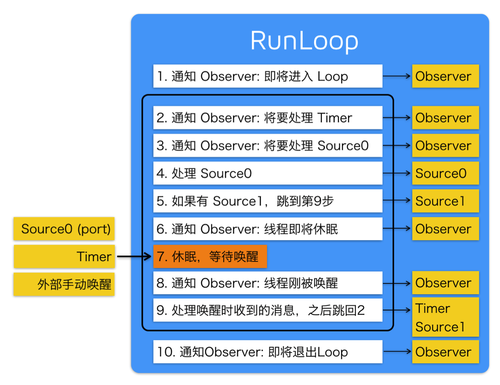

# Runloop运行逻辑与应用

 
##本节知识点:
1. Runloop运行逻辑
2. Runloop应用

--- 
 

##1. Runloop 运行逻辑

- **Runloop 的事件队列**
    - 每次运行 runloop , 线程中的 runloop 都会自动处理之前未处理的消息, 并通知相关的观察(监听)者. 具体的顺序如下:   

        1. 通知观察者 runloop 已经启动
        2. 通知观察者任何即将要开始的定时器
        3. 通知观察者任何即将要启动的非基于端口的源
        4. 启动任何准备好的非基于端口的源
        5. 如果基于端口的源准备好等待状态,立即启动;并进入步骤9;
        6. 通知观察着线程进入休眠
        7. 将线程置于休眠直到有下面的事件发生:
            - 某一事件到达基于端口的源
            - 定时器启动
            - runloop设置的时间已经超时
            - runloop被显示唤醒
        8. 通知观察者线程被唤醒
        9. 处理未处理的事件
            - 如果用户定义的定时器启动, 处理定时器事件并重启 runloop, 重新进入步骤2;
            - 如果输入源启动, 传递相应的消息,
            - 如果 runloop 被显示唤醒, 而且还没有超时, 启动 runloop. 进入步骤2;
        10. 同时观察者 runloop 结束
        
      

      
      
--- 
 

##2. Runloop应用

- **内部运行结构**
    - 重点理解运行逻辑图
    - 通过源码分析源码的运行结构
    - RunLoop本身就是个死循环

- **NSTimer**
- **ImageView显示**：控制方法在特定的模式下可用
- **PerformSelector**

- **常驻线程**
    - 子线程的运行循环需要手动创建
    - 子线程的运行循环开启后如果内部什么都没有那么会直接退出
        - 添加Port
        - 添加NSTimer
        - 添加Observer无效
    - 子线程的运行循环需要手动开启

- **自动释放池**
    - 第一次创建：Runloop启动的时候创建
    - 最后一次销毁：Runloop退出的时候销毁
    - 其它时候的创建和销毁：当Runloop即将进入休眠状态的时候会把当前的自动释放池释放并创建一个新的释放池
    

---
 