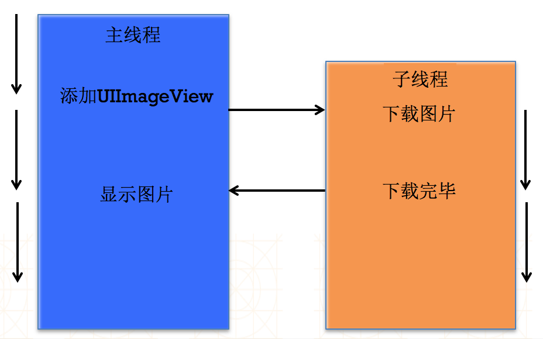
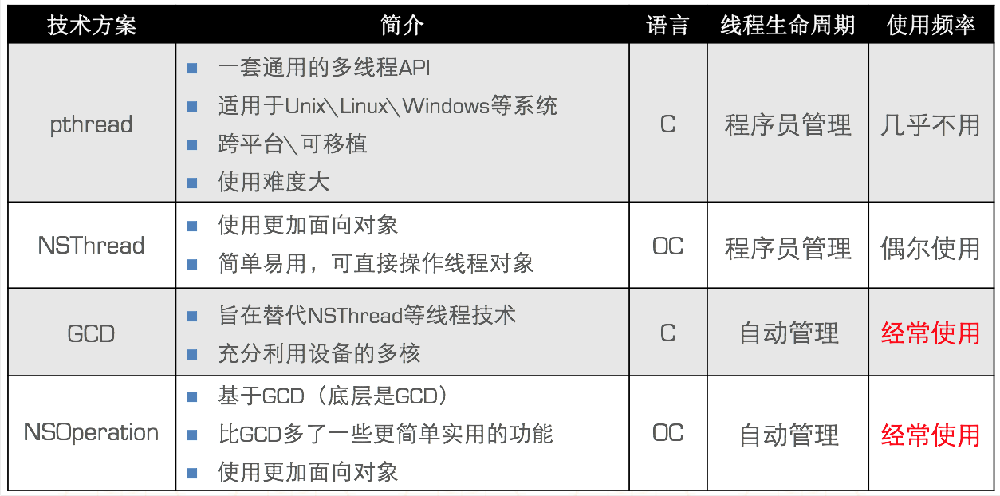
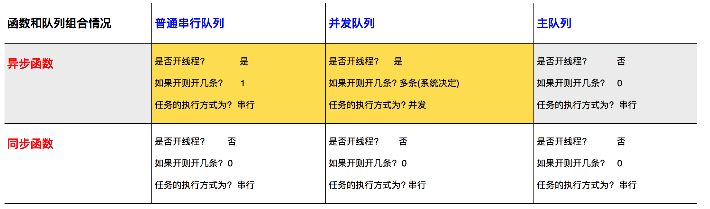

# 多线程面试题

---

####本节知识点
1. 什么是进程?
2. 什么是线程?
3. 什么是多线程?
4. 进程的特点?
5. 线程的特点?
6. 使用多线程技术有什么好处和弊端?
7. 什么是资源抢夺?
8. 什么是线程间的通信?
9. iOS开发,实现多线程的方案有哪几种?
10. 请说明原子和非原子属性的区别?
11. 请填表格: 假设所有的组合当前都在子线程中执行


---

####1. 什么是进程?

- 进程是指在系统中正在运行的一个应用程序。
- 程序是一个没有生命的实体，只有处理器赋予程序生命时，它才能成为一个活动的实体，我们称其为进程。
- 每个进程之间是独立的，每个进程均运行在其专用且受保护的内存空间内。


--- 

####2. 什么是线程?

- **基本概念**
    - 通常在一个进程中可以包含若干个线程，它们可以利用进程所拥有的资源。(每1个进程至少要有1条线程)；
    - 线程是进程的基本执行单元，一个进程(程序)的所有任务都在线程中执行。
    <br/><br/>
    - **比如: **使用酷狗播放音乐、使用迅雷下载电影，都需要在线程中执行
    

<br/>

- **线程的串行**
    - 1个线程中任务的执行是串行的;
    - 如果要在1个线程中执行多个任务，那么只能一个一个地按顺序执行这些任务;
    - 也就是说，在同一时间内，1个线程只能执行1个任务。
    <br/><br/>
    - 比如在1个线程中下载3个文件（分别是文件A、文件B、文件C）,因此，也可以认为线程是进程中的1条执行路径
    

--- 

####3. 什么是多线程?

- **基本概念**
    - 即1个进程中可以开启多条线程，每条线程可以并发(同时)执行不同的任务。

<br/>

- **线程的并行**
    - 并行即同时执行。比如同时开启3条线程分别下载3个文件(分别是文件A、文件B、文件C)。

    

- **多线程并行执行的原理**
    - 在同一时间里，CPU只能处理1条线程，只有1条线程在工作(执行);
    - 多线程并并行(同时)执行，其实是CPU快速地在多条线程之间调度(切换)，如果CPU调度线程的时间足够快，就造成了多线程并行执行的假象;

    
<br/> 

--- 

####4. 进程/线程的特点与区别?

- **地址空间和其它资源**：进程间相互独立，同一进程的各线程间共享。某进程内的线程在其它进程不可见。
- **通信**：进程间通信IPC，线程间可以直接读写进程数据段（如全局变量）来进行通信——需要进程同步和互斥手段的辅助，以保证数据的一致性。
- **调度和切换**：线程上下文切换比进程上下文切换要快得多。
- 在多线程OS中，进程不是一个可执行的实体。


--- 

####5. 使用多线程技术有什么好处和弊端?

- **优点**
    - 能适当提高程序的执行效率。
    - 能适当提高资源利用率(CPU、内存利用率)


- **缺点**
    - 开启线程需要占用一定的内存空间(默认情况下，主线程占用1M，子线程占用512KB)，如果开启大量的线程，会占用大量的内存空间，降低程序的性能。
    - 线程越多，CPU在调度线程上的开销就越大。
    - 程序设计更加复杂：比如线程之间的通信、多线程的数据共享


--- 


####6. 什么是资源抢夺?


- **安全隐患**
    - 问题产生的原因：多个线程访问同一块资源会发生数据安全问题

    
    

- **线程安全问题代码演示**
    - 三条线程同时卖票产生线程安全问题
    - 采用加互斥锁的方式来解决线程安全问题
    - 加锁的注意点
        - 必须使用同一把锁
        - 建议使用Self
        - 注意加锁的位置
        - 加锁耗费性能，不要乱加

```objc
@synchronized(锁对象) { // 需要锁定的代码 }
// 注意：锁定1份代码只用1把锁，用多把锁是无效的, 建议使用 self
```


--- 

####7. 什么是线程间的通信?
- **什么叫做线程间通信**
    - 在1个进程中，线程往往不是孤立存在的，多个线程之间需要经常进行通信


- **线程间通信的体现**
    - 1个线程传递数据给另1个线程
    - 在1个线程中执行完特定任务后，转到另1个线程继续执行任务


- **线程间通信常用方法**

```objc
- (void)performSelectorOnMainThread:(SEL)aSelector withObject:(id)arg waitUntilDone:(BOOL)wait;
- (void)performSelector:(SEL)aSelector onThread:(NSThread *)thr withObject:(id)arg waitUntilDone:(BOOL)wait;
```

- **线程间通信示例** – 图片下载

<br/>

---


####9. iOS开发,实现多线程的方案有哪几种?



<br/> 

--- 

####10. 请说明原子和非原子属性的区别?


- **OC在定义属性时有nonatomic和atomic两种选择**
    - atomic：原子属性，为setter方法加锁（默认就是atomic）
    - nonatomic：非原子属性，不会为setter方法加锁


- **nonatomic和atomic对比**
    - atomic：线程安全，需要消耗大量的资源
    - nonatomic：非线程安全，适合内存小的移动设备


- **iOS开发的建议**
    - 所有属性都声明为nonatomic
    - 尽量避免多线程抢夺同一块资源
    - 尽量将加锁、资源抢夺的业务逻辑交给服务器端处理，减小移动客户端的压力

<br/> 

--- 

####11. 请填表格: 假设所有的组合当前都在子线程中执行





--- 
<br/> 