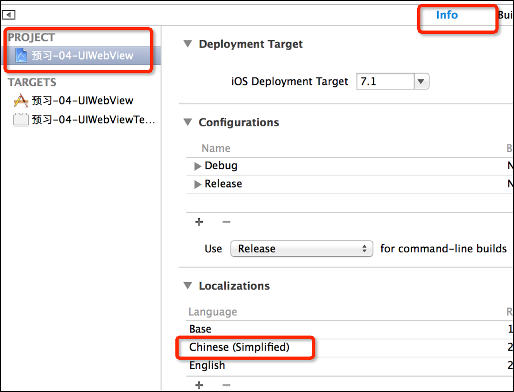

# WebView的基本使用
<br/>

##本节知识点:
1. 概念性知识
2. 代码相关


---
<br/>

##1. 概念性知识
- **什么是UIWebView**
    - UIWebView是iOS内置的浏览器控件
    - 系统自带的Safari浏览器就是通过UIWebView实现的
    - UIWebView不但能加载远程的网页资源，还能加载绝大部分的常见文件
        - html\htm
        - pdf、doc、ppt、txt
        - mp4
        - … …
    - **webView是有缺点的，会导致内存泄露，而且这个问题是它系统本身的问题。**
    - 现在的开发并不完全是原生的开发，而更加倾向于原生+Html5的方式
    - webView是OC代码和html代码之间进行交互的桥梁


- **键盘工具条显示中文**

  


- **常用属性和方法**
    - 重新加载（刷新）`- (void)reload;`
    - 停止加载`- (void)stopLoading;`
    - 回退`- (void)goBack;`
    - 前进`- (void)goForward;`
    - 需要进行检测的数据类型`@property(nonatomic) UIDataDetectorTypes dataDetectorTypes`
    - 是否能回退`@property(nonatomic,readonly,getter=canGoBack) BOOL canGoBack;`
    - 是否能前进`@property(nonatomic,readonly,getter=canGoForward) BOOL canGoForward;`
    - 是否正在加载中`@property(nonatomic,readonly,getter=isLoading) BOOL loading;`
    - 是否伸缩内容至适应屏幕当前尺寸`@property(nonatomic) BOOL scalesPageToFit;`
    - **UIWebView常用的加载资源的方法`- (void)loadRequest:(NSURLRequest *)request;`**


- **监听UIWebView的加载过程**
    - 成为UIWebView的代理，遵守UIWebViewDelegate协议，就能监听UIWebView的加载过程

  ```objc
  //开始发送请求（加载数据）时调用这个方法
  - (void)webViewDidStartLoad:(UIWebView *)webView;
  ```
  ```objc
  //请求完毕（加载数据完毕）时调用这个方法
  - (void)webViewDidFinishLoad:(UIWebView *)webView;
  ```
  ```objc
  //请求错误时调用这个方法
  - (void)webView:(UIWebView *)webView didFailLoadWithError:(NSError *)error;
  ```
  ```objc
  //UIWebView在发送请求之前，都会调用这个方法，如果返回NO，代表停止加载请求，返回YES，代表允许加载请求
  - (BOOL)webView:(UIWebView *)webView shouldStartLoadWithRequest:(NSURLRequest *)request navigationType:(UIWebViewNavigationType)navigationType;
  ```

---
<br/>


##2. 代码相关

- **示例代码**

  ```objc
  #import "ViewController.h"

  @interface ViewController ()<UIWebViewDelegate>
  @property (weak, nonatomic) IBOutlet UIWebView *webView;
  @property (weak, nonatomic) IBOutlet UIBarButtonItem *goBackButton;
  @property (weak, nonatomic) IBOutlet UIBarButtonItem *goForwardButton;

  @end

  @implementation ViewController

  - (void)viewDidLoad {
      [super viewDidLoad];
      [self test1];
  }
  - (IBAction)goBackClick:(id)sender {
      [self.webView goBack];
  }
  - (IBAction)goForwardClick:(id)sender {
      [self.webView goForward];
  }
  - (IBAction)reloadClick:(id)sender {
      [self.webView reload];
  }

  #pragma mark -------------------
  #pragma mark Methods

  - (void)test1{

      // 1. 确定 url
      // 加载本地资源
      //    NSURL *url = [NSURL fileURLWithPath:@"/Users/chendehao/Desktop/20-核心动画.pptx"];
      // 加载没有自适应的网页, 也可以设置为自适应
      //    NSURL *url = [NSURL URLWithString:@"http://www.520it.com"];
      // 设置为网页自适应(默认是 NO)
      //    self.webView.scalesPageToFit = YES;

      // 设置webView的属性-识别特殊格式的字符串
      //    NSURL *url = [[NSBundle mainBundle] URLForResource:@"text.html" withExtension:nil];
      // 识别特殊格式的字符串          可以识别 链接/ 电话号码等特殊字符
      //    self.webView.dataDetectorTypes = UIDataDetectorTypeAll;

      //使用webView加载网页
      NSURL *url = [NSURL URLWithString:@"http://baidu.com"];

      // 2. 创建请求对象
      NSURLRequest *request = [NSURLRequest requestWithURL:url];

      // 3. 加载网页
      [self.webView loadRequest:request];

      // 4. 可以通过设置代理过滤网页
      self.webView.delegate = self;

      // 4. 能够滚动是因为里面有个 scrollView 属性 因此可以修改偏移量
      //    self.webView.scrollView.contentInset = UIEdgeInsetsMake(44, 0, 0, 0);
  }
  ```
  ```objc
  #pragma mark - 代理方法
  //每当将加载请求的时候调用该方法，返回YES 表示加载该请求，返回NO 表示不加载该请求
  //可以在该方法中拦截请求
  - (BOOL)webView:(UIWebView *)webView shouldStartLoadWithRequest:(NSURLRequest *)request navigationType:(UIWebViewNavigationType)navigationType{

      if ([request.URL.absoluteString containsString:@"life"]) {
          return NO;
      }
      return YES;
  }
  //2.开始加载网页的时候调用
  - (void)webViewDidStartLoad:(UIWebView *)webView{
      NSLog(@"%s",__func__);
  }
  //3.加载完成
  - (void)webViewDidFinishLoad:(UIWebView *)webView{
      NSLog(@"%s",__func__);
      self.goBackButton.enabled = self.webView.canGoBack;
      self.goForwardButton.enabled = self.webView.canGoForward;
  }
  //4.当加载失败或者是错误的时候调用
  - (void)webView:(UIWebView *)webView didFailLoadWithError:(NSError *)error{
      NSLog(@"%s",__func__);
  }
  ```

- **拆分示例说明**

  ```objc
  /*A*网页操控相关方法**/
  [self.webView goBack];      回退
  [self.webView goForward];   前进
  [self.webView reload];      刷新

  //设置按钮是否使能(前进和回退)
  self.goBackBtn.enabled = webView.canGoBack;
  self.fowardBtn.enabled = webView.canGoForward;

  /*B*常用的属性设置**/
  self.webView.scalesPageToFit = YES; 设置网页自动适应
  self.webView.dataDetectorTypes = UIDataDetectorTypeAll; 设置检测网页中的格式类型，all表示检测所有类型包括超链接、电话号码、地址等。
  self.webView.scrollView.contentInset = UIEdgeInsetsMake(50, 0, 0, 0);

  /*C*相关代理方法**/
  //每当将加载请求的时候调用该方法，返回YES 表示加载该请求，返回NO 表示不加载该请求
  //可以在该方法中拦截请求
  -(BOOL)webView:(UIWebView *)webView shouldStartLoadWithRequest:(NSURLRequest *)request navigationType:(UIWebViewNavigationType)navigationType
  {
      // 拦截网页中含有 dushu 的字符串
      return ![request.URL.absoluteString containsString:@"dushu"];
  }

  //开始加载网页，不仅监听我们指定的请求，还会监听内部发送的请求
  -(void)webViewDidStartLoad:(UIWebView *)webView

  //网页加载完毕之后会调用该方法
  -(void)webViewDidFinishLoad:(UIWebView *)webView

  //网页加载失败调用该方法
  -(void)webView:(UIWebView *)webView didFailLoadWithError:(NSError *)error

  /*D*其它知识点-加载本地资源**/
  NSURL *url = [[NSBundle mainBundle] URLForResource:@"text.html" withExtension:nil];
  [self.webView loadRequest:[NSURLRequest requestWithURL:url]];
  ```


---
<br/>