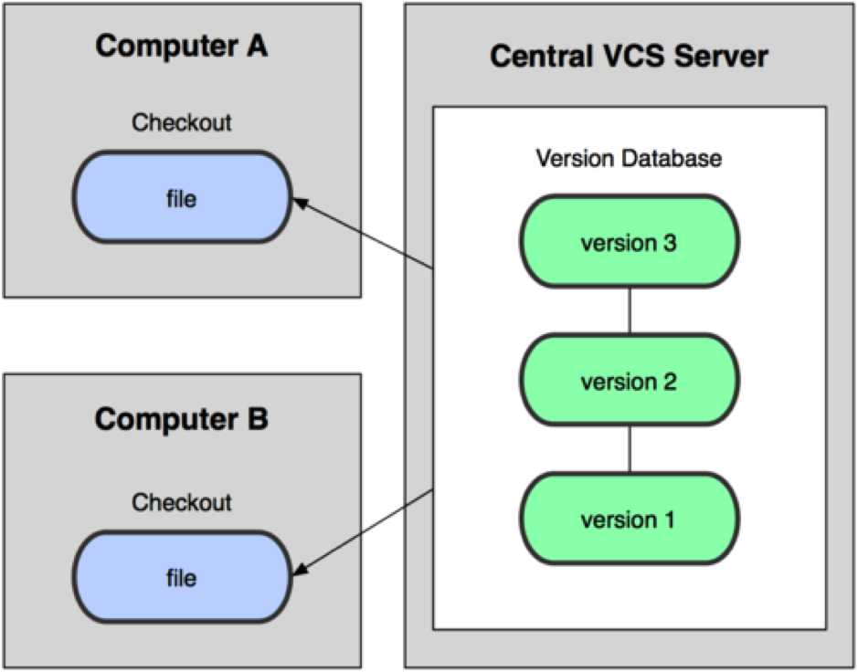
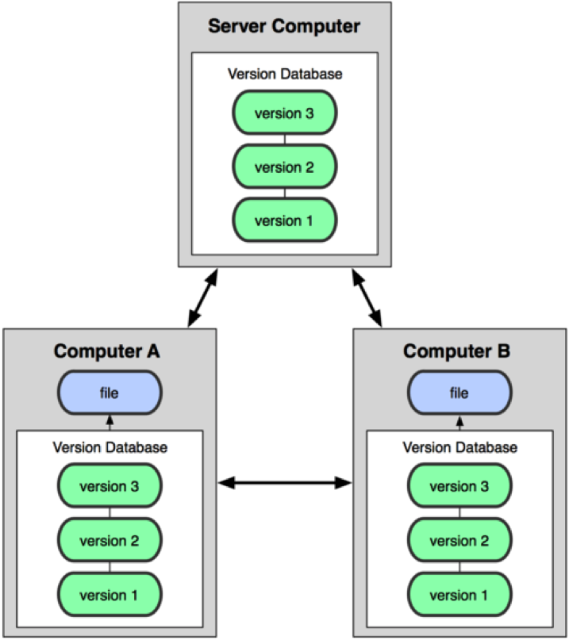
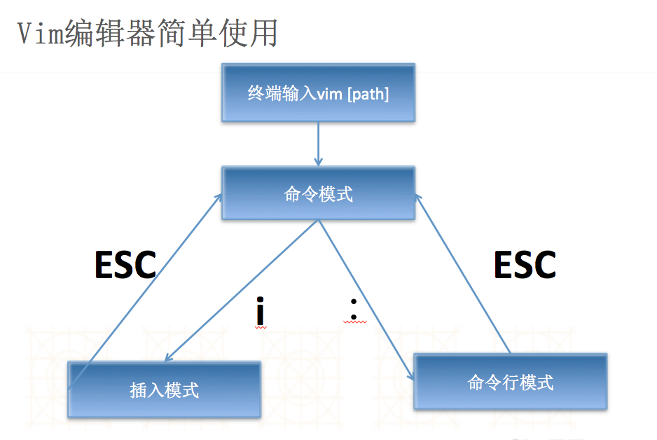
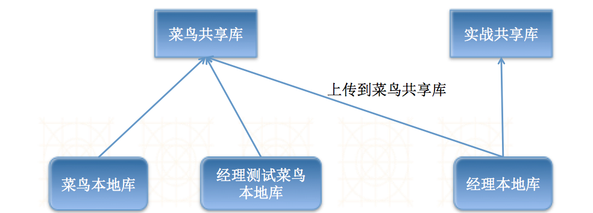

# 源代码管理工具-GIT

---


## 一. 掌握 - git 概述
### 1. git 简介?
1. 什么是git?
    - git是一款开源的分布式版本控制工具
	- 在世界上所有的分布式版本控制工具中，git是最快、最简单、最流行的
2. git的起源?
	- 作者是Linux之父：Linus Benedict Torvalds
	- 当初开发git仅仅是为了辅助Linux内核的开发（管理源代码）
3. git的现状?
	- 在国外已经非常普及，国内并未普及（在慢慢普及）
	- 越来越多的开源项目已经转移到git

### 2. 常见的源代码管理工具有哪些?
	
- CVS
    - 开启版本控制之门
    - 1990年诞生，“远古时代”的主流源代码管理工具


- SVN
    - 全称是Subversion，集中式版本控制之王者
    - 是CVS的接班人，速度比CVS快，功能比CVS多且强大
    - 在国内软件企业中使用最为普遍（70%-90%）


- ClearCase
    - 收费的集中式版本控制工具，安装比Windows还大，运行比蜗牛还慢
    - 能用ClearCase的一般是世界500强，他们有个共同的特点是财大气粗或者人傻钱多


- VSS
    - 微软的集中式版本控制工具，集成在Visual Studio中
		
        
### 3. 集中式版本控制
- **所有的代码都集中在一块, 统一进行管理**

  

### 4. 分布式版本控制
- **在每个客户端都有一份完整的代码仓库, 可以在每个客户端自行管理**

  

### 5. git 和 svn的简单对比
- 速度
	- 在很多情况下，git的速度远远比SVN快
- 结构
	- SVN是集中式管理，git是分布式管理
- 其他
	- SVN使用分支比较笨拙，git可以轻松拥有无限个分支
	- SVN必须联网才能正常工作，git支持本地版本控制工作	
	- 旧版本的SVN会在每一个目录置放一个.svn，git只会在根目录拥有一个.git

### 6. SVN工作流程和GIT工作流程对比
- svn checkout —— git clone
    - svn 只下载代码， git 会连同代码仓库一起下载下来
- svn commit —— git commit
    - svn 是提交到服务器，git 中是提交到本地仓库，需要使用push才能提交到服务器
-  svn update - git pull
    - 都是从服务器下载最新被修改的代码


**分布式和集中式最大的区别在于：在分布式下，本地有个代码仓库,开发者可以在本地提交; 而集中式版本控制, 只有在服务器才有一个代码仓库, 只能在服务器进行统一管理**

### 7. git工作原理
1. 概念理解	
    - 工作区
    - 与.git文件夹同级的其他文件夹或者子文件夹
    - 版本控制库
    - 暂缓区
    - 分支(Git不像SVN那样有主干和分支的概念. 仅仅存在分支,其中master分支为默认被创建的分支,类似于SVN中的主干)
    - *切换分支:通过控制HEAD指针指向不同的分支,就可以切换*
		
** 操作原则: 所有新添加/删除/修改的文件 必须先添加到暂缓区,然后才能提交到HEAD指向的当前分支中**


### 8. git使用环境
1. 单人开发只需要一个本地库
    - 原因:不需要与他人共享代码,只负责管理自己代码即可;例如提交代码,删除代码,版本控制等等
2. 多人开发时需要一个共享版本库
    - 共享版本库的形式:
        - 本地共享库:文件夹/U盘/硬盘
        - 远程共享库:自己搭建git服务器/ 托管到第三方平台(例如github, oschina)
3. 客户端使用环境
    - ** 无论是单人开发还是多人开发,客户端都可以使用命令行或者图形界面使用git**
    - SourceTree
        - 下载地址：http://www.sourcetreeapp.com/download/
    - GitHub
        - 下载地址：https://mac.github.com
        - 不过它是专门为GitHub网站而设计的
    - Xcode
        - 虽然集成较好,但是只能做一些常用的简单操作,复杂操作还要使用命令行

### 9. 学习网站

- [http://backlogtool.com/git-guide/cn/intro/intro1_1.html](http://backlogtool.com/git-guide/cn/intro/intro1_1.html)

----
<br/>
## 二. 掌握 - Git命令行演练-个人开发
### 0. 如何学习git指令

- git help [子命令]
- 和学习SVN指令是一样的，只不过git是通过使用指南的形式展示给用户看（不能编辑的vim编辑器），使用q退出vim编辑器，按空格进入下一页，ctrl + B 回到上一页； /关键字 进行搜索

### 1. 初始化一个本地仓库
- 原因: 管理本地代码,修改上传,版本回退
- 命令: `git init`

### 2. 配置仓库
- 告诉git你是谁？
    - 原因: 追踪修改记录
    - 命令: `git config user.name “shunzi”`


- 告诉git怎样联系你？
    - 原因: 多人合作开发时, 沟通交流
    - 命令: `git config user.email "shunzi@qq.com"`


- 查看配置信息（`.git` -> `config`打开）
    - 命令:  `git config -l`
	
### 3. 个人开发演练
	
- 创建文件并提交
    - 命令:
    ```
    touch main.c
    git add .   (提交当前所有未被提交到暂缓去的文件)
    git add 文件名 (提交当前文件到暂缓区)
    git commit -m “注释”
    ```
- 修改文件并提交 
    - 命令: 
    ```
    git add .
    git commit -m “注释”
    ```
- 删除文件并提交
    - 命令: 
    ```
    git rm person.h
    git commit -m “注释”
    ```
- 日志查看
    - 命令: 
    ```
    git log 
    git reflog
    ```
- 版本回退
    - 命令: 
    ```
    git reset —-hard HEAD 重置到当前版本
    git reset —-hard HEAD^^ 重置到上上个版本
    git reset ——hard HEAD~2 重置到往上2个版本
    git reset —-hard 七位版本号 重置到指定版本::
    ```


### 4. 备注补充
1. 文件状态(git status)	
	- 颜色含义
        - 红色: 代表被添加或者修改的文件没有被添加到暂缓区
        - 绿色: 代表文件在暂缓区,等待提交
	- 版本号的含义
        - 版本号是一个由SHA1生成的40位哈希值
        - 这样做的目的是保证版本号的唯	
2. vim编辑器的使用

  

		命令模式:等待编辑命令输入;所有输入的内容都被当做命令来执行
		插入模式:输入的所有内容都被显示,并被当做文件内容处理
		命令行模式:执行待定命令(保存文件并退出vim : wq   ; 强制退出不保存: q! )


3. 日志查看配置

		命令如下: 
			git config --global alias.lg "log --color --graph --pretty=format:'%Cred%h%Creset -%C(yellow)%d%Creset %s %Cgreen(%cr) %C(bold blue)\<%an\>%Creset' --abbrev-commit"

4. 配置别名

        git config alias.别名 "原名"
		git config alias.st “status”
        
		git config alias.ci “commit -m”
		
5. --global的作用
	
		可以进行全局配置,所有的版本库共享此配置
		查看全局配置（桌面前往->个人->.gitconfig
		** 个人电脑上建议使用全局配置**
        git config --global alias.lg "log --color --graph --pretty=format:'%Cred%h%Creset -%C(yellow)%d%Creset %s %Cgreen(%cr) %C(bold blue)\<%an\>%Creset' --abbrev-commit"
        git config --global user.name "chendehao"
        git config --global user.email "chendehao@qq.com"


----

## 三. 掌握 - Git命令行演练-团队开发
** 团队开发必须有一个共享库,这样成员之间才可以进行协作开发**

### 0. 共享库分类

- 本地共享库(只能在本地面对面操作)
    - 电脑文件夹/U盘/移动硬盘

- 远程共享库(可通过网络远程操作)
    - 自己搭建Git服务器(**不建议**)
    - 在Github上托管项目(** 建议**)
        - Github网址([https://github.com](https://github.com)); 公开项目免费, 私有项目收费
    - 在OSChina上托管项目(** 推荐**)
        - OSChina网址([https://git.oschina.net](https://git.oschina.net)) 安全免费,在国内访问速度快

### 1. 搭建本地共享库

- 原因: 多人合作开发,代码共享
- 命令: `git init —-bare`

### 2. 经理初始化项目到本地共享库

命令: `git clone 本地代码仓库地址`
	
### 3. 演示多人开发
	
- 创建文件夹manager, niuda
    - 命令:
    ```
    mkdir manager 
    mkdir niuda
    ```
- 分别进入到两个文件夹从共享库clone项目到本地
    - 命令:
    ```
    git clone 本地代码仓库地址
    git clone 本地代码仓库地址
    ```
- 演练新增文件同步
    - 命令:
    ```
    touch person.h
    git add .     
    git commit -m “创建person.h”
    git push    (提交到共享)
    git pull    (下载共享)
    ```
- 演练修改文件同步
    - 命令:
    ```
    git add . 
    git commit -m “注释”
    git push
    git pull
    ```
- 演练删除文件同步
    - 命令:
    ```
    git rm filename
    git commit -m “注释”
    git push       
    git pull
    ```
- 演练冲突解决
    - 命令:
    ```
    git pull
    ```
- 演练忽略文件
    - 命令:
    ```
    touch .gitignore   
    open .gitignore   加入忽略文件名
    git add .     
    git commit -m “注释”
    ```
    - `.gitignore`文件配置规则
        - 只对工作区中的文件起作用

  [http://www.cnblogs.com/haiq/archive/2012/12/26/2833746.html](http://www.cnblogs.com/haiq/archive/2012/12/26/2833746.html)

				
### 4. 备注笔记

- 关于忽略文件
    - 在真实开发中,配置`.gitignore`文件 ， 去github里面搜索gitignore 选择OC版本的，拷贝到本地仓库即可,记得添加到本地版本库

- 常见问题
    - `fetch first` 代表当前文件过期,需要从远程共享库更新 
        `git pull`

----

## 四. 掌握 - Git-XCode演练-团队开发
### 1. 搭建本地共享版本库
```
命令: git init —-bare
```
### 2. 经理初始化项目到共享版本库

- ** 注意: 添加忽略文件, 不然Xcode有可能会把没必要的文件提交**
- ** 必须在使用Xcode之前把忽略文件添加进来, 因为Xcode创建工程时, 默认直接把所有文件添加到暂缓区, 加进去之后忽略文件对其就无效了**
	
### 3. 牛大,牛二使用Xcode 克隆项目
### 4. 演练添加文件同步
### 5. 演练修改文件同步
### 6. 演练删除文件同步
### 7. 演练冲突

----
## 五. 了解 - github的使用
### 1. 托管项目到github-HTTPS验证
1. 打开github网站: [https://www.github.com](https://www.github.com)
2. 注册账号(OneShunzi)
3. 点击创建新仓库: [https://github.com/new](https://github.com/new)
4. 填入项目名称,描述等信息
5. 创建完成
6. 可根据生成的版本库地址进行克隆下来进行操作

	
### 2. 托管项目到github-SSH验证
1. 点击”个人” -\> setting -\> SSH keys -\> Add SSH key
2. 将生成的公钥添加进来即可.(以下是生成公钥私钥方法)   
[https://help.github.com/articles/generating-ssh-keys/](https://help.github.com/articles/generating-ssh-keys/)

	
### 3. 怎样将其他著名框架添加到我们的代码仓库?
1. 搜索到对应的框架
2. 点击fork
3. 当项目被移到自己代码仓库中,就可以根据地址克隆下来进行操作

- ** 注意:**
    - 你可以针对此框架进行任意修改,但是仅仅作用在你的本地仓库中的副本,对原作者项目没有任何影响. 
    - 如果想向原作者提建议,可以直接使用,pull request操作.
    - 提交完成后,原作者可以在pull request中看到你的提交.至于是否采纳,就是原作者的意愿

----

## 六. 了解 - OSChina的使用
### 1. 托管项目到OSChina

1. 打开oschina网站:[https://git.oschina.net](https://git.oschina.net)
2. 注册账号(OneShunzi)
3. 点击创建新仓库[https://git.oschina.net/projects/new](https://git.oschina.net/projects/new)
4. 填入项目名称,描述等信息
5. 创建完成
6. 可根据生成的版本库地址进行克隆下来进行操作


### 2. 怎样加入合作伙伴?

1. 点击”管理”-\>项目成员管理-\>选择成员权限进行创建
2. 或者直接只用SSH(以下是生成公钥私钥方法)
    - 部署公钥允许以只读的方式访问项目，主要用于项目在生产服务器的部署上，免去HTTP方式每次操作都要输入密码和普通SSH方式担心不小心修改项目代码的麻烦。
[https://help.github.com/articles/generating-ssh-keys/](https://help.github.com/articles/generating-ssh-keys/)

### 3. 怎样将其他著名框架添加到我们的代码仓库?

1. 搜索到对应的框架
2. 点击fork
3. 当项目被移到自己代码仓库中,就可以根据地址克隆下来进行操作


- ** 注意:**
    - 你可以针对此框架进行任意修改,但是仅仅作用在你的本地仓库中的副本,对原作者项目没有任何影响. 
    - 如果想向原作者提建议,可以直接使用,pull request操作.
    - 提交完成后,原作者可以在pull request中看到你的提交.至于是否采纳,就是原作者的意愿

				
----

## 七. 了解 - 新人服务器搭建
0. 新人服务器搭建概念原因?
    - 概念: 搭建一个临时共享版本库, 供新人专用
    - 原因: 防止新人刚到时，搞乱服务器上的项目
		
1. 新建一个文件夹，newBee，作为新人服务器
2. 进入文件夹 使用git init —-bare 初始化仓库
3. 经理打开自己项目所在文件夹，执行PULL ,更新到最新
4. 然后source control ->项目master -> configure 项目
	
	- 选择Remotes 选项 代表当前所连的远程服务器地址
	- 点击+号 添加 将newBee文件路径作为另外一个远程服务器地址 file:// 协议开头 结尾以/结尾
	- Done
		
5. 经理将最新代码提交到新人远程仓库
6. 经理分配新人服务器地址给新人
7. 新人各种折腾
8. 经理建立文件夹，从新人服务器下载代码检查
9. 图解



----

## 八. 了解 - Git版本备份/分支管理

** 在git中不是通过拷贝代码来解决备份和开启分支的**
** git 直接打标签， 通过控制head指向，来回到任一版本**


### 1.版本备份
1. 建立共享库
	- 创建文件夹shareWeibo
	- 进入文件夹后,初始化共享库
			git init ——bare
2. 经理克隆项目后开发完1.0版本,打标签后,上传共享库
	
	- 创建manager文件夹
	- 进入文件夹后
			git clone 共享库绝对路径
	- 进入工作区,配置姓名,邮箱
			git config user.name “manager”
			git config user.email “manager@qq.com”
	- 经理创建文件,并修改部分代码,提交代码,上传到共享库,完成v1.0版本
			touch main.c
			open main.c:: 打开后写入abc
			git add .
			git commit -m “完成1.0版本开发”
			git push
	- 经理给此版本打标签,并将标签上传到共享库
			git tag -a v1.0 -m “标记1.0版本”
			git push origin v1.0
	- 经理继续开发2.0版本......并提交
			git add .
			git commit -m “2.0部分功能”
			git push

### 2. 已发布版本bug修复
 
- **在以上步骤基础上做以下操作**
 
1. 牛大克隆项目,根据1.0版本创建分支,修复bug
	
	- 创建niuda文件夹
	- 进入文件夹后
	```
    git clone 共享库绝对路径
    ```
	- 进入工作区,配置姓名,邮箱
	```
    git config user.name “niuda”
    git config user.email “niuda@qq.com”
    ```
	- 根据v1.0版本建立新分支v1.0fixbug并切换到此分支
	```
    git checkout v1.0 -b v1.0fixbug::
    ```
	- 修复bug后提交到本地版本库
		
	** 注意此处提交到的是HEAD指向的分支-v1.0fixbug**
	```	
    git add .
    git commit -m “修复bug”
    ```
2. 牛大修复bug后,打标签v1.1作版本备份,并上传共享库
```	
git tag -a v1.1 -m “1.1版本备份”
git push origin v1.1
```	

3. 牛大上传整个分支到共享版本库
```	
git push origin v1.0fixbug
```	

- ** ———至此,分支修复bug结束,下面经理要合并分支———**

4. 经理从共享库更新代码到本地库
```	
git pull
```	

5. 经理查看当前服务器都有哪些分支
```	
git branch -r
```	

6. 经理切换到master分支后,将v1.0fixbug分支合并过来
```	
git checkout master
git merge origin/v1.0fixbug -m “合并分支”
```	

7. 经理合并完成后提交到共享库
```	
git add .
git commit -m “合并分支”
git push
```	

8. 合并完成后,可以删除共享库的分支
```	
git branch -r -d origin/v1.0fixbug
```	

9. 查看版本标签,至此结束!!    
```	
git tag
```	


---


