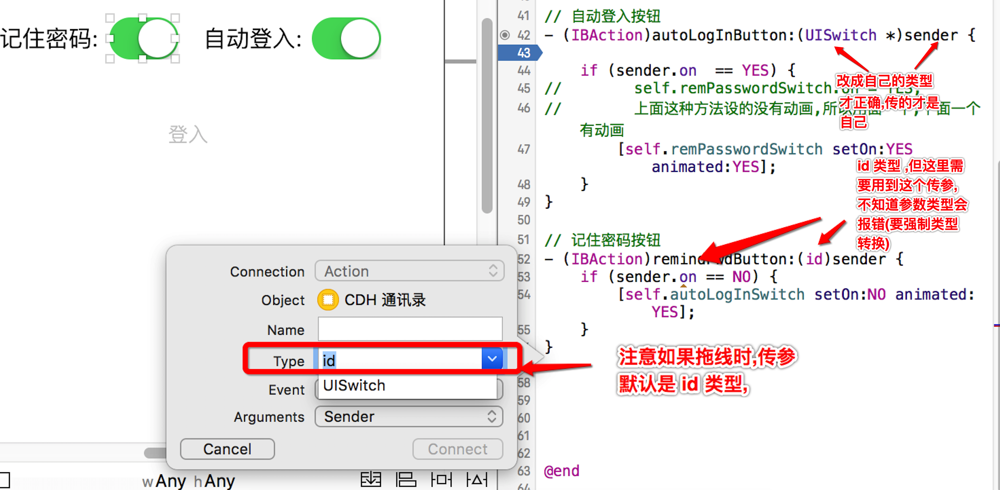
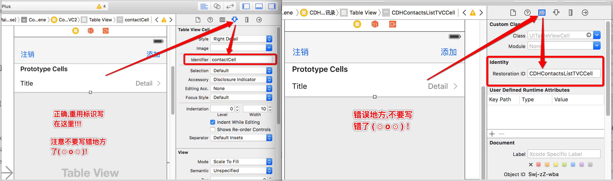

# Chapter01


##1. 如果使用下面的错误写法则会报这样的错误

```
 reason: '-[CDHFlagItem countByEnumeratingWithState:objects:count:]: unrecognized selector sent to instance 0x7ffddb1266c0'
```

```OBJC
// 文本框中的内容
- (void)pickerView:(UIPickerView *)pickerView didSelectRow:(NSInteger)row inComponent:(NSInteger)component{
//    获取数据,错误写法
//    CDHFlagItem *item = [CDHFlagItem itemWithDictionary:self.dataArray[row]];
//    解释: 这里定义的 item 就只是个指针,而且self.dataArray[row]本身就是个对象,
//    已经有了自己的内存地址,所以不需要再通过类工厂方法创建,只要地址引用就行了
    
//    正确,写法一:
//    1. 先取出模型
    CDHFlagItem *item = self.dataArray[row];
//    2. 通过模型获取数据
    self.text = item.name;
    
//    正确,写法二: 直接使用 getter 方法, 但不能直接在 [row].name
    self.text = [self.dataArray[row] name];
//    错误写法,不能直接使用点语法
//    self.text = self.dataArray[row].name; // 报错
    
}
```

---

##2. 拖线的时候如果希望某个控件传参传的就是自己,则需要注意参数类型,不要默认 id 类型

```objc
// 拖线的时候如果希望某个控件传参传的就是自己,并且在方法中使用到,
// 则要注意将传参的类型修改为自己的当前类型,不能直接默认使用 id 
// 如果使用 id 则不知道到实际类型,系统直接报错

// 自动登入按钮
- (IBAction)autoLogInButton:(UISwitch *)sender {
    
    if (sender.on  == YES) {
//        self.remPasswordSwitch.on = YES;
//        上面这种方法设的没有动画,所以用面一个,下面一个有动画
        [self.remPasswordSwitch setOn:YES animated:YES];
    }
}

// 记住密码按钮
- (IBAction)remindPwdButton:(id)sender {
    // 这里由于方法中参数的类型是 id 类型,这里会报错 if 判断已经报错
    if (sender.on == NO) {
        [self.autoLogInSwitch setOn:NO animated:YES];
    }
}

```




---


##3. 页面跳转,并有数据传输的时候一定要做懒加载

```objc
// 懒加载数据
- (NSMutableArray *)contactsListArray{
    if (!_contactsListArray) {
        _contactsListArray = [NSMutableArray array];
    }
    return _contactsListArray;
}
```

---

##4. 如果只是定义了模型属性只是个指针变量

- OC 的指针变量,如果不开辟存储控件,就没有对应的地址的,也就没办法存储数据

```objc
/** 联系人 (模型)*/
@property (nonatomic, strong)  CDHContactItem *addNewContact;
```

```objc
// 这样直接赋值是错误的
self.addNewContact.name = @"asdhf";
self.addNewContact.phone= @"234";
```

```objc
// 注意定要先创建模型,如果只是定义了一个模型属性,模型属性只是个指针变量,并没有指向模型的存储地址
// 只要创建了模型才会分配对应的存储空间也才会有相应的内存地址,
// 创建模型
CDHContactItem *item = [[CDHContactItem alloc]init];

item.name = self.nameTextF.text;
item.phone = self.phoneNumTextF.text;
self.addNewContact = item;
```

---

##5. 重用标识不要写错地方了




---

## 6. 注意很多方法名之间都很像不要写错了

- 这里举一个触摸平移的方法,如果写错了移动不了

```objc
//    错误代码
//    CGPoint preP = [touch preciseLocationInView:self];
//    正确代码
    CGPoint preP = [touch previousLocationInView:self];
```

```objc
//当手指在View上移动时,会持续调用.
//NSSet:元素都是无序
- (void)touchesMoved:(NSSet<UITouch *> *)touches withEvent:(UIEvent *)event{
//    NSLog(@"%s",__func__);
    
    //从 NSSet
    UITouch *touch = [touches anyObject];
    
//    当前点 注意这个是结构体不是对象,没有 *
    CGPoint curP = [touch locationInView:self];
//    CGPoint preP = [touch preciseLocationInView:self];
    CGPoint preP = [touch previousLocationInView:self];
    NSLog(@"%@-- %@",NSStringFromCGPoint(curP),NSStringFromCGPoint(preP));
    
//    求移动的偏移量
    //offsetX = 当前点.x – 上一个点的x
    CGFloat offsetX = curP.x - preP.x;
    CGFloat offsetY = curP.y - preP.y;
    
//    平移偏移量
    self.transform = CGAffineTransformTranslate(self.transform, offsetX, offsetY);
//    self.transform = CGAffineTransformTranslate(self.transform, offsetX, offsetY);   
}
```

---


##7. 导航控制器的栈顶控制器的 view 属性不可以另外开辟存储空间

- **注意使用 alloc/init 创建控制器之后,不要另外给控制器的 view 属性开辟存储空间,直接设置View 的相应属性即可**
- **如果给了 View 另外在开辟的存储空间就有可能出未知的错误**


```objc
    //    主窗口
    CDHMainVc *mainVc = [[CDHMainVc alloc]init];
    // 错误写法:
    //    mainVc.view = [[UIView alloc]initWithFrame:[UIScreen mainScreen].bounds];
    // 不需要另外开辟创建一个 VIEW 给控制器,控制器自带有属性 VIEW,只需要给 VIEW 设置相应的属性即可
    // 如果使用上面一句代码,再在代码设置导航条的时候,不管怎么写都不显示导航条的内容
    // 正确写法,
    mainVc.view.frame = [UIScreen mainScreen].bounds;
    mainVc.view.backgroundColor = [UIColor redColor];
    
    //    导航控制器 ,同时设置了导航控制器的 根控制器为 mainVc
    CDHNavigationVC *navigationVC = [[CDHNavigationVC alloc]initWithRootViewController:mainVc];
```

```objc
@implementation CDHMainVc

- (void)viewDidLoad {
    [super viewDidLoad];

    //导航条的内容由栈顶控制器来决定
    //设置导航条标题
    self.navigationItem.title = @"mainVc";
    //设置导航条视图
    self.navigationItem.titleView = [UIButton buttonWithType:UIButtonTypeContactAdd];
    //设置导航条右边视图
    self.navigationItem.rightBarButtonItem = [[UIBarButtonItem alloc] initWithTitle:@"right" style:0 target:self action:@selector(rightClick)];
    self.navigationItem.leftBarButtonItem =  [[UIBarButtonItem alloc]initWithTitle:@"left" style:0 target:self action:@selector(leftClick)];
}

@end
```


