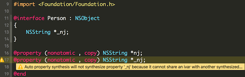
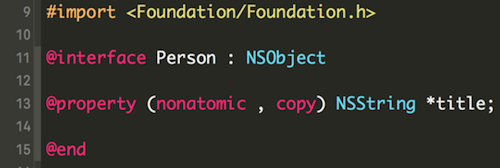
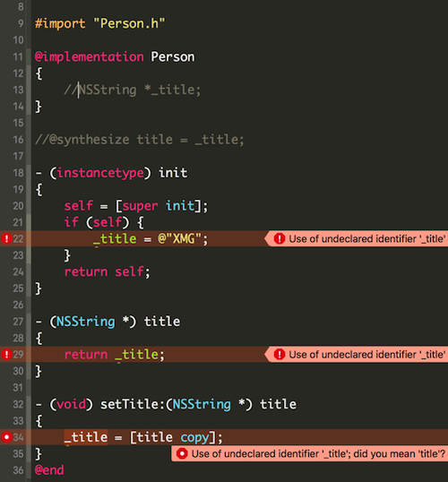
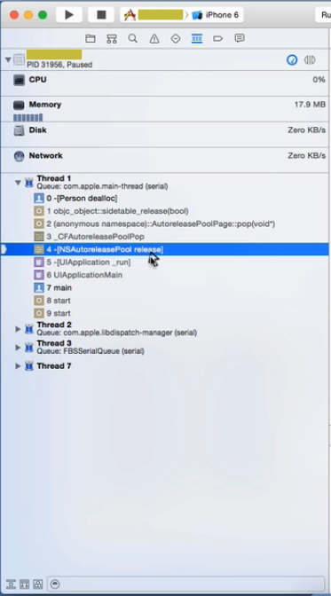
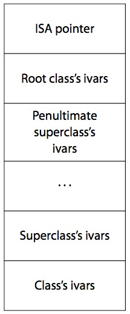
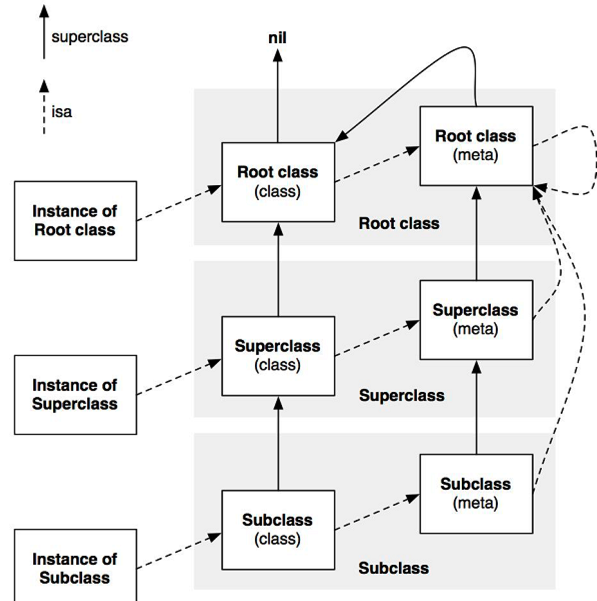
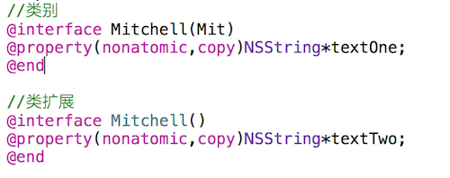
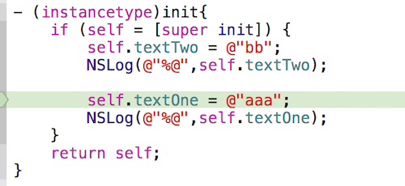
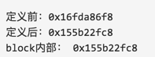

###基础面试题
#### **1. 什么情况使用 weak 关键字，相比 assign 有什么不同？**

答：<br/>
**使用 weak 关键字的情况：**<br/>
1）在ARC中，在有可能出现循环引用的时候，往往要通过让其中一端使用weak来解决，比如:delegate代理属性。<br/>
2）自身已经对它进行一次强引用，没有必要再强引用一次，此时也会使用weak，自定义IBOutlet控件属性一般也使用weak；当然，也可以使用strong。

**不同点：**<br/>
1）weak 此特质表明该属性定义了一种“非拥有关系” (nonowning relationship)。为这种属性设置新值时，设置方法既不保留新值，也不释放旧值。此特质同assign类似， 然而在属性所指的对象遭到摧毁时，属性值也会清空(nil out)。 而 assign 的“设置方法”只会执行针对“纯量类型” (scalar type，例如 CGFloat 或 NSlnteger 等)的简单赋值操作。<br/>
2）assigin 可以用非OC对象，而 weak 必须用于 OC 对象。


#### **2. copy 关键字应用场景？**

答：<br/>
当成员变量的类型是可变类型，或其子类是可变类型时，被赋值的对象有可能在赋值之后被修改，如果程序不需要这种修改影响 setter 方法设置的成员变量的值，就可以考虑使用 copy，因为它会将被赋值的对象复制一个副本，strong 不会。<br/>
一般我们在使用 <font color="#FF0000">NSString、NSArray、NSDictionary</font> 的时候，就会使用到 copy 了。<br/>


#### **3. 如何重写带 copy 关键字的 setter？**

答：<br/>
比如说你的程序里面有一个 name 属性，如下：
```objectivec
//声明一个name属性
@property (nonatomic, copy, readonly) NSString *name;
```
那么重写这个带有 copy 关键字的 name 的 setter 方法如下：
```objectivec
//重写name的set方法
- (void) setName:(NSString *) name {
   _name = [name copy];
}
```
但这样还不行，因为上面我们可以看到 name 是一个只读属性。所以编译器不会为其创建对应的“设置方法”，用初始化方法设置好属性值之后，就不能再改变了。所以，我们还需要搞一下它的初始化方法。
```objectivec
//重写初始化方法
- (instancetype) init {
   if (self = [super init]) {
     _name = [name copy];
   }
   return self;
}
```

#### **4. @property 的本质是什么？ivar、getter、setter 是如何生成并添加到这个类中的。**

答：<br/>
@property 的本质如下：<br/>
```objectivec
@property = ivar + getter + setter;
```

下面具体解释：<br/>
“属性” (property)有两大概念：ivar（实例变量）、存取方法（access method ＝ getter + setter）。

“属性” (property) 作为 Objective-C 的一项特性，主要的作用就在于封装对象中的数据。<br/>
Objective-C 对象通常会把其所需要的数据保存为各种实例变量。实例变量一般通过“存取方法”来访问。<br/>
其中，“获取方法” (getter)用于读取变量值，而“设置方法” (setter)用于写入变量值。<br/>
所以也可以这么认为：<br/>

```objectivec
@property = getter + setter;
```
例如下面有一个类：<br/>
```objectivec
@interface Person: NSObject
//声明一个firstName属性
@property NSString *firstName;
//声明一个lastName属性
@property NSString *lastName;
@end
```
那上面使用 setter & getter 方法写出来的效果跟下面的是一样的：
```objectivec
@interface Person: NSObject
- (NSString *) firstName;
- (void) setFirstName:(NSString *) firstName;
- (NSString *) lastName;
- (void) setLastName:(NSString *) lastName;
@end
```
接下来，我们看下它们是如何生成并添加到这个类中的。

“自动合成”( autosynthesis)<br/>

完成属性定义后，编译器会自动编写访问这些属性所需的方法，此过程叫做“自动合成”( autosynthesis)。需要强调的是，这个过程由编译器在编译期执行，所以编辑器里看不到这些“合成方法”(synthesized method)的源代码。除了生成方法代码 getter、setter 之外，编译器还要自动向类中添加适当类型的实例变量，并且在属性名前面加下划线，以此作为实例变量的名字。在前例中，会生成两个实例变量，其名称分别为 `_firstName`与`_latName`。也可以在类的实现代码里通过 @synthesize语法来指定实例变量的名字。

```objectivec
@implementation
//修改名字为 _myFirstName
@synthsize firstName = _myFirstName;
//修改名字为 myLastName
@synthsize lastName = myLastName;
@end
```
为了搞清属性是怎么实现的，只要反编译过相关的代码，就可以发现大致生成如下五个东西：

1）objectivec\_IVAR\_$类名$属性名称 ：该属性的“偏移量” (offset)，这个偏移量是“硬编码” (hardcode)，表示该变量距离存放对象的内存区域的起始地址有多远。<br/>
2）setter 与 getter 方法对应的实现函数。<br/>
3）ivar\_list ：成员变量列表。<br/>
4）method\_list ：方法列表。<br/>
5）prop\_list ：属性列表。<br/>

也就是说我们每次在增加一个属性，系统都会在ivar_list中添加一个成员变量的描述，在method_list中增加setter与getter方法的描述，在属性列表中增加一个属性的描述，然后计算该属性在对象中的偏移量，然后给出setter与getter方法对应的实现，在setter方法中从偏移量的位置开始赋值，在getter方法中从偏移量开始取值，为了能够读取正确字节数，系统对象偏移量的指针类型进行了类型强转。


#### **5. 这个写法会出什么问题： @property (copy) NSMutableArray \*array;**

答：<br/>
这里会出现两个问题：<br/>
1）添加，删除，修改数组内的元素的时候，程序会因为找不到对应的方法而崩溃。因为copy就是复制一个不可变 NSArray 的对象；<br/>
2）使用了 atomic 属性会严重影响性能。

第2条原因，如下：

该属性使用了同步锁，会在创建时生成一些额外的代码用于帮助编写多线程程序，这会带来性能问题，通过声明nonatomic可以节省这些虽然很小但是不必要额外开销。

在默认情况下，由编译器所合成的方法会通过锁定机制确保其原子性(atomicity)。如果属性具备nonatomic特质，则不使用同步锁。请注意，尽管没有名为“atomic”的特质(如果某属性不具备nonatomic特质，那它就是“原子的”(atomic))。

在iOS开发中，你会发现，几乎所有属性都声明为nonatomic。

一般情况下并不要求属性必须是“原子的”，因为这并不能保证“线程安全” ( thread safety)，若要实现“线程安全”的操作，还需采用更为深层的锁定机制才行。例如，一个线程在连续多次读取某属性值的过程中有别的线程在同时改写该值，那么即便将属性声明为atomic，也还是会读到不同的属性值。

因此，开发iOS程序时一般都会使用nonatomic属性。但是在开发Mac OS X程序时，使用 atomic属性通常都不会有性能瓶颈。

#### **6. @protocol 和 category 中使用 @property会怎么样？**

答：<br/>
1）在 protocol 中使用 property 只会生成 setter 和getter 方法声明,我们使用属性的目的,是希望遵守我协议的对象能实现该属性。<br/>

2）category 使用 @property 也是只会生成setter和getter方法的声明，如果我们真的需要给 category 增加属性的实现，需要借助于运行时的两个函数：
```objectivec
  objectivec_setAssociatedObject
  objectivec_getAssociatedObject
```


#### **7. @property 中有哪些属性关键字？/ @property 后面可以有哪些修饰符？**

答：<br/>
属性可以拥有的特质主要分为四类：<br/>
① 原子性【nonatomic】<br/>
在默认情况下，由编译器合成的方法会通过锁定机制确保其原子性(atomicity)。如果属性具备 nonatomic 特质，则不使用同步锁。请注意，尽管没有名为“atomic”的特质(如果某属性不具备nonatomic特质，那它就是“原子的” ( atomic) )，但是仍然可以在属性特质中写明这一点，编译器不会报错。若是自己定义存取方法，那么就应该遵从与属性特质相符的原子性。<br/>
② 读/写权限【readwrite(读写)、readonly (只读)】<br/>
③ 内存管理语义【assign、strong、 weak、unsafe_unretained、copy】<br/>
④ 方法名【getter=、setter=】<br/>

getter=的样式：
```objectivec
  @property (nonatomic, getter=isOn) BOOL on;
```
（ setter=这种不常用，也不推荐使用。故不在这里给出写法。）

不常用的：nonnull，null_resettable，nullable


#### **8. 用 @property 声明的 NSString（或NSArray，NSDictionary）经常使用copy关键字，为什么？如果改用strong关键字，可能造成什么问题？**

答：<br/>
1）因为父类指针可以指向子类对象，使用copy的目的是为了让本对象的属性不受外界影响，使用copy无论给我传入是一个可变对象还是不可对象，我本身持有的就是一个不可变的副本。<br/>
2）如果我们使用是strong，那么这个属性就有可能指向一个可变对象，如果这个可变对象在外部被修改了，那么会影响该属性。<br/>
比如看如下代码：<br/>
```objectivec
//新建一个类
@interface Person: NSObject
//声明一个name属性
@property(nonatomic) NSString *name;
@end
```

上面在 Person 类中声明了一个 name 属性。name 它的类型是 NSString，NSString 有一个可变的子类叫做 NSMutableString，如果此时我们把一个 NSMutableString 对象赋值给上面的 name。这个时候，NSMutableString 就会被修改，也会影响 name 属性。
```objectivec
#import "Person.h"

int main(int argc, char *argv[]){
  @autoreleasepool {
    //初始化 Person 
    Person *p = [Person alloc] init];
    //创建一个 NSMutableString 对象
    NSMutableString *str = [NSMutableString stringWithString:@"XMG"];
    //把上面的 str 设置给 Person 的 name
    [p setName:str];
    //打印
    NSLog(@"person 的 name：%@", [p name]);
    //修改 str
    [str appendString:@" 的iOS学院棒棒哒。"];
    //再打印
    NSLog(@"person 的 name：%@", [p name]);
  }
}
@end
```

#### **9. @synthesize合成实例变量的规则是什么？假如property名为nj，存在一个名为\_nj的实例变量，那么还会自动合成新变量么？**

答：<br/>
如果使用了属性的话，那么编译器就会自动编写访问属性所需的方法，此过程叫做“自动合成”。需要强调的是，这个过程由编译器在编译期执行，所以编辑器里看不到这些“合成方法”的源代码。除了生成方法代码之外，编译器还要自动向类中添加适当类型的实例变量，并且在属性名前面加下划线，以此作为实例变量的名字。<br/>
```objectivec
@interface Person: NSObject
@property NSString *firstName;
@property NSString *lastName;
@end
```
在上面代码中，会生成两个实例变量，其名称分别为 \_firstName与\_lastName。也可以在类的实现代码里通过 @synthesize 语法来指定实例变量的名字:
```objectivec
@implementation Person
@synthesize firstName = _myFirstName;
@sythesize lastName = _myLastName;
@end
```
上述语法会将生成的实例变量命名为\_myFirstName与\_myLastName，而不再使用默认的名字。一般情况下无须修改默认的实例变量名，但是如果你不喜欢以下划线来命名实例变量，那么可以用这个办法将其改为自己想要的名字。<br/>

假如property名为nj，存在一个名为\_nj的实例变量，那么就不会自动合成新变量了。看下图：



#### **10. 在有了自动合成属性实例变量之后，@synthesize还有哪些使用场景？**

答：<br/>
首先来看什么情况下不会自动合成。<br/>
① 同时重写了setter和getter时<br/>
② 重写了只读属性的getter时<br/>
③ 使用了@dynamic时<br/>
④ 在 @protocol 中定义的所有属性<br/>
⑤ 在 category 中定义的所有属性<br/>
⑥ 重载的属性<br/>
当你在子类中重载了父类中的属性，你必须 使用@synthesize来手动合成ivar。<br/>
除了后三条，对其他几个我们可以总结出一个规律：当你想手动管理@property的所有内容时，你就会尝试通过实现@property的所有“存取方法”或者使用@dynamic来达到这个目的，这时编译器就会认为你打算手动管理@property，于是编译器就禁用了自动合成。<br/>

@synthesize语法还有一个应用场景：可以在类的实现代码里通过@synthesize语法来指定实例变量的名字。<br/>
但是不太建议大家使用。<br/>
首先我们先声明一个 title 属性。<br/>


接着我们来到实现部分。<br/>


当你同时重写了setter和getter时，系统就不会生成ivar（实例变量/成员变量）。这时候有两种选择：

要么如第13行：手动创建ivar
要么如第16行：使用@synthesize title = _title; ，关联@property与ivar。

#### **11. @synthesize 和 @dynamic 分别有什么作用？**

答：<br/>
1）@property有两个对应的词，一个是 @synthesize，一个是@dynamic。如果 @synthesize 和 @dynamic 都没写，那么默认的就是 @syntheszie var = _var;

2）@synthesize 的语义是如果你没有手动实现 setter方法和getter方法，那么编译器会自动为你加上这两个方法。

3）@dynamic告诉编译器：属性的setter与getter方法由用户自己实现，不自动生成。（当然对于readonly的属性只需提供getter即可）。假如一个属性被声明为@dynamic var，然后你没有提供@setter方法和@getter方法，编译的时候没问题，但是当程序运行到instance.var = someVar，由于缺setter方法会导致程序崩溃；或者当运行到 someVar = instance.var时，由于缺getter方法同样会导致崩溃。编译时没问题，运行时才执行相应的方法，这就是所谓的动态绑定。

#### **12. weak属性需要在dealloc中置nil么？**

答：<br/>
不需要。在ARC环境无论是强指针还是弱指针都无需在deallco设置为nil，ARC会自动帮我们处理。<br/>


#### **13. ARC下，不显式指定任何属性关键字时，默认的关键字都有哪些？**

答：<br/>
1)对应基本数据类型默认关键字是：atomic,readwrite,assign<br/>
2)对于普通的OC对象：atomic,readwrite,strong<br/>


#### **14. ARC通过什么方式帮助开发者管理内存？**

答：<br/>
ARC相对于MRC，不是在编译时添加retain/release/autorelease这么简单。应该是编译期和运行期两部分共同帮助开发者管理内存。<br/>
在编译期，ARC用的是更底层的C接口实现的retain/release/autorelease，这样做性能更好，也是为什么不能在ARC环境下手动retain/release/autorelease，同时对同一上下文的同一对象的成对retain/release操作进行优化（即忽略掉不必要的操作）；ARC也包含运行期组件，这个地方做的优化比较复杂，但也不能被忽略。


#### **15. objectivec使用什么机制管理对象内存？**

答：<br/>
通过 retainCount 的机制来决定对象是否需要释放。 每次 runloop 的时候，都会检查对象的 retainCount，如果retainCount 为 0，说明该对象没有地方需要继续使用了，可以释放掉了。

#### **16. 苹果是如何实现autoreleasepool的？**

答：<br/>
autoreleasepool 以一个队列数组的形式实现,主要通过下列三个函数完成。<br/>
① objectivec_autoreleasepoolPush<br/>
② objectivec_autoreleasepoolPop<br/>
③ objectivec_autorelease<br/>
看函数名就可以知道，对 autorelease 分别执行 push，和 pop 操作。销毁对象时执行release操作。<br/>
举例说明：我们都知道用类方法创建的对象都是 Autorelease 的，那么一旦 Person 出了作用域，当在 Person 的 dealloc 方法中打上断点，我们就可以看到这样的调用堆栈信息：<br/>



#### **17. 不手动指定 autoreleasepool 的前提下，一个 autorealese 对象在什么时刻释放？（比如在一个vc的viewDidLoad中创建）**

分两种情况：手动干预释放时机、系统自动去释放。

手动干预释放时机 - 指定autoreleasepool就是所谓的：当前作用域大括号结束时释放。<br/>
系统自动去释放 - 不手动指定autoreleasepool<br/>
Autorelease对象出了作用域之后，会被添加到最近一次创建的自动释放池中，并会在当前的 runloop 迭代结束时释放。<br/>
如果在一个vc的viewDidLoad中创建一个 Autorelease对象，那么该对象会在 viewDidAppear 方法执行前就被销毁了。<br/>
参考链接：[<<黑幕背后的Autorelease>>](http://blog.sunnyxx.com/2014/10/15/behind-autorelease/)

#### **18. objectivec中向一个nil对象发送消息将会发生什么？**

答：<br/>
在Objective-C中向nil发送消息是完全有效的，只是在运行时不会有任何作用。<br/>
如果一个方法返回值是一个对象，那么发送给nil的消息将返回0(nil)。例如：
```objectivec
Person * motherInlaw = [[aPerson spouse] mother];
```
如果spouse对象为nil，那么发送给nil的消息mother也将返回nil。<br/>
1）如果方法返回值为指针类型，其指针大小为小于或者等于sizef(void\*)，float，double，long double 或者long long的整型标量，发送给nil的消息将返回0。<br/>
2）如果方法返回值为结构体,发送给nil的消息将返回0。结构体中各个字段的值将都是0。<br/>
3）如果方法的返回值不是上述提到的几种情况，那么发送给nil的消息的返回值将是未定义的。<br/>
具体原因如下：
> **<font color="FF0000">objectivec是动态语言，每个方法在运行时会被动态转为消息发送，即：objectivec_msgSend(receiver, selector)。</font>**

```objectivec
struct objectivec_class {
  //isa指针指向Meta Class，因为objectivec的类的本身也是一个Object，
  //为了处理这个关系，runtime就创造了Meta Class，
  //当给类发送[NSObject alloc]这样消息时，实际上是把这个消息发给了Class Object
  Class isa objectivec_ISA_AVAILABILITY; 
  #if !__objectivec2__
  Class super_class objectivec2_UNAVAILABLE; // 父类
  const char *name objectivec2_UNAVAILABLE; // 类名
  long version objectivec2_UNAVAILABLE; // 类的版本信息，默认为0
  long info objectivec2_UNAVAILABLE; // 类信息，供运行期使用的一些位标识
  long instance_size objectivec2_UNAVAILABLE; // 该类的实例变量大小
  struct objectivec_ivar_list *ivars objectivec2_UNAVAILABLE; // 该类的成员变量链表
  struct objectivec_method_list **methodLists objectivec2_UNAVAILABLE; // 方法定义的链表
  //方法缓存，对象接到一个消息会根据isa指针查找消息对象，
  //这时会在method Lists中遍历，
  //如果cache了，常用的方法调用时就能够提高调用的效率。
  struct objectivec_cache *cache objectivec2_UNAVAILABLE; 
  struct objectivec_protocol_list *protocols objectivec2_UNAVAILABLE; // 协议链表
  #endif
  } objectivec2_UNAVAILABLE;
```

objectivec在向一个对象发送消息时，runtime库会根据对象的isa指针找到该对象实际所属的类，然后在该类中的方法列表以及其父类方法列表中寻找方法运行，然后在发送消息的时候，objectivec_msgSend方法不会返回值，所谓的返回内容都是具体调用时执行的。 那么，回到本题，如果向一个nil对象发送消息，<font color = "#FF0000">首先在寻找对象的isa指针时就是0地址返回了，所以不会出现任何错误。</font>

#### **19. 什么时候会报unrecognized selector的异常？**

答：<br/>
简单来说：当调用该对象上某个方法，而该对象上没有实现这个方法的时候，可以通过“消息转发”进行解决。<br/>
简单的流程如下，我们知道：objectivec是动态语言，每个方法在运行时会被动态转为消息发送，即：objectivec_msgSend(receiver, selector)。<br/>
objectivec在向一个对象发送消息时，runtime库会根据对象的isa指针找到该对象实际所属的类，然后在该类中的方法列表以及其父类方法列表中寻找方法运行，如果，在最顶层的父类中依然找不到相应的方法时，程序在运行时会挂掉并抛出异常<font color="FF0000">unrecognized selector sent to XXX</font> 。但是在这之前，objectivec的运行时会给出三次拯救程序崩溃的机会：

① <font color="FF0000">Method resolution </font><br/>
objectivec运行时会调用+resolveInstanceMethod:或者 +resolveClassMethod:，让你有机会提供一个函数实现。如果你添加了函数并返回 YES，那运行时系统就会重新启动一次消息发送的过程，如果 resolve 方法返回 NO ，运行时就会移到下一步，消息转发（Message Forwarding）。

② <font color="FF0000">Fast forwarding</font><br/>
如果目标对象实现了-forwardingTargetForSelector:，Runtime 这时就会调用这个方法，给你把这个消息转发给其他对象的机会。 只要这个方法返回的不是nil和self，整个消息发送的过程就会被重启，当然发送的对象会变成你返回的那个对象。否则，就会继续Normal Fowarding。 这里叫Fast，只是为了区别下一步的转发机制。因为这一步不会创建任何新的对象，但下一步转发会创建一个NSInvocation对象，所以相对更快点。

③ <font color="FF0000">Normal forwarding</font><br/>
这一步是Runtime最后一次给你挽救的机会。首先它会发送-methodSignatureForSelector:消息获得函数的参数和返回值类型。如果-methodSignatureForSelector:返回nil，Runtime则会发出-doesNotRecognizeSelector:消息，程序这时也就挂掉了。如果返回了一个函数签名，Runtime就会创建一个NSInvocation对象并发送-forwardInvocation:消息给目标对象。

#### **20. 一个objectivec对象如何进行内存布局？（考虑有父类的情况）**

答：<br/>
> ① 所有父类的成员变量和自己的成员变量都会存放在该对象所对应的存储空间中。<br/>
  ② 每一个对象内部都有一个isa指针，指向他的类对象，类对象中存放着本对象的。
  
1）对象方法列表（对象能够接收的消息列表，保存在它所对应的类对象中）<br/>
2）成员变量的列表<br/>
3）属性列表<br/>
它内部也有一个isa指针指向元对象(meta class)，元对象内部存放的是类方法列表，类对象内部还有一个superclass的指针，指向他的父类对象。<br/>


1）根对象就是NSobject，它的superclass指针指向nil。<br/>
2）类对象既然称为对象，那它也是一个实例。类对象中也有一个isa指针指向它的元类(meta class)，即类对象是元类的实例。元类内部存放的是类方法列表，根元类的isa指针指向自己，superclass指针指向NSObject类。<br/>


#### **21. 一个objectivec对象的isa的指针指向什么？有什么作用？**

答：<br/>
指向他的类对象，从而可以找到对象上的方法。

#### **22. objectivec中向一个对象发送消息[obj foo]和objectivec_msgSend()函数之间有什么关系？**

答：<br/>
该方法编译之后就是objectivec_msgSend()函数调用。<br/>
```objectivec
((void ()(id, SEL))(void )objectivec_msgSend)((id)obj, sel_registerName("foo"));
```
也就是说：
[obj foo];在objectivec动态编译时，会被转意为：objectivec_msgSend(obj, @selector(foo));。

#### **23. objectivec中的类方法和实例方法有什么本质区别和联系？**

答：<br/>
1）类方法：<br/>
① 类方法是属于类对象的。<br/>
② 类方法只能通过类对象调用。<br/>
③ 类方法中的self是类对象。<br/>
④ 类方法可以调用其他的类方法。<br/>
⑤ 类方法中不能访问成员变量。<br/>
⑥ 类方法中不定直接调用对象方法。<br/>
2）实例方法：<br/>
① 实例方法是属于实例对象的。<br/>
② 实例方法只能通过实例对象调用。<br/>
③ 实例方法中的self是实例对象。<br/>
④ 实例方法中可以访问成员变量。<br/>
⑤ 实例方法中直接调用实例方法。<br/>
⑥ 实例方法中也可以调用类方法(通过类名)。<br/>

#### **24. Object-C有多继承吗？没有的话用什么代替？**

答：<br/>
没有，cocoa中所有的类都是NSObject的子类，多继承在这里是用protocol、代理来实现的。ood的多态特性在oc中通过委托来实现.

#### **25. Objective-C中类别和类扩展的区别**

答：<br/>
1）首先我们来看类扩展。它主要作用有：<br/>
① 能为某个类附加额外的属性，成员变量，方法声明。<br/>
② 一般的类扩展写到 .m 文件中。<br/>
③ 一般的私有属性写到类扩展。<br/>
它的使用格式如下：
```objectivec
@interface Person()
//声明属性
//声明方法
@end
```
2）接着来看类别（分类）。<br/>
① 分类的小括号中必须有名字。
```objectivec
@interface 类名(分类名字)
//方法声明
@end
@implementation 类名(分类名字)
//方法实现
@end
```
② 分类只能扩充方法，不能扩展属性和成员变量（如果包含成员变量会直接报错）<br/>
③ 如果分类中声明了一个属性，那么分类只会生成这个属性的set、get方法声明，也就是不会有实现。<br/>
接着，我们可以看一个例子：如果我们分别在类扩展和分类中添加了两个属性。<br/>


接着在初始化方法中分贝赋值。


然后，就崩掉了。

#### **26. 通知，代理，KVO 的区别**

答：<br/>
1）首先来看下代理的作用：<br/>
① A 对象监听 B 对象的一些行为，A 成为 B 的代理。<br/>
② B 对象想告诉 A 对象一些事情，A 成为 B 的代理。<br/>
也就是说，<br/>
① 如果你想监听别人的一些行为，那么你就要成为别人的代理。<br/>
② 如果你想告诉别人一些事情，那么就让别人成为你的代理。<br/>
2）再来看下通知的作用：<br/>
主要是 A 发出一个通知（广播等意思），其他对象可以根据通知的名字来进行监听。<br/>
接着我们来看下代理和通知的区别：<br/>
① 代理：1个对象只能告诉另1个对象发生了什么事情。<br/>
② 通知：1个对象可以告诉N个对象发生了什么事情。<br/>
3）KVO 常用来监听模型属性值的改变。<br/>
比如说可以看以下这个例子：
```objectivec
// cc监听了aa的name属性的改变
[aa addObserver:cc forKeyPath:@"name" options: NSKeyValueObservingOptionOld context:nil];
// cc得实现监听方法
/**
 * 当监听到object的keyPath属性发生了改变
 */
- (void)observeValueForKeyPath:(NSString *)keyPath ofObject:(id)object change:(NSDictionary *)change context:(void *)context
{
    NSLog(@"监听到%@对象的%@属性发生了改变， %@", object, keyPath, change);
}
```

#### **27. define 和 const 常量有什么区别?**

答：<br/>
1）首先从概念来看。<br/>
① define 主要是用来定义一个宏，可以是一个表达式。<br/>
② const 主要是用来定义一个常量。<br/>
2）接着他们的处理方式不同。<br/>
① define 是在预处理阶段处理。<br/>
② const 是在编译运行阶段处理。<br/>
3) 类型和安全检查不同<br/>
① define 没有类型，不做任何类型检查。<br/>
② const 有具体的类型，在编译阶段会执行类型检查。<br/>
4）存储方式不同<br/>
① define 仅仅是展开，有多少地方使用，就展开多少次，不会分配内存。<br/>
② const 会在内存中分配。<br/>
5）使用注意点<br/>
const 可以节省空间，避免不必要的内存分配。<br/>
```objectivec
//定义宏
#define PI 3.14159   
//此时并未将Pi放入ROM中
const doulbe Pi=3.14159;  
//此时为Pi分配内存，以后不再分配
double i=Pi; 
//编译期间进行宏替换，分配内存
double I=PI;   
//没有内存分配  
double j=Pi; 
//再进行宏替换，又一次分配内存
double J=PI; 
```

#### **28. ARC 下还会存在内存泄露吗？**

答：<br/>
还是会有的。<br/>
因为当一个对象存入到集合中的时候，默认会保存它的强指针，如果最后不对这个集合进行清空操作，一样会有内存溢出的情况。
```objectivec
Person * p = [[Person alloc] init];
NSMutableArray * arr = [[NSMutableArray alloc] init];
[arr addObject:p];
```
把对象从集合中移除的时候，也会释放掉这个对象的强指针。<br/>
```objectivec
[arr removeObject:p];
//或者
[arr removeAllObjects];
```
而接下来才是重点：<br/>
```objectivec
//如果不进行赋值为nil的操作，一样存在内存溢出的现象
//赋值为nil系统会对其进行清空所有强指针的操作.
arr = nil;
p = nil;
```

#### **29. 在block内如何修改block外部变量？**

答：<br/>
默认情况下，在 block 中访问的外部变量是访问的一个副本。不会直接对原有变量进行操作。不过，我们可以加上```__block``` 就不同了。如下所示：
```objectivec
__block int a = 0;
void (^foo)(void) = ^{ 
    a = 1; 
};
foo(); 
//这里，a的值被修改为1
```
不过这样还不全面，我们都知道：Block不允许修改外部变量的值，这里所说的外部变量的值，指的是栈中指针的内存地址。```__block```所起到的作用就是只要观察到该变量被 block 所持有，就将“外部变量”在栈中的内存地址放到了堆中。进而在block内部也可以修改外部变量的值。<br/>

Block不允许修改外部变量的值。Apple这样设计，应该是考虑到了block的特殊性，block也属于“函数”的范畴，变量进入block，实际就是已经改变了作用域。在几个作用域之间进行切换时，如果不加上这样的限制，变量的可维护性将大大降低。又比如我想在block内声明了一个与外部同名的变量，此时是允许呢还是不允许呢？只有加上了这样的限制，这样的情景才能实现。于是栈区变成了红灯区，堆区变成了绿灯区。<br/>

接着可以验证一下：
```objectivec
__block int a = 0;
NSLog(@"定义前：%p", &a); //栈区
void (^foo)(void) = ^{
    a = 1;
    NSLog(@"block内部：%p", &a); //堆区
};
NSLog(@"定义后：%p", &a); //堆区
foo();
```
运行结果如下：<br/>

可见，“定义后”和“block内部”两者的内存地址是一样的，我们都知道 block 内部的变量会被 copy 到堆区，“block内部”打印的是堆地址，因而也就可以知道，“定义后”打印的也是堆的地址。<br/>
那怎么证明“block内部”打印的是堆地址？<br/>
方法：把三个16进制的内存地址转成10进制就是：
> ① 定义后前：6171559672<br/>
② block内部：5732708296<br/>
③ 定义后后：5732708296<br/>

经过计算就可以知道，中间相差438851376个字节，也就是418.5M，因为堆地址要小于栈地址，又因为iOS中一个进程的栈区内存只有1M，Mac也只有8M，显然a已经是在堆区了。<br/>

这也证实了：a 在定义前是栈区，但只要进入了 block 区域，就变成了堆区。这才是 ```__block```关键字的真正作用。


#### **30. 使用block时什么情况会发生引用循环，如何解决？**

答：<br/>
一个对象中强引用了block，在block中又使用了该对象，就会发射循环引用。 解决方法是将该对象使用\_\_weak或者\_\_block修饰符修饰之后再在block中使用。
```objectivec
id weak weakSelf = self; 
//或者 
weak __typeof(&*self)weakSelf = self //该方法可以设置宏
id __block weakSelf = self;
```

#### **31. GCD的队列（dispatch_queue_t）分哪两种类型？**

答：<br/>
① 串行队列Serial Dispatch Queue <br/>
② 并行队列Concurrent Dispatch Queue <br/>

#### **32. dispatch_barrier_async的作用是什么？**

答：<br/>
在并行队列中，为了保持某些任务的顺序，需要等待一些任务完成后才能继续进行，使用 barrier 来等待之前任务完成，避免数据竞争等问题。 dispatch_barrier_async 函数会等待追加到Concurrent Dispatch Queue并行队列中的操作全部执行完之后，然后再执行 dispatch_barrier_async 函数追加的处理，等 dispatch_barrier_async 追加的处理执行结束之后，Concurrent Dispatch Queue才恢复之前的动作继续执行。

打个比方：比如你们公司周末跟团旅游，高速休息站上，司机说：大家都去上厕所，速战速决，上完厕所就上高速。超大的公共厕所，大家同时去，程序猿很快就结束了，但程序媛就可能会慢一些，即使你第一个回来，司机也不会出发，司机要等待所有人都回来后，才能出发。 dispatch_barrier_async 函数追加的内容就如同 “上完厕所就上高速”这个动作。

（注意：使用 dispatch_barrier_async ，该函数只能搭配自定义并行队列 dispatch_queue_t 使用。不能使用： dispatch_get_global_queue ，否则 dispatch_barrier_async 的作用会和 dispatch_async 的作用一模一样。 ）

#### **33. addObserver:forKeyPath:options:context:各个参数的作用分别是什么，observer中需要实现哪个方法才能获得KVO回调？**

答：<br/>
```objectivec
// 添加键值观察
/*
1 观察者，负责处理监听事件的对象
2 观察的属性
3 观察的选项
4 上下文
*/
[self.person addObserver:self forKeyPath:@"name" options:NSKeyValueObservingOptionNew | NSKeyValueObservingOptionOld context:@"Person Name"];
```
observer中需要实现一下方法：<br/>
```objectivec
// 所有的 kvo 监听到事件，都会调用此方法
/*
 1. 观察的属性
 2. 观察的对象
 3. change 属性变化字典（新／旧）
 4. 上下文，与监听的时候传递的一致
 */
- (void)observeValueForKeyPath:(NSString *)keyPath ofObject:(id)object change:(NSDictionary *)change context:(void *)context;
```

#### **34. 如何手动触发一个value的KVO**

答：<br/>
所谓的“手动触发”是区别于“自动触发”。自动触发是指类似这种场景：在注册 KVO 之前设置一个初始值，注册之后，设置一个不一样的值，就可以触发了。

想知道如何手动触发，必须知道自动触发 KVO 的原理：

键值观察通知依赖于 NSObject 的两个方法: willChangeValueForKey: 和 didChangevlueForKey: 。<br/>
在一个被观察属性发生改变之前， willChangeValueForKey: 一定会被调用，这就 会记录旧的值。<br/>
而当改变发生后， observeValueForKey:ofObject:change:context: 会被调用，继而 didChangeValueForKey: 也会被调用。如果可以手动实现这些调用，就可以实现“手动触发”了。<br/>
那么“手动触发”的使用场景是什么？一般我们只在希望能控制“回调的调用时机”时才会这么做。<br/>
具体做法如下：<br/>
如果这个 value 是 表示时间的 self.now ，那么代码如下：最后两行代码缺一不可。<br/>
```objectivec
//先声明一个 NSDate 类型的 now 属性
@property (nonatomic, strong) NSDate *now;
//...
- (void)viewDidLoad {
    [super viewDidLoad];
    //初始化
    _now = [NSDate date];
    //监听
    [self addObserver:self forKeyPath:@"now" options:NSKeyValueObservingOptionNew context:nil];
    NSLog(@"1");
    [self willChangeValueForKey:@"now"]; // “手动触发self.now的KVO”，必写。
    NSLog(@"2");
    [self didChangeValueForKey:@"now"]; // “手动触发self.now的KVO”，必写。
    NSLog(@"4");
}
```
但是平时我们一般不会这么干，我们都是等系统去“自动触发”。“自动触发”的实现原理：

> 比如调用 setNow: 时，系统还会以某种方式在中间插入 wilChangeValueForKey: 、 didChangeValueForKey: 和 observeValueForKeyPath:ofObject:change:context: 的调用。

#### **35. 若一个类有实例变量 NSString \*\_name ，调用setValue:forKey:时，可以以name还是 \_name 作为key？**

答：都可以。

#### **36. KVC的keyPath中的集合运算符如何使用？**

答：<br/>
① 必须用在集合对象上或普通对象的集合属性上。<br/>
② 简单集合运算符有@avg， @count ， @max ， @min ，@sum。<br/>
③ 格式 @"@sum.age"或 @"集合属性.@max.age"


#### **37. KVC和KVO的keyPath一定是属性么？**

答：不一定，KVO支持实例变量。

#### **38. IBOutlet连出来的视图属性为什么可以被设置成weak?**

答：当我们使用 xib或者storyboard 添加控件的时候，默认就对他有一个强引用了。同样道理，如果通过代码方式 addSubview: 来添加的话，也相当于是加到控制器的view中，同时也有一个强指针引用了。所以，这个时候只要使用 weak 就可以了。

#### **39. Objective-C有私有方法吗？私有变量呢？**

答：<br/>
在objective-c里面，是有私有变量和私有方法的。<br/>
我们在声明一个变量的时候在前面加上@private关键字，后面声明的变量这些就是私有的。<br/>
在objective-c里面声明的变量默认为@protected，它在外部是不能访问的，但是在子类中是可以访问。<br/>
在extensions里面声明的变量和属性也是私有的。<br/>

extensions声明的方法也是私有的，也可以在实现文件里面去声明一个interface添加私有方法<br/>


#### **40. +(void)load; +(void)initialize;有什么用处？**

答：<br/>
两个方法都可以进行一些类的初始化操作。其中有些小区别：<br/>
① +(void)load 方法只要加入了工程中，进行了编译，且.m中实现了这个方法，都会调用一次，值得注意的时没实现的子类是不会调用的，就算父类实现了也不行。<br/>
② +(void)initialize 在发送第一条消息给类的时候进行调用，跟load方法的不同之处在于，比较迟，可实现懒加载，且父类.m实现了该方法，子类不实现也会调用父类，跟正常的方法一样。categories，都实现了这个方法，只会调用其中一个，具有不确定性。<br/>

#### **41. 你一般是如何调试 Bug 的？**

答：<br/>


#### **42. 使用atomic一定是线程安全的吗？**

答：<br/>
不一定。<br/>
atomic在set方法里加了锁，防止了多线程一直去写这个property，造成难以预计的数值。但这也只是读写的锁定，跟线程安全其实还是差一些。看下面：
```objectivec
@interface MONPerson : NSObject 
//声明属性
@property (copy) NSString * firstName; 
@property (copy) NSString * lastName; 
//声明方法
- (NSString *)fullName; 
@end

Thread A:
p.firstName = @"Rob";
Thread B:
p.firstName = @"Robert";
Thread A:
label.string = p.firstName; 
```
但是如果有个C也在写，D在读取，D会读到一些随机的值（ABC修改的值），这就不是线程安全的了。最好的方法是使用lock。
```objectivec
Thread A:
[p lock]; //上锁
// 线程B现在不能访问
pp.firstName = @"Rob";
NSString fullName = p.fullName;
[p unlock];
// 线程B现在能够访问 plabel.string = fullName;

Thread B:
[p lock]; // 上锁
// 线程A现在不能够访问 p
[p unlock];
```
atomic有个很大的问题是很慢，要比nonatomic慢20倍。<br/>
当然最后建议这种数值数值变化可以让服务器来做。


