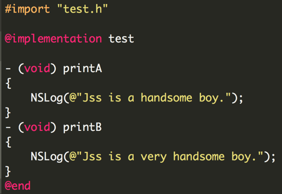

### 中级

#### **1. 如何优化一个TableView?**

答：<br/>
1)UITableView最核心的思想就是UITableViewCell的重用机制。<br/>
简单的理解就是：UITableView只会创建一屏幕（或一屏幕多一点）的UITableViewCell，其他都是从中取出来重用的。每当Cell滑出屏幕时，就会放入到一个集合（或数组）中（这里就相当于一个重用池），当要显示某一位置的Cell时，会先去集合（或数组）中取，如果有，就直接拿来显示；如果没有，才会创建。这样做的好处可想而知，极大的减少了内存的开销。<br/>

2)UITableView最主要的两个回调方法是tableView:cellForRowAtIndexPath:和tableView:heightForRowAtIndexPath:。<br/>
我们都知道，UITableView是继承自UIScrollView的，需要先确定它的contentSize及每个Cell的位置，然后才会把重用的Cell放置到对应的位置。所以事实上，UITableView的回调顺序是先多次调用tableView:heightForRowAtIndexPath:以确定contentSize及Cell的位置，然后才会调用tableView:cellForRowAtIndexPath:，从而来显示在当前屏幕的Cell。<br/>
既然如此的话，我们应该先来优化这两个方法。<br/>
我们来看一段代码：<br/>
```objectivec
//设置每行cell的内容
- (UITableViewCell *)tableView:(UITableView *)tableView cellForRowAtIndexPath:(NSIndexPath *)indexPath {
    ContacterTableCell *cell = [tableView dequeueReusableCellWithIdentifier:@"ContacterTableCell"];
    if (!cell) {
        cell = (ContacterTableCell *)[[[NSBundle mainBundle] loadNibNamed:@"ContacterTableCell" owner:self options:nil] lastObject];
    }
    //读取数据并且设置内容
    NSDictionary *dict = self.dataList[indexPath.row];
    [cell setContentInfo:dict];
    return cell;
}
//设置行高
- (CGFloat)tableView:(UITableView *)tableView heightForRowAtIndexPath:(NSIndexPath *)indexPath {
    UITableViewCell *cell = [tableView cellForRowAtIndexPath:indexPath];
    return cell.frame.size.height;
}
```
这样写，在Cell赋值内容的时候，会根据内容设置布局，当然也就可以知道Cell的高度，想想如果1000行，那就会调用1000+页面Cell个数次`tableView:(UITableView *)tableView cellForRowAtIndexPath:(NSIndexPath *)indexPath`方法，而我们对Cell的处理操作，都是在这个方法里的！什么赋值、布局等等。开销自然很大，这种方案直接干掉，接着改进代码：<br/>
```objectivec
- (CGFloat)tableView:(UITableView *)tableView heightForRowAtIndexPath:(NSIndexPath *)indexPath {
    NSDictionary *dict = self.dataList[indexPath.row];
    return [ContacterTableCell cellHeightOfInfo:dict];
}
```
具体思路：把赋值和计算布局分离。这样让tableView:cellForRowAtIndexPath:方法只负责赋值，tableView:heightForRowAtIndexPath:方法只负责计算高度。注意：两个方法尽可能的各司其职，不要重叠代码！两者都需要尽可能的简单易算。<br/>

基于上面的实现思路，我们可以在获得数据后，直接先根据数据源计算出对应的布局，并缓存到数据源中，这样在tableView:heightForRowAtIndexPath:方法中就直接返回高度，而不需要每次都计算了。<br/>

```objectivec
- (CGFloat)tableView:(UITableView *)tableView heightForRowAtIndexPath:(NSIndexPath *)indexPath {
    NSDictionary *dict = self.dataList[indexPath.row];
    CGRect rect = [dict[@"frame"] CGRectValue];
    return rect.frame.height;
}
```

3）上面的方案还不是最好的，还可以：自定义Cell。<br/>
注意，我们在Cell上添加系统控件的时候，实质上系统都需要调用底层的接口进行绘制，当我们大量添加控件时，对资源的开销也会很大，所以我们可以索性直接绘制，提高效率。代码如下：<br/>
```objectivec
//异步绘制
dispatch_async(dispatch_get_global_queue(DISPATCH_QUEUE_PRIORITY_DEFAULT, 0), ^{
        CGRect rect = [_data[@"frame"] CGRectValue];
        UIGraphicsBeginImageContextWithOptions(rect.size, YES, 0);
        CGContextRef context = UIGraphicsGetCurrentContext();
//整个内容的背景
        [[UIColor colorWithRed:250/255.0 green:250/255.0 blue:250/255.0 alpha:1] set];
        CGContextFillRect(context, rect);
//转发内容的背景
        if ([_data valueForKey:@"subData"]) {
            [[UIColor colorWithRed:243/255.0 green:243/255.0 blue:243/255.0 alpha:1] set];
            CGRect subFrame = [_data[@"subData"][@"frame"] CGRectValue];
            CGContextFillRect(context, subFrame);
            [[UIColor colorWithRed:200/255.0 green:200/255.0 blue:200/255.0 alpha:1] set];
            CGContextFillRect(context, CGRectMake(0, subFrame.origin.y, rect.size.width, .5));
        }
         
        {
    //名字
            float leftX = SIZE_GAP_LEFT+SIZE_AVATAR+SIZE_GAP_BIG;
            float x = leftX;
            float y = (SIZE_AVATAR-(SIZE_FONT_NAME+SIZE_FONT_SUBTITLE+6))/2-2+SIZE_GAP_TOP+SIZE_GAP_SMALL-5;
            [_data[@"name"] drawInContext:context withPosition:CGPointMake(x, y) andFont:FontWithSize(SIZE_FONT_NAME)
                             andTextColor:[UIColor colorWithRed:106/255.0 green:140/255.0 blue:181/255.0 alpha:1]
                                andHeight:rect.size.height];
    //时间+设备
            y += SIZE_FONT_NAME+5;
            float fromX = leftX;
            float size = [UIScreen screenWidth]-leftX;
            NSString *from = [NSString stringWithFormat:@"%@  %@", _data[@"time"], _data[@"from"]];
            [from drawInContext:context withPosition:CGPointMake(fromX, y) andFont:FontWithSize(SIZE_FONT_SUBTITLE)
                   andTextColor:[UIColor colorWithRed:178/255.0 green:178/255.0 blue:178/255.0 alpha:1]
                      andHeight:rect.size.height andWidth:size];
        }
//将绘制的内容以图片的形式返回，并调主线程显示
UIImage *temp = UIGraphicsGetImageFromCurrentImageContext();
        UIGraphicsEndImageContext();
        dispatch_async(dispatch_get_main_queue(), ^{
            if (flag==drawColorFlag) {
                postBGView.frame = rect;
                postBGView.image = nil;
                postBGView.image = temp;
            }
}
//内容如果是图文混排，就添加View，用CoreText绘制
[self drawText];
}}
```
上述代码只贴出来部分功能，但大体的思路都是一样的，各个信息都是根据之前算好的布局进行绘制的。这里是需要异步绘制，但如果在重写drawRect方法就不需要用GCD异步线程了，因为drawRect本来就是异步绘制的。<br/>

4)还可以继续优化：滑动UITableView时，按需加载对应的内容。<br/>
```objectivec
//按需加载 - 如果目标行与当前行相差超过指定行数，只在目标滚动范围的前后指定3行加载。
- (void)scrollViewWillEndDragging:(UIScrollView *)scrollView withVelocity:(CGPoint)velocity targetContentOffset:(inout CGPoint *)targetContentOffset{
    NSIndexPath *ip = [self indexPathForRowAtPoint:CGPointMake(0, targetContentOffset->y)];
    NSIndexPath *cip = [[self indexPathsForVisibleRows] firstObject];
    NSInteger skipCount = 8;
    if (labs(cip.row-ip.row)>skipCount) {
        NSArray *temp = [self indexPathsForRowsInRect:CGRectMake(0, targetContentOffset->y, self.width, self.height)];
        NSMutableArray *arr = [NSMutableArray arrayWithArray:temp];
        if (velocity.y<0) {
            NSIndexPath *indexPath = [temp lastObject];
            if (indexPath.row+33) {
                [arr addObject:[NSIndexPath indexPathForRow:indexPath.row-3 inSection:0]];
                [arr addObject:[NSIndexPath indexPathForRow:indexPath.row-2 inSection:0]];
                [arr addObject:[NSIndexPath indexPathForRow:indexPath.row-1 inSection:0]];
            }
        }
        [needLoadArr addObjectsFromArray:arr];
    }
}
```
记得在tableView:cellForRowAtIndexPath:方法中加入判断：<br/>
```objectivec
if (needLoadArr.count>0&&[needLoadArr indexOfObject:indexPath]==NSNotFound) {
    [cell clear];
    return;
}
```

总结：<br/>
① 提前计算并缓存好高度（布局），因为heightForRowAtIndexPath:是调用最频繁的方法；<br/>
② 异步绘制，遇到复杂界面，遇到性能瓶颈时，可能就是突破口；<br/>
③ 滑动时按需加载，这个在大量图片展示，网络加载的时候很管用！（SDWebImage已经实现异步加载，配合这条性能杠杠的）。<br/>


#### **2. 响应链（Responder Chain）是什么？它是如何发挥作用的？**

答：<br/>
**1）响应链**

响应链是由响应者（Responder object）之间的touch消息传递以及检测组成，我们也可以理解为响应链是由响应者组成。<br/>

UIResponder是所有响应对象的基类，在UIResponder类中定义了处理上述各种事件的接口。我们熟悉的UIApplication、 UIViewController、UIWindow和所有继承自UIView的UIKit类都直接或间接的继承自UIResponder，所以它们的实例都是可以构成响应者链的响应者对象。<br/>


从图一中可以看到，响应者链有以下特点：<br/>
① 响应者链通常是由视图（UIView）构成的；<br/>
② 一个视图的下一个响应者是它视图控制器（UIViewController）（如果有的话），然后再转给它的父视图（Super View）；<br/>
③ 视图控制器（如果有的话）的下一个响应者为其管理的视图的父视图；<br/>
④ 单例的窗口（UIWindow）的内容视图将指向窗口本身作为它的下一个响应者。<br/>
需要指出的是，Cocoa Touch应用不像Cocoa应用，它只有一个UIWindow对象，因此整个响应者链要简单一点；<br/>
⑤ 单例的应用（UIApplication）是一个响应者链的终点，它的下一个响应者指向nil，以结束整个循环。

**2）具体来看下：事件的分发。**

第一响应者（First responder）指的是当前接受触摸的响应者对象（通常是一个UIView对象），即表示当前该对象正在与用户交互，它是响应者链的开端。整个响应者链和事件分发的使命都是找出第一响应者。

UIWindow对象以消息的形式将事件发送给第一响应者，使其有机会首先处理事件。如果第一响应者没有进行处理，系统就将事件（通过消息）传递给响应者链中的下一个响应者，看看它是否可以进行处理。

iOS系统检测到手指触摸(Touch)操作时会将其打包成一个UIEvent对象，并放入当前活动Application的事件队列，单例的UIApplication会从事件队列中取出触摸事件并传递给单例的UIWindow来处理，UIWindow对象首先会使用hitTest:withEvent:方法寻找此次Touch操作初始点所在的视图(View)，即需要将触摸事件传递给其处理的视图，这个过程称之为hit-test view。

UIWindow实例对象会首先在它的内容视图上调用hitTest:withEvent:，此方法会在其视图层级结构中的每个视图上调用pointInside:withEvent:（该方法用来判断点击事件发生的位置是否处于当前视图范围内，以确定用户是不是点击了当前视图），如果pointInside:withEvent:返回YES，则继续逐级调用，直到找到touch操作发生的位置，这个视图也就是要找的hit-test view。
hitTest:withEvent:方法的处理流程如下:
① 首先调用当前视图的pointInside:withEvent:方法判断触摸点是否在当前视图内；<br/>
② 若返回NO,则hitTest:withEvent:返回nil;<br/>
③ 若返回YES,则向当前视图的所有子视图(subviews)发送hitTest:withEvent:消息，所有子视图的遍历顺序是从最顶层视图一直到到最底层视图，即从subviews数组的末尾向前遍历，直到有子视图返回非空对象或者全部子视图遍历完毕；<br/>
④ 若第一次有子视图返回非空对象，则hitTest:withEvent:方法返回此对象，处理结束；<br/>
⑤ 如所有子视图都返回非，则hitTest:withEvent:方法返回自身(self)。<br/>


接着来分析下上图：假如用户点击了View E，下面介绍hit-test view的流程：<br/>
① A是UIWindow的根视图，因此，UIWindwo对象会首相对A进行hit-test；<br/>
② 显然用户点击的范围是在A的范围内，因此，pointInside:withEvent:返回了YES，这时会继续检查A的子视图；<br/>
③ 这时候会有两个分支，B和C：<br/>
a. 点击的范围不在B内，因此B分支的pointInside:withEvent:返回NO，对应的hitTest:withEvent:返回nil；<br/>
b. 点击的范围在C内，即C的pointInside:withEvent:返回YES；<br/>
④ 这时候有D和E两个分支：<br/>
点击的范围不再D内，因此D的pointInside:withEvent:返回NO，对应的hitTest:withEvent:返回nil；<br/>
点击的范围在E内，即E的pointInside:withEvent:返回YES，由于E没有子视图（也可以理解成对E的子视图进行hit-test时返回了nil），因此，E的hitTest:withEvent:会将E返回，再往回回溯，就是C的hitTest:withEvent:返回E--->>A的hitTest:withEvent:返回E。<br/>
至此，本次点击事件的第一响应者就通过响应者链的事件分发逻辑成功的找到了。<br/>
不难看出，这个处理流程有点类似二分搜索的思想，这样能以最快的速度，最精确地定位出能响应触摸事件的UIView。<br/>

#### **3. runloop和线程有什么关系？**

答：<br/>
**1）RunLoop 和线程的区别：<br/>**

RunLoop 的作用就是来管理线程的，当线程的 RunLoop。<br/>
开启后，线程就会在执行完任务后，处于休眠状态，随时等待接受新的任务，而不是退出。<br/>

只有主线程的RunLoop是默认开启的，所以程序在开启后，会一直运行，不会退出。其他线程的RunLoop 如果需要开启，就手动开启。

**2）补充：猜想runloop内部是如何实现的？<br/>**

a. 有一个判断循环的条件，满足条件，就一直循环。<br/>
b. 线程得到唤醒事件被唤醒，事件处理完毕以后，回到睡眠状态，等待下次唤醒。<br/>


#### **4. runloop的mode作用是什么？**

答：<br/>

在Cocoa中，每个线程(NSThread)对象中内部都有一个run loop（NSRunLoop）对象用来循环处理输入事件，处理的事件包括两类，一是来自Input sources的异步事件，一是来自Timer sources的同步事件; 

run Loop在处理输入事件时会产生通知，可以通过Core Foundation向线程中添加run-loop observers来监听特定事件,以在监听的事件发生时做附加的处理工作。


每个run loop可运行在不同的模式下，一个run loop mode是一个集合，其中包含其监听的若干输入事件源，定时器，以及在事件发生时需要通知的run loop observers。运行在一种mode下的run loop只会处理其run loop mode中包含的输入源事件，定时器事件，以及通知run loop mode中包含的observers。
Cocoa中的预定义模式有:

① Default模式<br/>
定义：NSDefaultRunLoopMode (Cocoa) kCFRunLoopDefaultMode (Core Foundation)<br/>
描述：默认模式中几乎包含了所有输入源(NSConnection除外)，一般情况下应使用此模式。<br/>

② Connection模式<br/>
定义：NSConnectionReplyMode(Cocoa)<br/>
描述：处理NSConnection对象相关事件，系统内部使用，用户基本不会使用。<br/>

③ Modal模式<br/>
定义：NSModalPanelRunLoopMode(Cocoa)<br/>
描述：处理modal panels事件。<br/>

④ Event tracking模式<br/>
定义：UITrackingRunLoopMode(iOS) NSEventTrackingRunLoopMode(cocoa)<br/>
描述：在拖动loop或其他user interface tracking loops时处于此种模式下，在此模式下会限制输入事件的处理。例如，当手指按住UITableView拖动时就会处于此模式。<br/>

⑤ Common模式<br/>
定义：NSRunLoopCommonModes (Cocoa) kCFRunLoopCommonModes (Core Foundation)<br/>
描述：这是一个伪模式，其为一组run loop mode的集合，将输入源加入此模式意味着在Common Modes中包含的所有模式下都可以处理。在Cocoa应用程序中，默认情况下Common Modes包含default modes,modal modes,event Tracking modes.可使用CFRunLoopAddCommonMode方法想Common Modes中添加自定义modes。<br/>

获取当前线程的run loop mode：
```objectivec
NSString* runLoopMode = [[NSRunLoop currentRunLoop] currentMode];
```


#### **5. runloop内部是如何实现的？**

答：<br/>
1）根据苹果在文档里的说明，RunLoop 内部的逻辑大致如下：<br/>


其内部代码整理如下 （太长了不想看可以直接跳过去，后面会有说明）：
```objectivec
/// 用DefaultMode启动
void CFRunLoopRun(void) {
    CFRunLoopRunSpecific(CFRunLoopGetCurrent(), kCFRunLoopDefaultMode, 1.0e10, false);
}
 
/// 用指定的Mode启动，允许设置RunLoop超时时间
int CFRunLoopRunInMode(CFStringRef modeName, CFTimeInterval seconds, Boolean stopAfterHandle) {
    return CFRunLoopRunSpecific(CFRunLoopGetCurrent(), modeName, seconds, returnAfterSourceHandled);
}
 
/// RunLoop的实现
int CFRunLoopRunSpecific(runloop, modeName, seconds, stopAfterHandle) {
    
    /// 首先根据modeName找到对应mode
    CFRunLoopModeRef currentMode = __CFRunLoopFindMode(runloop, modeName, false);
    /// 如果mode里没有source/timer/observer, 直接返回。
    if (__CFRunLoopModeIsEmpty(currentMode)) return;
    
    /// 1. 通知 Observers: RunLoop 即将进入 loop。
    __CFRunLoopDoObservers(runloop, currentMode, kCFRunLoopEntry);
    
    /// 内部函数，进入loop
    __CFRunLoopRun(runloop, currentMode, seconds, returnAfterSourceHandled) {
        
        Boolean sourceHandledThisLoop = NO;
        int retVal = 0;
        do {
 
            /// 2. 通知 Observers: RunLoop 即将触发 Timer 回调。
            __CFRunLoopDoObservers(runloop, currentMode, kCFRunLoopBeforeTimers);
            /// 3. 通知 Observers: RunLoop 即将触发 Source0 (非port) 回调。
            __CFRunLoopDoObservers(runloop, currentMode, kCFRunLoopBeforeSources);
            /// 执行被加入的block
            __CFRunLoopDoBlocks(runloop, currentMode);
            
            /// 4. RunLoop 触发 Source0 (非port) 回调。
            sourceHandledThisLoop = __CFRunLoopDoSources0(runloop, currentMode, stopAfterHandle);
            /// 执行被加入的block
            __CFRunLoopDoBlocks(runloop, currentMode);
 
            /// 5. 如果有 Source1 (基于port) 处于 ready 状态，直接处理这个 Source1 然后跳转去处理消息。
            if (__Source0DidDispatchPortLastTime) {
                Boolean hasMsg = __CFRunLoopServiceMachPort(dispatchPort, &msg)
                if (hasMsg) goto handle_msg;
            }
            
            /// 通知 Observers: RunLoop 的线程即将进入休眠(sleep)。
            if (!sourceHandledThisLoop) {
                __CFRunLoopDoObservers(runloop, currentMode, kCFRunLoopBeforeWaiting);
            }
            
            /// 7. 调用 mach_msg 等待接受 mach_port 的消息。线程将进入休眠, 直到被下面某一个事件唤醒。
            /// • 一个基于 port 的Source 的事件。
            /// • 一个 Timer 到时间了
            /// • RunLoop 自身的超时时间到了
            /// • 被其他什么调用者手动唤醒
            __CFRunLoopServiceMachPort(waitSet, &msg, sizeof(msg_buffer), &livePort) {
                mach_msg(msg, MACH_RCV_MSG, port); // thread wait for receive msg
            }
 
            /// 8. 通知 Observers: RunLoop 的线程刚刚被唤醒了。
            __CFRunLoopDoObservers(runloop, currentMode, kCFRunLoopAfterWaiting);
            
            /// 收到消息，处理消息。
            handle_msg:
 
            /// 9.1 如果一个 Timer 到时间了，触发这个Timer的回调。
            if (msg_is_timer) {
                __CFRunLoopDoTimers(runloop, currentMode, mach_absolute_time())
            } 
 
            /// 9.2 如果有dispatch到main_queue的block，执行block。
            else if (msg_is_dispatch) {
                __CFRUNLOOP_IS_SERVICING_THE_MAIN_DISPATCH_QUEUE__(msg);
            } 
 
            /// 9.3 如果一个 Source1 (基于port) 发出事件了，处理这个事件
            else {
                CFRunLoopSourceRef source1 = __CFRunLoopModeFindSourceForMachPort(runloop, currentMode, livePort);
                sourceHandledThisLoop = __CFRunLoopDoSource1(runloop, currentMode, source1, msg);
                if (sourceHandledThisLoop) {
                    mach_msg(reply, MACH_SEND_MSG, reply);
                }
            }
            
            /// 执行加入到Loop的block
            __CFRunLoopDoBlocks(runloop, currentMode);
            
 
            if (sourceHandledThisLoop && stopAfterHandle) {
                /// 进入loop时参数说处理完事件就返回。
                retVal = kCFRunLoopRunHandledSource;
            } else if (timeout) {
                /// 超出传入参数标记的超时时间了
                retVal = kCFRunLoopRunTimedOut;
            } else if (__CFRunLoopIsStopped(runloop)) {
                /// 被外部调用者强制停止了
                retVal = kCFRunLoopRunStopped;
            } else if (__CFRunLoopModeIsEmpty(runloop, currentMode)) {
                /// source/timer/observer一个都没有了
                retVal = kCFRunLoopRunFinished;
            }
            
            /// 如果没超时，mode里没空，loop也没被停止，那继续loop。
        } while (retVal == 0);
    }
    
    /// 10. 通知 Observers: RunLoop 即将退出。
    __CFRunLoopDoObservers(rl, currentMode, kCFRunLoopExit);
}
```
可以看到，实际上 RunLoop 就是这样一个函数，其内部是一个 do-while 循环。当你调用 CFRunLoopRun() 时，线程就会一直停留在这个循环里；直到超时或被手动停止，该函数才会返回。

2）再来看下它的底层实现。<br/>

从上面代码可以看到，RunLoop 的核心是基于 mach port 的，其进入休眠时调用的函数是 mach_msg()。为了解释这个逻辑，下面稍微介绍一下 OSX/iOS 的系统架构。<br/>


苹果官方将整个系统大致划分为上述4个层次：<br/>

① 应用层包括用户能接触到的图形应用，例如 Spotlight、Aqua、SpringBoard 等。<br/>
② 应用框架层即开发人员接触到的 Cocoa 等框架。<br/>
③ 核心框架层包括各种核心框架、OpenGL 等内容。<br/>
④ Darwin 即操作系统的核心，包括系统内核、驱动、Shell 等内容，这一层是开源的，其所有源码都可以在 opensource.apple.com 里找到。<br/>

#### **6. 简述下Objective-C中调用方法的过程（runtime）**

答：<br/>

Objective-c是一门动态语言，动态两个字主要就体现在我们调用方法的时候，运行时回动态的查找方法，然后调用相应的函数地址。运行时是整个Objective-c程序的基石，有了它我们的程序才能正常运行起来。<br/>

NSObject是Cocoa中绝大部分类的基类，它主要是提供了序列话，拷贝对象，以及支持运行时动态识别的框架。<br/>

在Objective-c中每一个类对象最开始的位置都会有一个isa指针，该指针指向一块内存区域，该部分主要包含两部分信息：<br/>
① 指向父类的指针。<br/>
② 自身的方法分发表。<br/>

有了这两部分，Objective-c的方法的调用流程就可以跑起来了。当我们调用一个对象的某一个方法的时候，首先会在当前类的分发表中寻找该方法，如果找不到对应的方法，然后再去其父类中寻找该方法，依次类推直到找到对应的方法为止，流程图如下：<br/>


  
你可能会想到，如果一个类有很深的继承层次，每次去调用根类的某个函数，岂不是都要做很多次查找。理论上是这个样子的，不过runtime也并非那么傻，它会为每一个类（不是对象）维护一个经常调用的方法的列表，只要调用过就会缓存起来（官方没有明确说明缓存机制），这样当程序运行稳定以后整个方法调用的过程就会更加高效。<br/>

通过学习官方文档Objective-C Runtime Programming Guide，可以发现其实所有的selector调用最后都会转化为C类型的函数调用。举个例子我们创建了一个A类型的对象aSample，然后调用其test方法（[aSample test]），编译的时候，编译器就会将该调用转化为objectivec_send(aSample, selector)的形式，runtime会调用test方法实现所对应的函数地址。该函数的参数包含了两个隐含的参数self以及_cmd，其中self指向调用该方法的对象，_cmd则代表要调用的方法。<br/>

前面提到了NSObject提供了很多遍历的方法可以和运行时进行交互，其中有个方法methodForSelector，通过它我们可以直接获取到指定的方法对应的函数指针。通常我们直接使用Objective-c方式的方法调用就可以了，但有时程序中可能会频繁的调用某一个方法，为了提高效率。我们可以直接获取到方法对应的函数地址，然后直接调用该函数，这样就少了动态识别的时间。<br/>

下面来看一个例子：<br/>
```objectivec
// 父类中定义该方法
- (void)testMethod
{
    //NSLog(@"the implementation of BaseSample!!!");
    int a = 5 / 2.0f;
    a = ~a;
}

// 测试方法，分别使用两种方法调用1亿次
- (void)test
{
    void (*methodAddress)(id,SEL);
    methodAddress = (void(*)(id,SEL))[self methodForSelector:@selector(testMethod)];
    
    NSLog(@"Invoke with Method Address start!!!");
    for (int i = 0; i < 100000000; ++i) {
        methodAddress(self, @selector(testMethod));
    }
    NSLog(@"Invoke with Method Address finish!!!");
    
    NSLog(@"Invoke with direct selector start!!!");
    for (int i = 0; i < 100000000; ++i) {
        [self testMethod];
    }
    NSLog(@"Invoke with direct selector finish!!!");
}
```
  
运行结果如下：<br/>


可以看出调用时间：使用函数地址调用共花费0.151s，直接调用方法花费0.734s。时间是有一点儿差距，但是已经微乎其微了，这也从侧面说明了runtime的缓存机制还是很给力的。

当我们调用某一个不存在的方法的时候，程序会crush，在命令行提示“unrecognized selector sent to instance 0xxxxxxx”，并抛出“NSInvalidArgumentException”的异常。当调用一个对象不能识别的方法时，runtime会一直沿着类的继承关系往基类方向寻找，直到NSObject类，如果还是识别不了该方法的话，再抛出异常之前runtime还给我们了最后一次“补救”的机会。它会先调用forwardInvocation方法，如果我们想把这个方法异常调用捕获并传递到其他地方的话，可以在类中重写该方法。NSObject对于forwardInvocation方法的默认实现是调用doesNotRecognizeSelector方法，而doesNotRecognizeSelector则是直接抛出异常。

当调用forwardInvocation的时候会传入一个NSInvocation的参数，该参数标识了调用的方法的对象以及调用的方法，并对该方法的调用结果进行封装。我们重写forwardInvocation方法的时候，还必须同时重写methodSignatureForSelector方法，该方法返回表示一个方法的字符串，具体如何构建请看Type Encodings。

下面举一个简单的重写forwardInvocation的例子：

```objectivec
#pragma mark-
#pragma mark 重写 ForwardInvocation

- (NSMethodSignature *)methodSignatureForSelector:(SEL)aSelector
{
    if ([self respondsToSelector:aSelector]) {
        return [super methodSignatureForSelector:aSelector];
    }
    else {
        return [NSMethodSignature signatureWithobjectivecTypes:"v@:"];
    }
}

- (void)forwardInvocation:(NSInvocation *)anInvocation
{
    NSLog(@"Hello unreconginized selector!");
}

// 在init中调用一个不存在的方法hello
- (id)initWithFrame:(CGRect)frame
{
    self = [super initWithFrame:frame];
    if (self) {
        // Initialization code
        [self hello];
    }
    return self;
}
```

上面的例子，截获了不能识别的方法调用，创建了一个返回void类型的方法签名，当调用不能识别的方法的时候打印简单的日志。当然在程序中最好不要这么做，特别是开发的时候，大部分时候我们更希望能够尽早的发现这种调用错误。


#### **7. runtime 如何实现 weak 属性**

答：<br/>

1）要实现 weak 属性，首先要搞清楚 weak 属性的特点：

> weak 此特质表明该属性定义了一种“非拥有关系” (nonowning relationship)。为这种属性设置新值时，设置方法既不保留新值，也不释放旧值。此特质同 assign 类似， 然而在属性所指的对象遭到摧毁时，属性值也会清空(nil out)。

2）那么 runtime 如何实现 weak 变量的自动置nil？

> runtime 对注册的类， 会进行布局，对于 weak 对象会放入一个 hash 表中。 用 weak 指向的对象内存地址作为 key，当此对象的引用计数为0的时候会 dealloc，假如 weak 指向的对象内存地址是a，那么就会以a为键， 在这个 weak 表中搜索，找到所有以a为键的 weak 对象，从而设置为 nil。

我们可以设计一个函数（伪代码）来表示上述机制：

**objectivec_storeWeak(&a, b)函数**：

objectivec_storeWeak函数把第二个参数--赋值对象（b）的内存地址作为键值key，将第一个参数--weak修饰的属性变量（a）的内存地址（&a）作为value，注册到 weak 表中。如果第二个参数（b）为0（nil），那么把变量（a）的内存地址（&a）从weak表中删除，

你可以把objectivec_storeWeak(&a, b)理解为：objectivec_storeWeak(value, key)，并且当key变nil，将value置nil。

在b非nil时，a和b指向同一个内存地址，在b变nil时，a变nil。此时向a发送消息不会崩溃：在Objective-C中向nil发送消息是安全的。

而如果a是由 assign 修饰的，则： 在 b 非 nil 时，a 和 b 指向同一个内存地址，在 b 变 nil 时，a 还是指向该内存地址，变野指针。此时向 a 发送消息极易崩溃。

下面我们将基于objectivec_storeWeak(&a, b)函数，使用伪代码模拟“runtime如何实现weak属性”：

```objectivec
// 使用伪代码模拟：runtime如何实现weak属性
 id obj1;
 objectivec_initWeak(&obj1, obj);
/*obj引用计数变为0，变量作用域结束*/
 objectivec_destroyWeak(&obj1);
```

下面对用到的两个方法objectivec_initWeak和objectivec_destroyWeak做下解释：

总体说来，作用是： 通过objectivec_initWeak函数初始化“附有weak修饰符的变量（obj1）”，在变量作用域结束时通过objectivec_destoryWeak函数释放该变量（obj1）。

下面分别介绍下方法的内部实现：

objectivec_initWeak函数的实现是这样的：在将“附有weak修饰符的变量（obj1）”初始化为0（nil）后，会将“赋值对象”（obj）作为参数，调用objectivec_storeWeak函数。

```objectivec
obj1 = 0；
obj_storeWeak(&obj1, obj);
```

也就是说：

> weak 修饰的指针默认值是 nil （在Objective-C中向nil发送消息是安全的）
然后obj_destroyWeak函数将0（nil）作为参数，调用objectivec_storeWeak函数。

objectivec_storeWeak(&obj1, 0);

前面的源代码与下列源代码相同。

```objectivec
// 使用伪代码模拟：runtime如何实现weak属性
id obj1;
obj1 = 0;
objectivec_storeWeak(&obj1, obj);
/* ... obj的引用计数变为0，被置nil ... */
objectivec_storeWeak(&obj1, 0);
```
objectivec_storeWeak 函数把第二个参数--赋值对象（obj）的内存地址作为键值，将第一个参数--weak修饰的属性变量（obj1）的内存地址注册到 weak 表中。如果第二个参数（obj）为0（nil），那么把变量（obj1）的地址从 weak 表中删除，在后面的相关一题会详解。


#### **8. runtime如何通过selector找到对应的IMP地址？（分别考虑类方法和实例方法）**

答：<br/>

概述: 类对象中有类方法和实例方法的列表，列表中记录着方法的名词、参数和实现，而selector本质就是方法名称，runtime通过这个方法名称就可以在列表中找到该方法对应的实现。

```objectivec
struct objc_class {
    Class isa  OBJC_ISA_AVAILABILITY;

#if !__OBJC2__
    Class super_class                                        
    const char *name                                         
    long version                                             
    long info                                                
    long instance_size                                       
    struct objc_ivar_list *ivars                             
    struct objc_method_list **methodLists                    
    struct objc_cache *cache                                 
    struct objc_protocol_list *protocols                     
#endif

} OBJC2_UNAVAILABLE;
```

这里声明了一个指向struct objc_method_list指针的指针，可以包含类方法列表和实例方法列表; <br/>

具体实现:<br/>
在寻找IMP的地址时，runtime提供了两种方法

```objectivec
IMP class_getMethodImplementation(Class cls, SEL name);
IMP method_getImplementation(Method m);
```

而根据官方描述，第一种方法可能会更快一些
```objectivec
@note \c class_getMethodImplementation may be faster than \c method_getImplementation(class_getInstanceMethod(cls, name)).
```
对于第一种方法而言，类方法和实例方法实际上都是通过调用`class_getMethodImplementation()`来寻找IMP地址的，不同之处在于传入的第一个参数不同

类方法（假设有一个类A）
```objectivec
class_getMethodImplementation(objc_getMetaClass("A"),@selector(methodName));
```
实例方法
```objectivec
class_getMethodImplementation([A class],@selector(methodName));
```
通过该传入的参数不同，找到不同的方法列表，方法列表中保存着下面方法的结构体，结构体中包含这方法的实现，selector本质就是方法的名称，通过该方法名称，即可在结构体中找到相应的实现。
```objectivec
struct objc_method {
    SEL method_name                                      
    char *method_types                                       
    IMP method_imp                                           
}
```
而对于第二种方法而言，传入的参数只有method，区分类方法和实例方法在于封装method的函数;<br/>

类方法
```objectivec
Method class_getClassMethod(Class cls, SEL name)
```
实例方法
```objectivec
Method class_getInstanceMethod(Class cls, SEL name)
```
最后调用`IMP method_getImplementation(Method m)` 获取IMP地址

<font color="#ff0000">值得注意的是，如果使用第一种方法，即使找不到方法，仍然会返回一个地址（所有无法找到的IMP都返回一个相同的地址），而第二种方法如果找不到IMP时则返回0.</font>

#### **9. 使用runtime Associate方法关联的对象，需要在主对象dealloc的时候释放么？**

答：<br/>

无论在MRC下还是ARC下均不需要。<br/>

```objectivec
// 在MRC下，使用runtime Associate方法关联的对象，不需要在主对象dealloc的时候释放
// 摘自2011年版本的Apple API 官方文档 - Associative References 
static char overviewKey;

NSArray *array =
    [[NSArray alloc] initWithObjects:@"One", @"Two", @"Three", nil];
// For the purposes of illustration, use initWithFormat: to ensure
// the string can be deallocated
NSString *overview =
    [[NSString alloc] initWithFormat:@"%@", @"First three numbers"];

objectivec_setAssociatedObject (
    array,
    &overviewKey,
    overview,
    objectivec_ASSOCIATION_RETAIN
);

[overview release];
// (1) overview valid
[array release];
// (2) overview invalid
```
文档指出：<br/>

> At point 1, the string overview is still valid because the objectivec_ASSOCIATION_RETAIN policy specifies that the array retains the associated object. When the array is deallocated, however (at point 2), overview is released and so in this case also deallocated.

我们可以看到，在[array release];之后，overview就会被release释放掉了。<br/>

既然会被销毁，那么具体在什么时间点？<br/>

>根据 WWDC 2011, Session 322 (第36分22秒) 中发布的内存销毁时间表，被关联的对象在生命周期内要比对象本身释放的晚很多。它们会在被 NSObject -dealloc 调用的 object_dispose() 方法中释放。

```objectivec
// 对象的内存销毁时间表
// 根据 WWDC 2011, Session 322 (36分22秒)中发布的内存销毁时间表 

 1. 调用 -release ：引用计数变为零
     * 对象正在被销毁，生命周期即将结束.
     * 不能再有新的 __weak 弱引用， 否则将指向 nil.
     * 调用 [self dealloc] 
 2. 子类 调用 -dealloc
     * 继承关系中最底层的子类 在调用 -dealloc
     * 如果是 MRC 代码 则会手动释放实例变量们（iVars）
     * 继承关系中每一层的父类 都在调用 -dealloc
 3. NSObject 调 -dealloc
     * 只做一件事：调用 Objective-C runtime 中的 object_dispose() 方法
 4. 调用 object_dispose()
     * 为 C++ 的实例变量们（iVars）调用 destructors 
     * 为 ARC 状态下的 实例变量们（iVars） 调用 -release 
     * 解除所有使用 runtime Associate方法关联的对象
     * 解除所有 __weak 引用
     * 调用 free()
```


#### **10. 什么是UDP和TCP的区别是什么？**

答：<br/>

**TCP(传输控制协议)：**

1)提供IP环境下的数据可靠传输(一台计算机发出的字节流会无差错的发往网络上的其他计算机，而且计算机A接收数据包的时候，也会向计算机B回发数据包，这也会产生部分通信量)，有效流控，全双工操作(数据在两个方向上能同时传递)，多路复用服务，是面向连接，端到端的传输;

2)面向连接：正式通信前必须要与对方建立连接。事先为所发送的数据开辟出连接好的通道，然后再进行数据发送，像打电话。

3)TCP支持的应用协议：Telnet(远程登录)、FTP(文件传输协议)、SMTP(简单邮件传输协议)。TCP用于传输数据量大，可靠性要求高的应用。

**UDP(用户数据报协议，User Data Protocol)**

1)面向非连接的(正式通信前不必与对方建立连接，不管对方状态就直接发送，像短信，QQ)，不能提供可靠性、流控、差错恢复功能。UDP用于一次只传送少量数据，可靠性要求低、传输经济等应用。

2) UDP支持的应用协议：NFS(网络文件系统)、SNMP(简单网络管理系统)、DNS(主域名称系统)、TFTP(通用文件传输协议)等。

**总结：**

TCP：面向连接、传输可靠(保证数据正确性,保证数据顺序)、用于传输大量数据(流模式)、速度慢，建立连接需要开销较多(时间，系统资源)。

UDP：面向非连接、传输不可靠、用于传输少量数据(数据包模式)、速度快。

#### **12. 能否向编译后得到的类中增加实例变量？能否向运行时创建的类中添加实例变量？为什么？**

答：<br/>

不能向编译后得到的类中增加实例变量；
能向运行时创建的类中添加实例变量；
解释下：

因为编译后的类已经注册在 runtime 中，类结构体中的 objectivec_ivar_list 实例变量的链表 和 instance_size 实例变量的内存大小已经确定，同时runtime 会调用 class_setIvarLayout 或 class_setWeakIvarLayout 来处理 strong weak 引用。所以不能向存在的类中添加实例变量；

运行时创建的类是可以添加实例变量，调用 class_addIvar 函数。但是得在调用 objectivec_allocateClassPair 之后，objectivec_registerClassPair 之前，原因同上。

#### **13. 以+ scheduledTimerWithTimeInterval...的方式触发的timer，在滑动页面上的列表时，timer会暂定回调，为什么？如何解决？**

答：<br/>

RunLoop只能运行在一种mode下，如果要换mode，当前的loop也需要停下重启成新的。利用这个机制，ScrollView滚动过程中NSDefaultRunLoopMode（kCFRunLoopDefaultMode）的mode会切换到UITrackingRunLoopMode来保证ScrollView的流畅滑动：只能在NSDefaultRunLoopMode模式下处理的事件会影响ScrollView的滑动。

如果我们把一个NSTimer对象以NSDefaultRunLoopMode（kCFRunLoopDefaultMode）添加到主运行循环中的时候, ScrollView滚动过程中会因为mode的切换，而导致NSTimer将不再被调度。

同时因为mode还是可定制的，所以：

Timer计时会被scrollView的滑动影响的问题可以通过将timer添加到NSRunLoopCommonModes（kCFRunLoopCommonModes）来解决。代码如下：

```objectivec
//将timer添加到NSDefaultRunLoopMode中
[NSTimer scheduledTimerWithTimeInterval:1.0
     target:self
     selector:@selector(timerTick:)
     userInfo:nil
     repeats:YES];
//然后再添加到NSRunLoopCommonModes里
NSTimer *timer = [NSTimer timerWithTimeInterval:1.0
     target:self
     selector:@selector(timerTick:)
     userInfo:nil
     repeats:YES];
[[NSRunLoop currentRunLoop] addTimer:timer forMode:NSRunLoopCommonModes];
```

#### **14. 使用系统的某些block api（如UIView的block版本写动画时），是否也考虑引用循环问题？**

答：<br/>

系统的某些block api中，UIView的block版本写动画时不需要考虑，但也有一些api 需要考虑：

所谓“引用循环”是指双向的强引用，所以那些“单向的强引用”（block 强引用 self ）没有问题，比如这些:

```objectivec
[UIView animateWithDuration:duration animations:^{ [self.superview layoutIfNeeded]; }]; 
```

```objectivec
[[NSOperationQueue mainQueue] addOperationWithBlock:^{ self.someProperty = xyz; }]; 
```

```objectivec
[[NSNotificationCenter defaultCenter] addObserverForName:@"someNotification" 
                                                  object:nil 
                           queue:[NSOperationQueue mainQueue]
                                              usingBlock:^(NSNotification * notification) {
                                                    self.someProperty = xyz; }]; 
```
这些情况不需要考虑“引用循环”。

但如果你使用一些参数中可能含有 ivar 的系统 api ，如 GCD 、NSNotificationCenter就要小心一点：比如GCD 内部如果引用了 self，而且 GCD 的其他参数是 ivar，则要考虑到循环引用：

```objectivec
__weak __typeof__(self) weakSelf = self;
dispatch_group_async(_operationsGroup, _operationsQueue, ^
{
    __typeof__(self) strongSelf = weakSelf;
    [strongSelf doSomething];
    [strongSelf doSomethingElse];
} );
```

类似的：

```objectivec
  __weak __typeof__(self) weakSelf = self;
  _observer = [[NSNotificationCenter defaultCenter] addObserverForName:@"testKey"
                                                                object:nil
                                                                 queue:nil
                                                            usingBlock:^(NSNotification *note) {
      __typeof__(self) strongSelf = weakSelf;
      [strongSelf dismissModalViewControllerAnimated:YES];
  }];
```

self --> \_observer --> block --> self 显然这也是一个循环引用。

检测代码中是否存在循环引用问题，可使用 Facebook 开源的一个检测工具 FBRetainCycleDetector 。


#### **15. 如何用GCD同步若干个异步调用？（如根据若干个url异步加载多张图片，然后在都下载完成后合成一张整图）**

答：<br/>

使用Dispatch Group追加block到Global Group Queue,这些block如果全部执行完毕，就会执行Main Dispatch Queue中的结束处理的block。

```objectivec
dispatch_queue_t queue = dispatch_get_global_queue(DISPATCH_QUEUE_PRIORITY_DEFAULT, 0);
dispatch_group_t group = dispatch_group_create();
dispatch_group_async(group, queue, ^{ /*加载图片1 */ });
dispatch_group_async(group, queue, ^{ /*加载图片2 */ });
dispatch_group_async(group, queue, ^{ /*加载图片3 */ }); 
dispatch_group_notify(group, dispatch_get_main_queue(), ^{
        // 合并图片
});
```

#### **16. 苹果为什么要废弃dispatch_get_current_queue？**

答：<br/>

`dispatch_get_current_queue`容易造成死锁。

#### **17. KVO内部实现原理？**

答：<br/>

KVO 的实现也依赖于 Objective-C 强大的 Runtime 。Apple 的文档有简单提到过 KVO 的实现：

> Automatic key-value observing is implemented using a technique called isa-swizzling... When an observer is registered for an attribute of an object the isa pointer of the observed object is modified, pointing to an intermediate class rather than at the true class ...

Apple 的文档真是一笔带过，唯一有用的信息也就是：被观察对象的 isa 指针会指向一个中间类，而不是原来真正的类。看来，Apple 并不希望过多暴露 KVO 的实现细节。不过，要是你用 runtime 提供的方法去深入挖掘，所有被掩盖的细节都会原形毕露。Mike Ash 早在 2009 年就做了这么个探究。

**简单概述下 KVO 的实现：**

当你观察一个对象时，一个新的类会动态被创建。这个类继承自该对象的原本的类，并重写了被观察属性的 setter 方法。自然，重写的 setter 方法会负责在调用原 setter 方法之前和之后，通知所有观察对象值的更改。最后把这个对象的 isa 指针 ( isa 指针告诉 Runtime 系统这个对象的类是什么 ) 指向这个新创建的子类，对象就神奇的变成了新创建的子类的实例。

原来，这个中间类，继承自原本的那个类。不仅如此，Apple 还重写了 -class 方法，企图欺骗我们这个类没有变，就是原本那个类。更具体的信息，去跑一下 Mike Ash 的那篇文章里的代码就能明白，这里就不再重复。

#### **18. 如何关闭默认的KVO的默认实现，并进入自定义的KVO实现？**

答：<br/>
如果没找到理想的，就自己动手做一个。既然我们对官方的 API 不太满意，又知道如何去实现一个 KVO，那就尝试自己动手写一个简易的 KVO 玩玩。

首先，我们创建 NSObject 的 Category，并在头文件中添加两个 API：<br/>

```objectivec
typedef void(^PGObservingBlock)(id observedObject, NSString *observedKey, id oldValue, id newValue);

@interface NSObject (KVO)

- (void)PG_addObserver:(NSObject *)observer
                forKey:(NSString *)key
             withBlock:(PGObservingBlock)block;

- (void)PG_removeObserver:(NSObject *)observer forKey:(NSString *)key;

@end
```

接下来，实现 PG_addObserver:forKey:withBlock: 方法。逻辑并不复杂：

① 检查对象的类有没有相应的 setter 方法。如果没有抛出异常；<br/>
② 检查对象 isa 指向的类是不是一个 KVO 类。如果不是，新建一个继承原来类的子类，并把 isa 指向这个新建的子类；<br/>
③ 检查对象的 KVO 类重写过没有这个 setter 方法。如果没有，添加重写的 setter 方法；<br/>
④ 添加这个观察者<br/>

```objectivec
- (void)PG_addObserver:(NSObject *)observer
                forKey:(NSString *)key
             withBlock:(PGObservingBlock)block
{
    // Step 1: Throw exception if its class or superclasses doesn't implement the setter
    SEL setterSelector = NSSelectorFromString(setterForGetter(key));
    Method setterMethod = class_getInstanceMethod([self class], setterSelector);
    if (!setterMethod) {
        // throw invalid argument exception
    }

    Class clazz = object_getClass(self);
    NSString *clazzName = NSStringFromClass(clazz);

    // Step 2: Make KVO class if this is first time adding observer and 
    //          its class is not an KVO class yet
    if (![clazzName hasPrefix:kPGKVOClassPrefix]) {
        clazz = [self makeKvoClassWithOriginalClassName:clazzName];
        object_setClass(self, clazz);
    }

    // Step 3: Add our kvo setter method if its class (not superclasses) 
    //          hasn't implemented the setter
    if (![self hasSelector:setterSelector]) {
        const char *types = method_getTypeEncoding(setterMethod);
        class_addMethod(clazz, setterSelector, (IMP)kvo_setter, types);
    }

    // Step 4: Add this observation info to saved observation objects
    PGObservationInfo *info = [[PGObservationInfo alloc] initWithObserver:observer Key:key block:block];
    NSMutableArray *observers = objectivec_getAssociatedObject(self, (__bridge const void *)(kPGKVOAssociatedObservers));
    if (!observers) {
        observers = [NSMutableArray array];
        objectivec_setAssociatedObject(self, (__bridge const void *)(kPGKVOAssociatedObservers), observers, objectivec_ASSOCIATION_RETAIN_NONATOMIC);
    }
    [observers addObject:info];
}
```
再来一步一步细看。

第一步里，先通过 setterForGetter() 方法获得相应的 setter 的名字（SEL）。也就是把 key 的首字母大写，然后前面加上 set 后面加上 :，这样 key 就变成了 setKey:。然后再用 class_getInstanceMethod 去获得 setKey: 的实现（Method）。如果没有，自然要抛出异常。

第二步，我们先看类名有没有我们定义的前缀。如果没有，我们就去创建新的子类，并通过 object_setClass() 修改 isa 指针。

```objectivec
- (Class)makeKvoClassWithOriginalClassName:(NSString *)originalClazzName
{
    NSString *kvoClazzName = [kPGKVOClassPrefix stringByAppendingString:originalClazzName];
    Class clazz = NSClassFromString(kvoClazzName);

    if (clazz) {
        return clazz;
    }

    // class doesn't exist yet, make it
    Class originalClazz = object_getClass(self);
    Class kvoClazz = objectivec_allocateClassPair(originalClazz, kvoClazzName.UTF8String, 0);

    // grab class method's signature so we can borrow it
    Method clazzMethod = class_getInstanceMethod(originalClazz, @selector(class));
    const char *types = method_getTypeEncoding(clazzMethod);
    class_addMethod(kvoClazz, @selector(class), (IMP)kvo_class, types);

    objectivec_registerClassPair(kvoClazz);

    return kvoClazz;
}
```

动态创建新的类需要用 objectivec/runtime.h 中定义的 objectivec_allocateClassPair() 函数。传一个父类，类名，然后额外的空间（通常为 0），它返回给你一个类。然后就给这个类添加方法，也可以添加变量。这里，我们只重写了 class 方法。哈哈，跟 Apple 一样，这时候我们也企图隐藏这个子类的存在。最后 objectivec_registerClassPair() 告诉 Runtime 这个类的存在。

第三步，重写 setter 方法。新的 setter 在调用原 setter 方法后，通知每个观察者（调用之前传入的 block ）：

```objectivec
static void kvo_setter(id self, SEL _cmd, id newValue)  
{
    NSString *setterName = NSStringFromSelector(_cmd);
    NSString *getterName = getterForSetter(setterName);

    if (!getterName) {
        // throw invalid argument exception
    }

    id oldValue = [self valueForKey:getterName];

    struct objectivec_super superclazz = {
        .receiver = self,
        .super_class = class_getSuperclass(object_getClass(self))
    };

    // cast our pointer so the compiler won't complain
    void (*objectivec_msgSendSuperCasted)(void *, SEL, id) = (void *)objectivec_msgSendSuper;

    // call super's setter, which is original class's setter method
    objectivec_msgSendSuperCasted(&superclazz, _cmd, newValue);

    // look up observers and call the blocks
    NSMutableArray *observers = objectivec_getAssociatedObject(self, (__bridge const void *)(kPGKVOAssociatedObservers));
    for (PGObservationInfo *each in observers) {
        if ([each.key isEqualToString:getterName]) {
            dispatch_async(dispatch_get_global_queue(DISPATCH_QUEUE_PRIORITY_DEFAULT, 0), ^{
                each.block(self, getterName, oldValue, newValue);
            });
        }
    }
}
```

细心的会发现我们对 objectivec_msgSendSuper 进行类型转换。在 Xcode 6 里，新的 LLVM 会对 objectivec_msgSendSuper 以及 objectivec_msgSend 做严格的类型检查，如果不做类型转换。Xcode 会抱怨有 too many arguments 的错误。（在 WWDC 2014 的视频 What new in LLVM 中有提到过这个问题。）

最后一步，把这个观察的相关信息存在 associatedObject 里。观察的相关信息（观察者，被观察的 key, 和传入的 block ）封装在 PGObservationInfo 类里。

```objectivec
@interface PGObservationInfo : NSObject

@property (nonatomic, weak) NSObject *observer;
@property (nonatomic, copy) NSString *key;
@property (nonatomic, copy) PGObservingBlock block;

@end
```


#### **19. IB中User Defined Runtime Attributes如何使用？**

答：<br/>


#### **20. SDWebImage内部实现过程**

答：<br/>

SDWebImage内部实现过程(新版本在各方法前加上了sd\_前缀，以区分UIImageView+AFNetworking中的方法)。

1.入口 ```setImageWithURL:placeholderImage:options:``` 会先把 placeholderImage 显示，然后 SDWebImageManager 根据 URL 开始处理图片。

2.进入 SDWebImageManager ```-downloadWithURL:delegate:options:userInfo:```，交给 SDImageCache 从缓存查找图片是否已经下载 ```queryDiskCacheForKey:delegate:userInfo:```.

3.先从内存图片缓存查找是否有图片，如果内存中已经有图片缓存，SDImageCacheDelegate 回调 ```imageCache:didFindImage:forKey:userInfo:``` 到 SDWebImageManager。

4.SDWebImageManagerDelegate 回调 ```webImageManager:didFinishWithImage:```到 UIImageView+WebCache 等前端展示图片。

5.如果内存缓存中没有，生成 NSInvocationOperation 添加到队列开始从硬盘查找图片是否已经缓存。

6.根据 URLKey 在硬盘缓存目录下尝试读取图片文件。这一步是在 NSOperation 进行的操作，所以回主线程进行结果回调 notifyDelegate:。

7.如果上一操作从硬盘读取到了图片，将图片添加到内存缓存中（如果空闲内存过小，会先清空内存缓存）。SDImageCacheDelegate 回调 ```imageCache:didFindImage:forKey:userInfo:```。进而回调展示图片。

8.如果从硬盘缓存目录读取不到图片，说明所有缓存都不存在该图片，需要下载图片，回调 ```imageCache:didNotFindImageForKey:userInfo:```。

9.共享或重新生成一个下载器 SDWebImageDownloader 开始下载图片。

10.图片下载由 NSURLConnection 来做，实现相关 delegate 来判断图片下载中、下载完成和下载失败。

11.```connection:didReceiveData:```中利用 ImageIO 做了按图片下载进度加载效果。

12.```connectionDidFinishLoading:```数据下载完成后交给 SDWebImageDecoder 做图片解码处理。

13.图片解码处理在一个 NSOperationQueue 完成，不会拖慢主线程 UI。如果有需要对下载的图片进行二次处理，最好也在这里完成，效率会好很多。

14.在主线程 ```notifyDelegateOnMainThreadWithInfo:``` 宣告解码完成，```imageDecoder:didFinishDecodingImage:userInfo:``` 回调给 SDWebImageDownloader。

15.```imageDownloader:didFinishWithImage:``` 回调给 SDWebImageManager 告知图片下载完成。

16.通知所有的 downloadDelegates 下载完成，回调给需要的地方展示图片。

17.将图片保存到 SDImageCache 中，内存缓存和硬盘缓存同时保存。写文件到硬盘也在以单独 NSInvocationOperation 完成，避免拖慢主线程。

18.SDImageCache 在初始化的时候会注册一些消息通知，在内存警告或退到后台的时候清理内存图片缓存，应用结束的时候清理过期图片。

19.SDWI 也提供了 UIButton+WebCache 和 MKAnnotationView+WebCache，方便使用。

20.SDWebImagePrefetcher 可以预先下载图片，方便后续使用。

从上面流程可以看出，当你调用setImageWithURL:方法的时候，他会自动去给你干这么多事，当你需要在某一具体时刻做事情的时候，你可以覆盖这些方法。比如在下载某个图片的过程中要响应一个事件，就覆盖这个方法：

覆盖方法，指哪打哪，这个方法是下载imagePath2的时候响应

```objectivec
    SDWebImageManager *manager = [SDWebImageManager sharedManager];

    [manager downloadImageWithURL:imagePath2 options:SDWebImageRetryFailed progress:^(NSInteger receivedSize, NSInteger expectedSize) {

        NSLog(@"显示当前进度");

    } completed:^(UIImage *image, NSError *error, SDImageCacheType cacheType, BOOL finished, NSURL *imageURL) {

        NSLog(@"下载完成");
    }];
```

当服务器更新了某一张图片资源时，客户端需要重新加载，那么就可以设置SDWebImageOption为SDWebImageRefreshCached；附上全部的SDWebImageOptions：

```objectivec
typedef NS_OPTIONS(NSUInteger, SDWebImageOptions) {
    /**
     * By default, when a URL fail to be downloaded, the URL is blacklisted so the library won't keep trying.
     * This flag disable this blacklisting.
     */
    SDWebImageRetryFailed = 1 << 0,

    /**
     * By default, image downloads are started during UI interactions, this flags disable this feature,
     * leading to delayed download on UIScrollView deceleration for instance.
     */
    SDWebImageLowPriority = 1 << 1,

    /**
     * This flag disables on-disk caching
     */
    SDWebImageCacheMemoryOnly = 1 << 2,

    /**
     * This flag enables progressive download, the image is displayed progressively during download as a browser would do.
     * By default, the image is only displayed once completely downloaded.
     */
    SDWebImageProgressiveDownload = 1 << 3,

    /**
     * Even if the image is cached, respect the HTTP response cache control, and refresh the image from remote location if needed.
     * The disk caching will be handled by NSURLCache instead of SDWebImage leading to slight performance degradation.
     * This option helps deal with images changing behind the same request URL, e.g. Facebook graph api profile pics.
     * If a cached image is refreshed, the completion block is called once with the cached image and again with the final image.
     *
     * Use this flag only if you can't make your URLs static with embeded cache busting parameter.
     */
    SDWebImageRefreshCached = 1 << 4,

    /**
     * In iOS 4+, continue the download of the image if the app goes to background. This is achieved by asking the system for
     * extra time in background to let the request finish. If the background task expires the operation will be cancelled.
     */
    SDWebImageContinueInBackground = 1 << 5,

    /**
     * Handles cookies stored in NSHTTPCookieStore by setting
     * NSMutableURLRequest.HTTPShouldHandleCookies = YES;
     */
    SDWebImageHandleCookies = 1 << 6,

    /**
     * Enable to allow untrusted SSL ceriticates.
     * Useful for testing purposes. Use with caution in production.
     */
    SDWebImageAllowInvalidSSLCertificates = 1 << 7,

    /**
     * By default, image are loaded in the order they were queued. This flag move them to
     * the front of the queue and is loaded immediately instead of waiting for the current queue to be loaded (which 
     * could take a while).
     */
    SDWebImageHighPriority = 1 << 8,

    /**
     * By default, placeholder images are loaded while the image is loading. This flag will delay the loading
     * of the placeholder image until after the image has finished loading.
     */
    SDWebImageDelayPlaceholder = 1 << 9,

    /**
     * We usually don't call transformDownloadedImage delegate method on animated images,
     * as most transformation code would mangle it.
     * Use this flag to transform them anyway.
     */
    SDWebImageTransformAnimatedImage = 1 << 10,
};
```


#### **21. MVC 和 MVVM 的区别?**

答：<br/>

简单理解。<br/>
1）在MVC里，View是可以直接访问Model的！从而，View里会包含Model信息，不可避免的还要包括一些业务逻辑。 MVC模型关注的是Model的不变，所以，在MVC模型里，Model不依赖于View，但是 View是依赖于Model的。不仅如此，因为有一些业务逻辑在View里实现了，导致要更改View也是比较困难的，至少那些业务逻辑是无法重用的。

2）MVVM在概念上是真正将页面与数据逻辑分离的模式，它把数据绑定工作放到一个JS里去实现，而这个JS文件的主要功能是完成数据的绑定，即把model绑定到UI的元素上。

根据之前业内有人做过测试：使用Angular（MVVM）代替Backbone（MVC）来开发，代码可以减少一半。

此外，MVVM另一个重要特性，双向绑定。它更方便你同时维护页面上都依赖于某个字段的N个区域，而不用手动更新它们。

#### **22. 如何制作一个静态库/动态库？他们的区别是什么？**

答：<br/>
**制作静态库。**<br/>

1）新建项目-> 选择 “Cocoa Touch Static Library”。<br/>


2）其中会生成一个类，在它的.h文件中声明两个方法，并在实现部分实现它们。




3）先选择“真机”模式，并且修改它的 scheme。


4）编译，本来是红色，编译成功后是黑色。


5）因为上面编译的是真机的静态库，但是在模拟设备上也需要使用，所以，相同步骤，上面重新选择模拟设备再来一次。<br/>

然后经过两次处理之后，都生成了 .a 文件。<br/>


但两个分散着不好用，我们把它合并成一个，不管真机还是模拟设备，只用一个即可。

使用命令：lipo -create 两个.a文件的路径 -output 你想放置的路径 


6）使用 .a 文件。

① 把 .h 文件拷贝到你要使用的工程里边。

② 把 .a 文件拷贝到你要使用的工程里边。


③ 在代码中的使用。


**制作动态库。**<br/>

1）创建动态库。


根据对话窗口一步步操作，即可创建一个动态库工程，此处叫 Dylib，创建成功之后默认有一个工程同名的 .h 文件。


2）向工程中添加文件。

此处，我们添加一个经典的 Person 类。


接着在 Person 类中添加点代码。


3）设置开放的头文件。

一个库里面可以后很多的代码，但是我们需要设置能够提供给外界使用的接口，可以通过Target—>Build Phases—>Headers来设置，如下图所示：


一切完成，Run以后就能成功生成framework文件了。

4）通用动态库

经过第一步我们只是创建了一个动态库文件，但是和静态库类似，该动态库并同时不支持真机和模拟器，可以通过以下步骤创建通用动态库。

5）创建Aggregate Target


6）设置Target Dependencies

按以下路径设置CommonDylib对应的Target Dependencies:

```
TARGETS-->CommonDylib-->Build Phases-->Target Dependencies 
```
将真正的动态库Dylib Target添加到其中。

7)添加Run Script

按以下路径为CommonDylib添加Run Script:
```
TARGETS-->CommonDylib-->Build Phases-->Run Script
```
添加的脚本为：
```
# Sets the target folders and the final framework product. 
FMK_NAME=${PROJECT_NAME} 
 
# Install dir will be the final output to the framework. 
# The following line create it in the root folder of the current project. 
INSTALL_DIR=${SRCROOT}/Products/${FMK_NAME}.framework 
 
# Working dir will be deleted after the framework creation. 
WRK_DIR=build 
DEVICE_DIR=${WRK_DIR}/Release-iphoneos/${FMK_NAME}.framework 
SIMULATOR_DIR=${WRK_DIR}/Release-iphonesimulator/${FMK_NAME}.framework 
 
# -configuration ${CONFIGURATION}  
# Clean and Building both architectures. 
xcodebuild -configuration "Release" -target "${FMK_NAME}" -sdk iphoneos clean build 
xcodebuild -configuration "Release" -target "${FMK_NAME}" -sdk iphonesimulator clean build 
 
# Cleaning the oldest. 
if [ -d "${INSTALL_DIR}" ] 
then 
rm -rf "${INSTALL_DIR}" 
fi 
 
mkdir -p "${INSTALL_DIR}" 
 
cp -R "${DEVICE_DIR}/" "${INSTALL_DIR}/" 
 
# Uses the Lipo Tool to merge both binary files (i386 + armv6/armv7) into one Universal final product. 
lipo -create "${DEVICE_DIR}/${FMK_NAME}" "${SIMULATOR_DIR}/${FMK_NAME}" -output "${INSTALL_DIR}/${FMK_NAME}" 
 
rm -r "${WRK_DIR}" 
```
添加的效果如下：


> 脚本的主要功能是：<br/>
1.分别编译生成真机和模拟器使用的framework；<br/>
2.使用lipo命令将其合并成一个通用framework；<br/>
3.最后将生成的通用framework放置在工程根目录下新建的Products目录下。<br/>


8）如果一切顺利，对CommonDylib target执行run操作以后就能生成一个如图所示的通用framework文件了：


9）使用动态库

添加动态库到工程文件。

经过以上生成了最终需要的framework文件，为了演示动态库的使用，新建了一个名为FrameworkDemo的工程。通过以下方式将刚生成的framework添加到工程中：
```
Targets-->Build Phases-->Link Binary With Libraries
```
同时设置将framework作为资源文件拷贝到Bundle中：
```
Targets-->Build Phases-->Copy Bundle Resources
```
如图所示：


仅仅这样做是不够的，还需要为动态库添加链接依赖。

10）自动链接动态库

添加完动态库后，如果希望动态库在软件启动时自动链接，可以通过以下方式设置动态库依赖路径：
```
Targets-->Build Setting-->Linking-->Runpath Search Paths 
```
由于向工程中添加动态库时，将动态库设置了Copy Bundle Resources，因此就可以将Runpath Search Paths路径依赖设置为main bundle，即沙盒中的FrameworkDemo.app目录，向Runpath Search Paths中添加下述内容：
```
@executable_path/Frameworks 
```
如图所示：


其中的@executable_path/表示可执行文件所在路径，即沙盒中的.app目录，注意不要漏掉最后的/。
 
如果你将动态库放到了沙盒中的其他目录，只需要添加对应路径的依赖就可以了。

11）需要的时候链接动态库

动态库的另一个重要特性就是即插即用性，我们可以选择在需要的时候再加载动态库。

12）更改设置

如果不希望在软件一启动就加载动态库，需要将
```
Targets-->Build Phases-->Link Binary With Libraries 
```
中Dylib.framework对应的Status由默认的Required改成Optional；或者更干脆的，将Dylib.framework从Link Binary With Libraries列表中删除即可。

13)使用NSBundle加载动态库

也可以使用NSBundle来加载动态库，实现代码如下：
```
- (IBAction)onBundleLoadAtPathAction1:(id)sender 
{ 
    NSString *documentsPath = [NSString stringWithFormat:@"%@/Documents/Dylib.framework",NSHomeDirectory()]; 
    [self bundleLoadDylibWithPath:documentsPath]; 
} 
 
- (void)bundleLoadDylibWithPath:(NSString *)path 
{ 
    _libPath = path; 
    NSError *err = nil; 
    NSBundle *bundle = [NSBundle bundleWithPath:path]; 
    if ([bundle loadAndReturnError:&err]) { 
        NSLog(@"bundle load framework success."); 
    } else { 
        NSLog(@"bundle load framework err:%@",err); 
    } 
} 
```

14）使用动态库中代码

通过上述任一一种方式加载的动态库后，就可以使用动态库中的代码文件了，以Dylib.framework中的Person类的使用为例：
```
- (IBAction)onTriggerButtonAction:(id)sender 
{ 
    Class rootClass = NSClassFromString(@"Person"); 
    if (rootClass) { 
        id object = [[rootClass alloc] init]; 
        [(Person *)object run]; 
    } 
} 
```
注意，如果直接通过下属方式初始化Person类是不成功的：
```
- (IBAction)onTriggerButtonAction:(id)sender 
{ 
    Person *object = [[Person alloc] init]; 
    if (object) { 
       [object run]; 
    } 
} 
```

**<font color="#ff0000">静态库与动态库的区别:</font>**<br/>

静态库和动态库是相对编译期和运行期的：静态库在程序编译时会被链接到目标代码中，程序运行时将不再需要改静态库；而动态库在程序编译时并不会被链接到目标代码中，只是在程序运行时才被载入，因为在程序运行期间还需要动态库的存在。

1）静态库的好处：

① 模块化，分工合作，提高了代码的复用及核心技术的保密程度。<br/>
② 避免少量改动经常导致大量的重复编译连接。<br/>
③ 也可以重用，注意不是共享使用。<br/>

2）动态库的好处：

① 使用动态库，可以将最终可执行文件体积缩小，将整个应用程序分模块，团队合作，进行分工，影响比较小。<br/>
② 使用动态库，多个应用程序共享内存中得同一份库文件，节省资源。<br/>
③ 使用动态库，可以不重新编译连接可执行程序的前提下，更新动态库文件达到更新应用程序的目的。<br/>
④ 应用插件化。<br/>
⑤ 软件版本实时模块升级。<br/>
⑥ 共享可执行文件 在其它大部分平台上，动态库都可以用于不同应用间共享，这就大大节省了内存。从目前来看，iOS仍然不允许进程间共享动态库，即iOS上的动态库只能是私有的，因为我们仍然不能将动态库文件放置在除了自身沙盒以外的其它任何地方。 


#### **23. 如何实现单例，单例会有什么弊端？**

答：<br/>

1）首先，单例写法有好几种，通常的写法是基于线程安全的写法，结合dispatch_once来使用，保证单例对象只会被创建一次。如果不小心销毁了单例，再调用单例生成方法是不会再创建的。

2）其次，由于单例是约定俗成的，因此在实际开发中通常不会去重写内存管理方法。

单例确实给我们带来的便利，但是它也会有代价的。单例一旦创建，整个App使用过程都不会释放，这会占用内存，因此不可滥用单例。

#### **24. 简单的介绍下APNS发送系统消息的机制**

答：<br/>

iOS消息推送的工作机制可以简单的用下图来概括：


Provider是指某个iPhone软件的Push服务器，APNS是Apple Push Notification Service的缩写，是苹果的服务器。

上图可以分为三个阶段：

第一阶段：应用程序把要发送的消息、目的iPhone的标识打包，发给APNS。 

第二阶段：APNS在自身的已注册Push服务的iPhone列表中，查找有相应标识的iPhone，并把消息发送到iPhone。 

第三阶段：iPhone把发来的消息传递给相应的应用程序，并且按照设定弹出Push通知。


从上图我们可以看到：

1、应用程序注册消息推送。

2、iOS从APNS Server获取device token，应用程序接收device token。

3、应用程序将device token发送给PUSH服务端程序。

4、服务端程序向APNS服务发送消息。

5、APNS服务将消息发送给iPhone应用程序。


#### **25. 沙盒目录结构是怎样的？各自用于那些场景？有什么注意点？**

答：<br/>

沙盒默认情况下有三个目录文件夹documents、Library、tmp及应用的App文件，只可在相应的文件夹中进行操作。

① documents：一般用来存放应用中建立的文件，如数据库文件，或程序中浏览到的文件数据。如果进行备份会将此文件夹中的文件包括其中；

② Library/Preferences:存储应用的默认设置及状态信息； 

③ Library/Cache:用来存放缓存文件，此文件夹下数据在应用退出时不会删除。备份时不会包括此文件夹； 

④ tmp：存放即时创建的临时文件;


#### **26. socket连接和http连接的区别**

答：<br/>
我们在传输数据时，可以只使用（传输层）TCP/IP协议，但是那样的话，如果没有应用层，便无法识别数据内容，如果想要使传输的数据有意义，则必须使用到应用层协议，应用层协议有很多，比如HTTP、FTP、TELNET等，也可以自己定义应用层协议。WEB使用HTTP协议作应用层协议，以封装HTTP文本信息，然后使用TCP/IP做传输层协议将它发到网络上。

1）Socket是一个针对TCP和UDP编程的接口，你可以借助它建立TCP连接等等。而TCP和UDP协议属于传输层。而http是个应用层的协议，它实际上也建立在TCP协议之上。 
(HTTP是轿车，提供了封装或者显示数据的具体形式；Socket是发动机，提供了网络通信的能力。)

2）Socket是对TCP/IP协议的封装，Socket本身并不是协议，而是一个调用接口（API），通过Socket，我们才能使用TCP/IP协议。Socket的出现只是使得程序员更方便地使用TCP/IP协议栈而已，是对TCP/IP协议的抽象，从而形成了我们知道的一些最基本的函数接口。


#### **27. 利用Socket建立网络连接的步骤**

答：<br/>
建立Socket连接至少需要一对套接字，其中一个运行于客户端，称为ClientSocket ，另一个运行于服务器端，称为ServerSocket 。

套接字之间的连接过程分为三个步骤：服务器监听，客户端请求，连接确认。

1）服务器监听：服务器端套接字并不定位具体的客户端套接字，而是处于等待连接的状态，实时监控网络状态，等待客户端的连接请求。

2）客户端请求：指客户端的套接字提出连接请求，要连接的目标是服务器端的套接字。为此，客户端的套接字必须首先描述它要连接的服务器的套接字，指出服务器端套接字的地址和端口号，然后就向服务器端套接字提出连接请求。

3）连接确认：当服务器端套接字监听到或者说接收到客户端套接字的连接请求时，就响应客户端套接字的请求，建立一个新的线程，把服务器端套接字的描述发给客户端，一旦客户端确认了此描述，双方就正式建立连接。而服务器端套接字继续处于监听状态，继续接收其他客户端套接字的连接请求。


#### **28. 你是否在App Store上发布过应用？能否概括一下过程？**

答：<br/>

App发布的工作一切准备好了之后，就可以发布应用到App Store了，应用发布概括起来需要以下几个流程：

1）注册App ID，在Xcode中指定Bundle Identifier

2）创建发布证书（Distribution Certificate）

3）创建Distribution Provisioning Profile

4）用Distribution Profile为应用签名

5）打包App

6）在iTunes Connect上传App

以上大部分的操作是在Provisioning Portal、XCode、Keychain Access工具和iTunes Connect中完成的。

#### **29. HealthKit是什么？**

答：<br/>

Healthkit 为第三方应用开发提供接口，从而可以让第三方应用可以访问苹果手机上的健康数据。

#### **30. HomeKit是什么？**

答：<br/>

HomeKit支持用户通过Siri控制各种设备，比如说出“该睡觉了”，iPhone就会发出指令执行关灯操作。

简单说，HomeKit要打破现在各个智能硬件厂家各自为政，用户体验参差不齐的混乱市场格局，让各个厂家的智能家居设备能在iOS层面互动协作，而无需这些厂家直接对接。仔细研究这个架构后，我们发现HomeKit是一套协议，是一个iOS上的数据库，更是智能家居产品互联互通的新思维模式。苹果留给了智能硬件开发商以及第三方开发者很多的发展空间。

#### **31. 请解释一下Handoff是什么，并简述它是如何实现iOS、Mac/网页应用互通的**

答：<br/>

通俗易懂的话就是电脑操作移动终端，能够支撑一些复杂的操作在Mac上完成。Handoff的原理本质上还是通过icloud，通过蓝牙的传输的数据指令对正在操作的icloud文档进行一次单一云端同步请求，所以感觉会比普通icloud的云端同步要快。

#### **32. Apple Pay是什么？能否描述一下如何在应用中使用Apple Pay？**

答：<br/>
是苹果公司发布的一种基于NFC的手机支付功能。 希望后续能够接触到对应的需求，再来补全此模块。

#### **33. 发布iAds（苹果平台广告）有哪些要求？**

答：<br/>

#### **34. 应何时验证购买收据？**

答：<br/>

#### **35. 在网络请求中如何提高性能 **

答：<br/>
优化网络操作。

　　1，减少请求带宽。

　　1)JSON与XML是用于请求与响应体的常见的数据编码方式。压缩模式的效率在很大程序上取决于待压缩的数据，不过通常情况下JSON都是一种更为高效的模式。

　　2)Web浏览器对请求压缩的支持并不太好，因为浏览器不知道目标服务器是滞能够支持对请求的解压缩。如果服务器无法理解压缩模式，那么请求就会被丢弃，客户端应用将无法得到响应。

　　3)与响应压缩一样，客户端不应改将CPU时间浪费在压缩如PDF,加密数据，图像，音频及视频等已经压缩的内容上，然而，代表预先压缩的数据的Base64数据常常会从请求压缩中获益。比如，如果要以Base64格式上传JPEG文件，那么可以对Base64数据进行压缩，相较于未压缩的Base64数据，压缩后的数据体积会降低30%左右。

　　2，降低请求延迟。

　　1)实现上，在iOS设备上，我们没有办法降低单个网络请求的延迟，不过可以通过一些技术来降低多个请求的延迟。

　　2)降低请求延迟有两项最佳实践：在单个TCP连接上发送HTTP请求，以管道的形式发送HTTP请求，从而优化全双工TCP连接的使用。
　　3)Apache和IIS都支持管道，无需任何额外的配置。

　　3，避免网络请求。

　　1)通过HTTP缓存机制的基本原理，在iOS应用中利用这些规则，可以在本地缓存内容以避免不必要的网络流量。

　　2)HTTP被设计作为浏览器与服务器之间的通信，缓存机制也是针对这种使用模式的。iOS提供了一种机制来利用标准的HTTP缓存，以及采取相应的行为。通过NSURLRequest发出的每个请求都会经过缓存组件。该组件是NSURLCache或其子类的实例。

　　3)在iOS中有一种奇怪的现象，即在某些情况下，应用中的系统组件会将缓存的内存容量设为0，这就禁用了缓存。解决无法解释的行为的一种方式就是通过自已的实现子类化NSURLCache。拒绝将内存缓存大小设为0.


#### **36. 在网络请求中如何保证安全性 **

答：<br/>

应该提供加密操作，常见的加密算法：常见的加密算法

MD5 \ SHA \ DES \ 3DES \ RC2和RC4 \ RSA \ IDEA \ DSA \ AES

#### **37. MD5和Base64的区别是什么，各自场景是什么？**

答：<br/>

做过加密相关的功能的，几乎都会使用到MD5和Base64，它们两者在实际开发中是最常用的。

MD5：是一种不可逆的摘要算法，用于生成摘要，无法逆着破解得到原文。常用的是生成32位摘要，用于验证数据的有效性。比如，在网络请求接口中，通过将所有的参数生成摘要，客户端和服务端采用同样的规则生成摘要，这样可以防篡改。又如，下载文件时，通过生成文件的摘要，用于验证文件是否损坏。

Base64：属于加密算法，是可逆的，经过encode后，可以decode得到原文。在开发中，有的公司上传图片采用的是将图片转换成base64字符串，再上传。在做加密相关的功能时，通常会将数据进行base64加密/解密。

#### **38. 如何添加一个自定义字体到工程中 ?**

答：<br/>

字体有相应的字体文件，一般是以ttf或者otf为后缀，我们可以去一些第三方网站去下载(也有人专门做了字体出售)，Google Fonts是个比较好的网站，可以去找找看。我们就用Open Sans这个字体来做例子吧。首先当然是去下载字体文件，下载后发现是10个ttf文件，没错，这是一个系列的字体，有粗体，有斜体，还有不同的大小，方便用户在不同的场景下使用。


在准备好了字库文件后，就可以加到项目中了，是把ttf文件加入到项目中，这里需要注意的是要把这些ttf加入到bundle中，也就是说，最后的ipa文件中必须包含有这些ttf(否则应用中到哪里去找字库呢？)


在加入后，我们可以分别在FileExplore和Build Phase里面看到这些内容，如下图所示：


 设置到这里还有最后一步，就是在info.plist文件中加入相应信息，这一步实际上实在项目的Info页里面增加Fonts provided by application项，并设置相应的ttf文件进去，这样就告诉了应用，我要加入新的字体了，对应的字体文件是哪些。
 
 
 
   到这里，字库文件应该是准备好了，下面我们需要确认一下字库的名字，因为代码中需要用名字来指定字体。通常来说，这个名字和文件名是相同的，但也有不同的时候，所以这一步一定不要忽略。

字库的名字这里是通过NSLog这个打印语句来获得，我们看一下代码：

```
for (NSString *fontFamilyName in [UIFont familyNames]) {  
    NSLog(@"--- %@ ---", fontFamilyName);  
    for (NSString *fontName in [UIFont fontNamesForFamilyName:fontFamilyName]) {  
        NSLog(@"  %@", fontName);  
    }  
      
    NSLog(@"   ");  
} 
```
这段代码我们逐个读入字体族的名字，然后每个族中读取每种字体的名字。从代码中我们可以知道，实际上我们打印了所有的字体，全部列出实在太长了，所以截了一部分列出来，我们的Open Sans也在其中。

我们看一下，里面有些字体名字和文件名相同，如OpenSans-Bold；有些字体名字和文件名不同，如OpenSansLight-Italic。至此，准备工作终于全部完成了。

准备工作相当的繁琐，每一步都不能省，但下面正式使用就非常简单了，我做了三个label，分别放入了三种字体，为了向大师致敬，都显示Hello World！的字样。

代码是这样的：

```
self.label1.font = [UIFont fontWithName:@"OpenSans-Bold" size:20.0];  
self.label1.text = @"Hello World!";  
self.label2.font = [UIFont fontWithName:@"OpenSans-BoldITalic" size:20.0];  
self.label2.text = @"Hello World!";  
self.label3.font = [UIFont fontWithName:@"OpenSans-Light" size:20.0];  
self.label3.text = @"Hello World!";  
```
效果是这样的：


#### **39. 发送10个网络请求，然后再接收到所有回应之后执行后续操作，如何实现？**

答：<br/>

从题目分析可知，10个请求要全部完成后，才执行某一功能。比如，下载10图片后合成一张大图，就需要异步全部下载完成后，才能合并成大图。

做法：通过dispatch_group_t来实现，将每个请求放入到Group中，将合并成大图的操作放在dispatch_group_notify中实现。


#### **40. 两个App之间如何互调，又如何传参？**

答：<br/>

假设需求是这样的：由一个app1跳转到app2之后，app2完成某项任务之后，怎么把app2的完成信息传到app1（自己的程序是app1），传的是什么类型的数据，怎么进行解析？

使用TestApp1作为第一个app的URL Schemes，TestApp2为第二个app的URL Schemes。

1）TestApp1工程配置

如下图，要适配iOS9.0：


对于URL Schemes中的TestApp1是本应用提供给其它应用调用的。

2）TestApp2工程配置

如下图，要适配iOS9.0：


对于URL Schemes中的TestApp2是本应用提供给其它应用调用的。

3）TestApp1工程中实现代码测试

``` objectivec
- (BOOL)application:(UIApplication *)application didFinishLaunchingWithOptions:(NSDictionary *)launchOptions {
  // TestApp2是TestApp2这个app在info.plist中配置的URL Schemes
  if ([[UIApplication sharedApplication] canOpenURL:[NSURL URLWithString:@"TestApp2://"]]) {
    [[UIApplication sharedApplication] openURL:[NSURL URLWithString:@"TestApp2://success=1&count=100"]];
  }
  
  return YES;
}
 
- (BOOL)application:(UIApplication *)application handleOpenURL:(NSURL *)url {
  NSString *receText = [[url host] stringByReplacingPercentEscapesUsingEncoding:NSUTF8StringEncoding];
  NSLog(@"%@    %@",receText, url.absoluteString);
 
  return YES;
}
```
我们首先需要判断手机是否安装了应用TestApp2，通过TestApp2工程公开的URL Schemes来判断，即TestApp2://。需要传参数时，是通过URL参数来传的。如：TestApp2://success=1&count=100就是一个URL。

4）TestApp2工程中实现代码测试
```objectivec
- (BOOL)application:(UIApplication *)application handleOpenURL:(NSURL *)url {
  NSString *receText = [[url host] stringByReplacingPercentEscapesUsingEncoding:NSUTF8StringEncoding];
  NSLog(@"%@    %@",receText, url.absoluteString);
  
  
  [self performSelector:@selector(goBackToApp1) withObject:nil afterDelay:2];
  
  return YES;
  
}
 
- (void)goBackToApp1 {
  if ([[UIApplication sharedApplication] canOpenURL:[NSURL URLWithString:@"TestApp1://"]]) {
    [[UIApplication sharedApplication] openURL:[NSURL URLWithString:@"TestApp1://paySuccess=1"]];
  }
}
```
我们在- (BOOL)application:(UIApplication *)application handleOpenURL:(NSURL *)url处理来自TestApp1应用的调用，获取到相应的参数了。

当我们处理数据完成，需要反馈给TestApp1时，就需要调用通过TestApp1://paySuccess=1调用回到TestApp1并将状态带回去。


