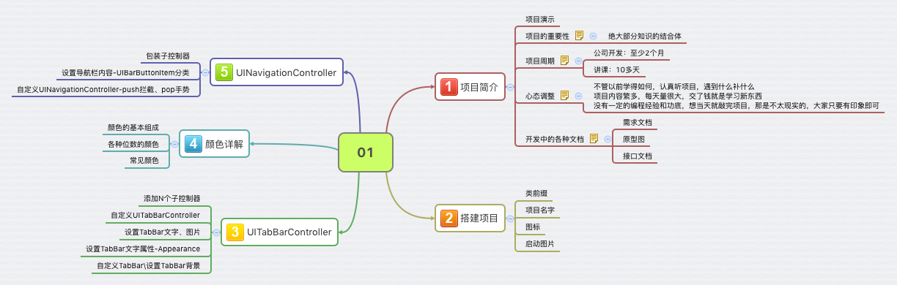
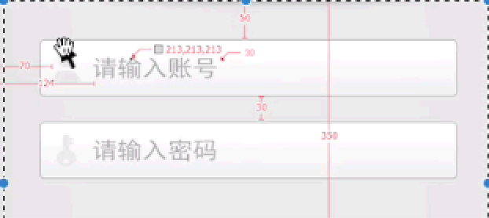
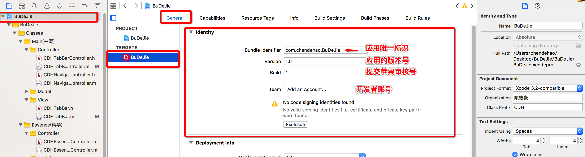
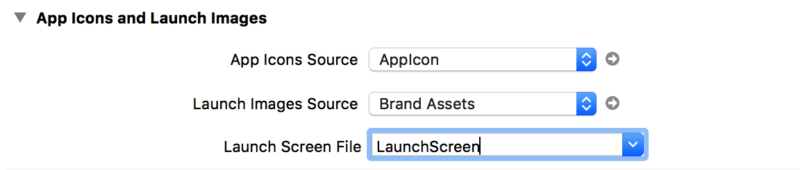

#项目常识

##1. 开发必备
- 1.需求文档(word版本/excelb版本): APP的功能需求说明
- 2.原型图(Axure-网页版/图片版): 界面的搭建及业务逻辑, 界面之间的跳转
- 3.接口文档(word版/网页版): 服务器人员(运维部门)提供给客户端获取数据的参考文档

- **像素的问题**:究竟是像素px还是点pt ,是像素就除以2
  '

- **颜色**
    - 颜色: 是由3各颜色通道组成:R, G, B (红,绿,蓝 色彩三原色)  255,255,255
    - 二进制:
        - 颜色由24位表示, 每个颜色通道占8位, 取值:0~255, 在OC中取值为:0~1.0
        - 颜色由32位表示,每个颜色通道占8位,R,G,B,A (红,绿,蓝,透明度)

    - 在html中,#表示16进制数; 在C/OC中,0x表示16进制数
    - 16进制颜色中每两位表示一个颜色通道,R, G, B (红,绿,蓝 色彩三原色)  ff,ff,ff:例如: “#123456”, “0X123456”
    - 由于OC中提供的方法对于颜色通道的取值范围为0~1.0,因此最好提供一个UIColor的分类来方便直接输入16进制字符串,或者0~255的表示分类如下:
    [>>点击此处跳转到开源项目查阅工具类的代码](https://git.oschina.net/chendehao001/ToolsClasses/tree/master/ToolsClasses/ToolsClasses/Classes/UIColor)

- **苹果应用唯一标识符**
    -  Bundle Identifier :上传AppStore  尽管在百度/友盟新浪等应用通过了审核,但是应用名称在苹果平台已经存在,耽误上架, 最好在项目开始就用开发者账号到 AppStore 上注册项目

  

- **系统适配**
    - 在低版本手机运行时,新的API会导致程序崩溃
    - 没有适配这个系统版本的工程就不要上传
  

- **程序启动过程的状态栏颜色**
  

- **Launch（启动页面）**
  
  
    - 1.将需要展示的图片放到assets中，在LaunchScreen.storyboard中设置图片，设置约束（推荐）
    - 2.或者在 Lauch Images Source -- Use Asset Catalog -- 弹框点击Migrate(不同版本不同，不选Cancel即可)，将需要展示的图片拖到assets新建的文件夹中
    - 3.对比：设置LaunchScreen.storyboard比Use Asset Catalog优先级高，推荐通过LaunchScreen.storyboard设置启动图片(或者可以这样理解: 前面通过 Use Asset Catalog 设置了启动图片, 但通过 LaunchScreen.storyboard 设置, 设置的是同一东西, 后面设置的会覆盖掉前面设置的)
    - 4.旧项目中是对启动图片有规定的命名，放在supportFiles中自动加载

    - **启动界面的注意点**
        - 因为模拟器和真机的可视范围是由启动图片确定的，如果通过第二种，会导致显示图片与真实不符。而第一种方法会自动适配机器
        - 通过LaunchScreen加载，可以只选择最大的图片，这样自动布局后可以兼容之前的版本。当然有条件的可以根据不同版本设置不同的启动图片。

