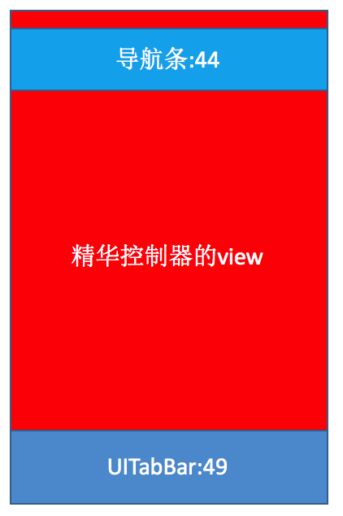
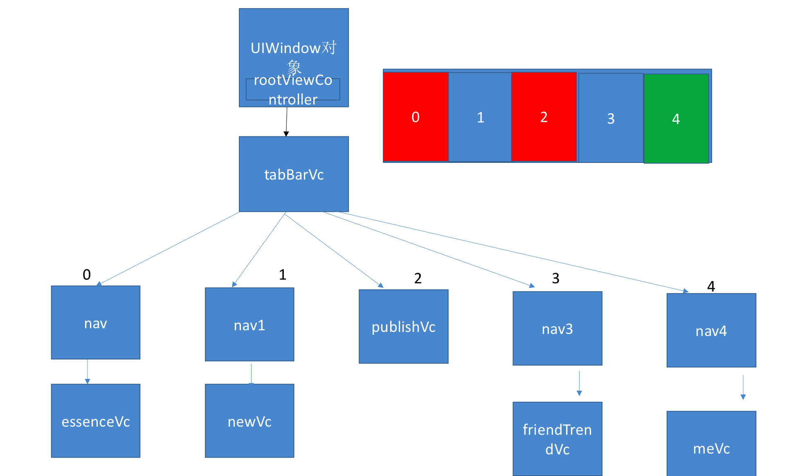

# 项目结构搭建

## 1. 结构搭建分析

- **1.开发方式： 纯代码 + xib**
    - 注:storyboard不适合大型项目开发，多人开发容易产生冲突；storyboard的不适用于继承，复用性差

- **2.主流结构： UITabBarController + UINavgationController**
    - 架构思想 MVC  MVVM MVCS VIPER:美团
    - 自定义类 -> 先看下有没有划分项目结构
    - 自定义类 -> 谁的事情谁管理 -> 方便以后修改需求,顺序找到对应的类做事情

- **3.自定义所有子控制器（精华，新帖，发布，关注，我）**

- **4.UITabBarController:会自动把第0个子控制器的view添加上去,后面控制器的view**

- **5.UINavgationController:会自动把栈顶控制器的view添加上去**

- **6.UINavgationController初始化方法initWithRootViewController会自动调用push**

##2. 主流结构如下:

  
  

---
 