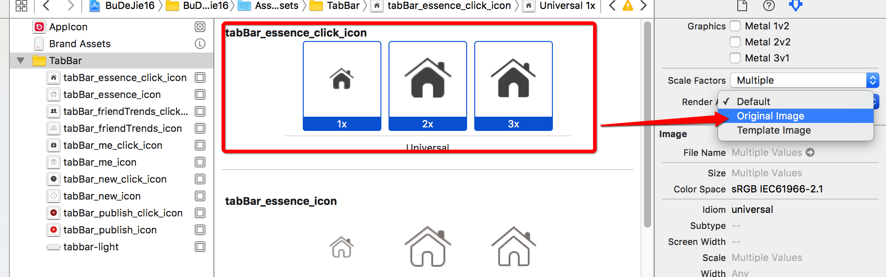
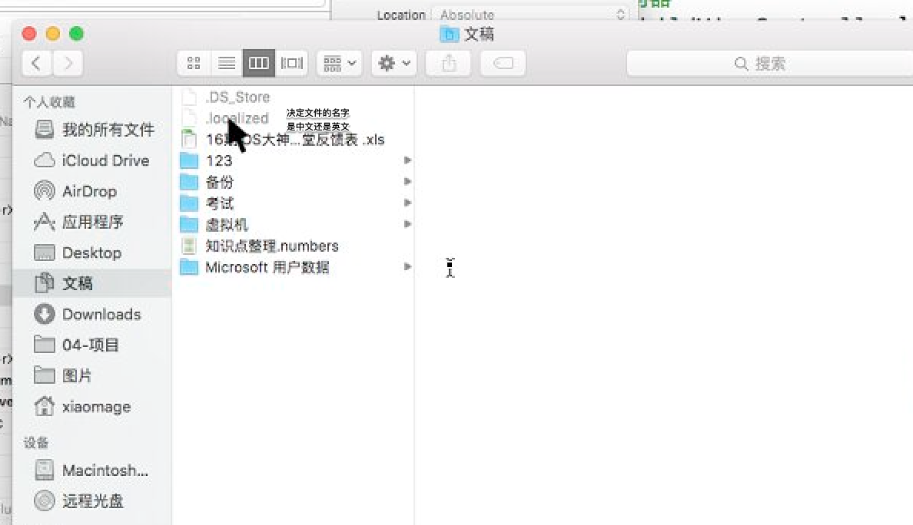

# 解决 tabBar上的图片和文字被渲染的问题

##1.解决:TabBarButton图片被渲染

- **1.可以在xcode中设置**

  
  
- **2.通过代码设置**
    - UIImage有一个方法可以设置图片渲染的模式的方法:
    - ` - (UIImage *)imageWithRenderingMode:(UIImageRenderingMode)renderingMode NS_AVAILABLE_IOS(7_0);`

  ```objc
  typedef NS_ENUM(NSInteger, UIImageRenderingMode){
          UIImageRenderingModeAutomatic,          // Use the default rendering mode for the context where the image is used
          UIImageRenderingModeAlwaysOriginal,     // Always draw the original image, without treating it as a template
          UIImageRenderingModeAlwaysTemplate,     // Always draw the image as a template image, ignoring its color information
  } NS_ENUM_AVAILABLE_IOS(7_0);
  ```

  ```objc
  //通过这个方法我们可以让图片不被渲染的.因为这个方法需要经常用到,因此最好提出一个分类,如下:
  + (UIImage *)imageNamedWithOriginal:(NSString *)name {
      UIImage *image = [UIImage imageNamed:name];
      image = [image imageWithRenderingMode:UIImageRenderingModeAlwaysOriginal];
      return image;
  }
  ```
  [>>点击此处跳转到我的开源项目 Images+Render 的分类查阅代码](https://git.oschina.net/chendehao001/ToolsClasses/tree/master/ToolsClasses/ToolsClasses/Classes/UIImage)
  
  
---
<br/>
  
## 2.解决: tabBarItem文字被渲染的
- **如何设置文字不要渲染?**
    - 技巧:不要记方法,忘记,直接跳入头文件去查找
    - 通过富文本属性去设置文字颜色,字体,阴影,下划线,图文混排等等


- **tabBarItem:模型 通过富文本属性设置字符串**
    - tabBarItem不是按钮,只是按钮对应模型


- **如何获取到这个 tabBarItem 属性?**

    - 因为需要统一设置,  因此可以通过appearance方法获取某个类的的属性.(平时不用这个方法, 而是另一个方法)

  ```objc
  /*
      1.appearance是什么?UIAppearance协议里面一个方法
      2.任何对象都可以使用appearance? 不能,只有遵守了UIAppearance协议,才能使用UIAppearance,所有的控件都可以使用appearance
      3.任何属性都可以通过appearance去设置吗?不是任何属性都可以通过appearance设置
      4.哪些属性可以通过appearance去设置,只有有UI_APPEARANCE_SELECTOR宏属性才可以通过appearance去设置
      5.如果一个属性通过appearance去设置,必须要保证在显示之前去设置
   */
  ```

- **在什么地方设置?**
    - **方法一:**
        - 如果在viewDidLoad方法中设置是不起效果的,应该在+load方法或者+initialize方法中设置.因为 +load方法是在程序启动加载代码的时候调用 / +initialize方法是在类创建的时候调用,都能能够保证view在加载完成时把相应属性设置好.
        - **注意: 在选中状态下设置文字字体不成功,应该在正常状态下去设置文字字体.**

  ```objc
  + (void)load
  {
      UITabBarItem *item = [UITabBarItem appearance];
      NSDictionary *titleDict =@{
                                 NSFontAttributeName :[UIFont systemFontOfSize:14],
                                 NSForegroundColorAttributeName : [UIColor grayColor]
                                 };
      // 注意: 在选中状态下设置文字字体不成功,应该在正常状态下去设置文字字体.
      [item setTitleTextAttributes:titleDict forState:UIControlStateNormal];
  }
  ```

-  **方法二: tintColor**
    - 每个继承于UIView的控件都有一个tintcolor的属性,用于描述主题颜色(字体和图片渲染的默认色彩).
    - 通过  self.tabBar.tintAdjustmentMode 的属性可以 设置主题颜色渲染的模式.

  ```objc
#pragma mark - 自定义 tabBar 
  - (void)setupTabBar{

      CDHTabBar * tabBar = [[CDHTabBar  alloc] init];

      // 替换系统的 tabBar KVC: 设置 readonly 属性
      [self setValue:tabBar forKey:@"tabBar"];
      /*
       1.查找有没有set方法
       2.查找有没有tabBar
       3.查找有没有_tabBar
       */

  //    通过设置这个属性也可以是图片为原有的状态, 不被渲染
      self.tabBar.tintAdjustmentMode = UIViewTintAdjustmentModeDimmed;
  /*
      typedefNS_ENUM(NSInteger, UIViewTintAdjustmentMode) {
          UIViewTintAdjustmentModeAutomatic,
          UIViewTintAdjustmentModeNormal,
          UIViewTintAdjustmentModeDimmed,
      } NS_ENUM_AVAILABLE_IOS(7_0);
   */
  }
  ```

---

##3. 补充: MAC 电脑上面的语言本地化文件


