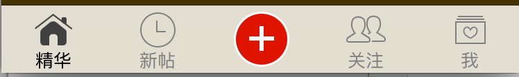

# 设置百思样式tabBar(系统属性 及 自定义tabBar)

##百思样式TabBar(即中间有一个加号图标,没有标题):

  


##1.系统属性设置实现

- **bug1:如果直接将中间的加号按钮设置上去, 按钮图片显示不出来:**
    - 因为图片超出 tabBar 的图片显示的位置
    - 普通状态下图片也被渲染: 图片尺寸跟tabBar高度一样,就会渲染
- **如何解决:**利用之前抽取出来的分类来得到一张不被渲染的图片.

  ```objc
  #import "UIImage+Render.h"
  ```
  ```objc
  UIViewController *vc2 = self.childViewControllers[2];//多态的使用
  vc2.tabBarItem.image = [UIImage imageNamedWithOriginal:@"tabBar_publish_icon"];
  vc2.tabBarItem.selectedImage = [UIImage imageNamedWithOriginal:@"tabBar_publish_click_icon"];
  ```


- **bug 2:图片的位置没有居中**
- **如何解决:** 去tabBarItem的头文件里找一下有没有相应的属性或者方法可以调整frame的. 发现 imageInsets 属性可以设置内边距.

  ```objc
   // 修改图片位置
      vc2.tabBarItem.imageInsets = UIEdgeInsetsMake(7, 0, -7, 0);
  ```


- **bug 3:按钮只有选中状态而没有高亮状态**
- **如何解决:** 在tabBarItem的头文件里找不到可以设置tabBar按钮的状态的属性或者方法, 通过系统属性或方法无法完全实现百思样式的tabBar,因此需要自定义tabBar来实现.


---
<br/>

##2.自定义tabBar实现
- **1.在类扩展中定义UIButton类的属性,方便在各个方法中获取这个属性, 需要懒加载方法创建:**

  ```objc
  - (UIButton *)plusBtn {
      if (!_plusBtn) {
          //通过分类实现对按钮的快速创建并监听点击事件
          UIButton *plusBtn = [[UIButton alloc]initWithImage:[UIImage imageNamed:@"tabBar_publish_icon"] highlightedImage:[UIImage imageNamed:@"tabBar_publish_click_icon"] addTarget:self action:@selector(plusBtnClick:)];
          // 按钮尺寸跟图片自适应
          [plusBtn sizeToFit];
          //一定要记得添加到tabBar上,否则无法显示.
          [self.tabBar addSubview:plusBtn];
          _plusBtn = plusBtn;
      }
      return _plusBtn;
  }
  ```


- **2.在viewDidLoad方法中设置按钮的位置:**(此方法一般不用)
- **一般都是在 layoutSubviews 方法中设置子控件的位置**
- 只要 frame 有修改都会调用 layoutSubviews 这个方法

  ```objc
  - (void)viewDidLoad {
      [super viewDidLoad];

      [self setupAllChildViewController];

       //在此设置位置能通过懒加载创建加号按钮
       self.plusBtn.center = CGPointMake(self.tabBar.CDH_width * 0.5, self.tabBar.CDH_height* 0.5);
  }
  //注意点: 按钮的中心位置不能直接设置为: self.plusButton.center = self.tabBar.center; 因为两者的坐标参考系不一样.
  ```
  ```objc
  - (void)layoutSubviews{

      [super layoutSubviews];
      // 设置加号按钮居中
      // 注意点: 按钮的中心位置不能直接设置为: self.plusBtn.center = self.tabBar.center; 因为两者的坐标参考系不一样.
      self.plusBtn.center = CGPointMake(self.CDH_width * 0.5, self.CDH_height * 0.5);
  }
  ```


- **3.让按钮能够点击**
- **bug: 添加的按钮无法点击, 点击出现的系统的按钮切换界面**
- **问题分析**: 新添加的按钮被tabBar上系统按钮覆盖了, 根据事件的传递和响应 , 系统的tabBar是最适合控件

  ```objc
  // tabBar上按钮比中间按钮 后 添加上去
  // tabBar上不是在viewDidLoad添加上去
  //  tabBar上按钮什么时候添加上去? viewWillAppear添加上去
  //    NSLog(@"%@",self.tabBar.subviews);
  // 技巧:如何判断一个方法做了什么事情,直接注释掉

  //- (void)viewWillAppear:(BOOL)animated
  //{
  //     NSLog(@"%@",self.tabBar.subviews);=
  //     [super viewWillAppear:animated];
  //     NSLog(@"%@",self.tabBar.subviews);
  //}
  ```

- **解决办法: **最快和方便的办法就是禁用该系统tabBar按钮

  ```objc
  UIViewController *placeholderVC = [[UIViewController alloc]init];
  //谁是tabBar的子控制器,就能获取tabBarItem的属性.
  placeholderVC.tabBarItem.enabled = NO;
```

- **4.实现自定义tabBar点击的方法(modal出新的界面)**

  ```objc
  - (void)plusBtnClick:(UIButton *)btn {
      CDHPublishViewController *publishVC = [[CDHPublishViewController alloc]init];
      [self presentViewController:publishVC animated:YES completion:^{
          nil;
      }];
  }
  ```