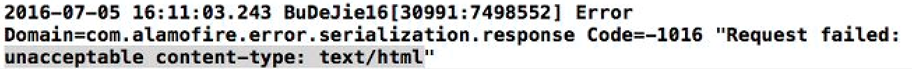
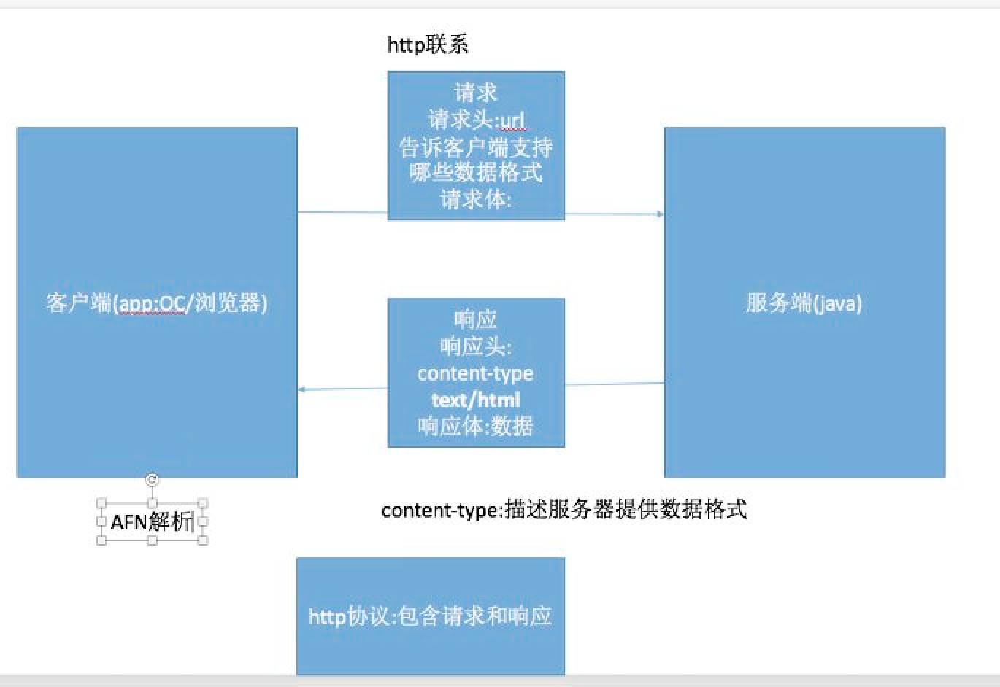
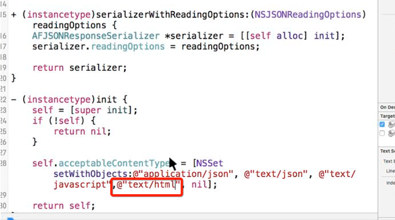

# 加载和解析广告界面数据 (AFN框架的使用)

- **业务逻辑:  加载广告数据 -> 接口文档 -> AFN加载数据 -> 解析数据**


- **AFN基本使用步骤:**
    - 创建请求会话管理者.
    - 拼接请求参数
    - 发送 http 请求(get/post)


- **根据接口文档,确定请求的url, 支持格式, http请求方式**
  - 完整URL = 基本URL?请求参数
  - 支持格式: JSON /  XML
  - get / post 请求

  ```objc
  // 加载广告数据
  - (void)loadData{
      // 请求数据 -> 查看接口文档 -> 测试接口有没有问题 -> 解析数据(w_picurl,ori_curl:广告界面跳转地址,w,h) arr = dict[@"ad"]
      // 1. 创建一个请求会话管理者
      AFHTTPSessionManager  *mage = [AFHTTPSessionManager manager];

      mage.responseSerializer = [AFJSONResponseSerializer serializer];
      mage.responseSerializer.acceptableContentTypes = [NSSet setWithObject:@"text/html"];

      // 2. 创建请求参数: 字典
      NSMutableDictionary * parameters = [NSMutableDictionary dictionary];
      parameters[@"code2"] = CDHCode2;
      // 3. 发送请求(get.post)
      [mage GET:@"http://mobads.baidu.com/cpro/ui/mads.php" parameters:parameters progress:nil success:^(NSURLSessionDataTask * _Nonnull task, NSDictionary *  _Nullable responseObject) {

          // 写成plist文件
          [responseObject writeToFile:@"/Users/chendehao/Desktop/BuDeJie/BuDeJie/BuDeJie/Classes/AD/ad.plist" atomically:YES];

          NSDictionary *adDict = [responseObject[@"ad"] firstObject];
          // 字典转模型
          _item = [CDHADItem mj_objectWithKeyValues:adDict];

          // 防止除以0
          if(_item.w <= 0)return ;

          CGFloat w = CDHScreenW;
          CGFloat h = CDHScreenH;
          self.imageView.frame = CGRectMake(0, 0, w, h);
          // 加载广告图片
          [self.imageView sd_setImageWithURL:[NSURL URLWithString:_item.w_picurl]];

      } failure:^(NSURLSessionDataTask * _Nullable task, NSError * _Nonnull error) {}];
  }
  ```

- **注意: 这里一定要配置接收服务器返回的的数据类型, 如果配置则默认是接收 JSON 类型, 控制就导致会出现下面的 bug**:
  - 1.ATS 特性- 解决 去plist文字中配置.
  - 2.unacceptable content-type

  


- **要解决第2个bug**, 就需要了解http协议通讯过程:

  

- 现在的问题是服务器返回的是text/html格式,但实际上是JSON数据(把整个请求的url拷贝到浏览器加载显示可以确实). 因此AFN解析不了而报错.即服务器返回的响应头中type的类型错误了.AFN默认是JSON解析.


- **解决办法**:
- **第一种方法**:需要修改AFN框架的内容.
    - 如果需要进入框架的头文件查找内容,那么应该从哪里入手?
    - 判断跳类还是方法
    - 如果想看这个类由于哪些功能,跳类
    - 如果想看这个类做了什么事情,跳方法
    - 去AFN框架内找到初始化方法 , 添加服务器返回的数据.(注:这个添加只有在服务器返回的真实数据是JSON数据时才能这样添加)

  
 

- **第二种方法**:设置 序列化支持类型.(要求同样是真实类型是JSON数据才可以这样设置)

  ```objc
  manager.responseSerializer = [AFJSONResponseSerializer serializer];
  manager.responseSerializer.acceptableContentTypes = [NSSet setWithObject:@"text/html"];
  ```


- 如何提取服务器返回的数据 ?
    - 服务器会返回很多数据, 不一定全部数据都有价值, 我们应该提取我们需要的数据
    - 把响应体的数据转换plist文件,再从plist文件转成字典数组, 再从字典转模型 得到有用的数据
    - 怎么获取plist文件?
    - 直接写到项目同级目录

  ```objc
  [responseObject writeToFile:[NSString stringWithFormat:@"/Users/chendehao/Desktop/BuDeJie/BuDeJie/BuDeJie/Classes/AD/ad.plist"atomically:YES];
  ```

- plist文件有好多内容,但只需要获取对我们有价值的可以

  ```objc
  //获取广告字典
  NSDictionary *adDict = [[responseObject objectForKey:@"ad"] firstObject];
  根据字典转成模型 , 新建一个WYADItem类保存模型 , 用MJExtension框架来字典转模型:
   WYADItem *adItem = [WYADItem mj_objectWithKeyValues:adDict];
  //定义属性来保存模型
  _adItem = adItem;
  ```
 
- 怎么确定模型需要哪些属性?即,如何知道字典中哪些数据有用的?
- 看看字典中有没有需要展示的数据,一般是图片格式, 如果找到有图片格式的url, 可以尝试把这个url拷贝到浏览器打开看看是不是就是需要的广告图片.然后需要图片的宽高(方便对图片的等比例缩放),广告跳转的url