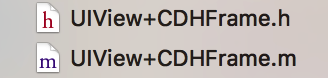

# 抽取UIView+Frame 分类
- **为什么要抽取UIView分类 ?**
- 因为我们经常要获取一个View的位置和尺寸, 即:x , y , weith , height.为了能够快速获取,我们应该把这个这些属性抽取出来

- **1.抽取的分类命名:**

  
 
 
- **注意点:**
    - 分类不能添加成员属性
    - @property如果在分类里面，只会自动生成get,set方法的声明，不会生成成员属性，和方法的实现
    - 注意: 最好加上前缀, 避免其他人也创建相同的分类

  
- **在`.h`文件中:**
  ```objc
  #import <UIKit/UIKit.h>

  @interface UIView (CDHFrame)

  // 分类不能添加成员属性
  // @property如果在分类里面，只会自动生成get,set方法的声明，不会生成成员属性，和方法的实现

  // 注意: 最好加上前缀, 避免其他人也创建相同的分类
  @property (nonatomic, assign) CGFloat CDH_x;
  @property (nonatomic, assign) CGFloat CDH_y;
  @property (nonatomic, assign) CGFloat CDH_width;
  @property (nonatomic, assign) CGFloat CDH_height;

  @end
  ```

- **在`.m`文件中: 重写get和set方法.**

  ```objc
  #import "UIView+CDHFrame.h"

  @implementation UIView (CDHFrame)

  - (void)setCDH_x:(CGFloat)CDH_x{

      CGRect frame = self.frame;
      frame.origin.x = CDH_x;
      self.frame = frame;
  }

  - (CGFloat)CDH_x{

      return self.frame.origin.x;
  }

  - (void)setCDH_y:(CGFloat)CDH_y{

      CGRect frame = self.frame;
      frame.origin.y = CDH_y;
      self.frame = frame;
  }

  - (CGFloat)CDH_y{

      return self.frame.origin.y;
  }

  - (void)setCDH_width:(CGFloat)CDH_width{

      CGRect frame = self.frame;
      frame.size.width = CDH_width;
      self.frame = frame;
  }

  - (CGFloat)CDH_width{

      return self.frame.size.width;
  }

  - (void)setCDH_height:(CGFloat)CDH_height{

      CGRect frame = self.frame;
      frame.size.height = CDH_height;
      self.frame = frame;
  }

  - (CGFloat)CDH_height{

      return self.frame.size.height;
  }
  @end
  ```

- [>>点击此处跳转到我的开源项目代码查看](https://git.oschina.net/chendehao001/ToolsClasses/tree/master/ToolsClasses/ToolsClasses/Classes/Category/UIView?dir=1&filepath=ToolsClasses%2FToolsClasses%2FClasses%2FCategory%2FUIView&oid=851806dd4dad26ee442aff145f0e0714e6cb1a29&sha=58afe9d339fa3d806e23934f857ff7ce3fe118b1)


