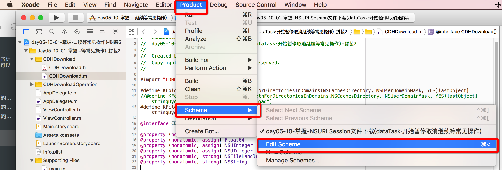
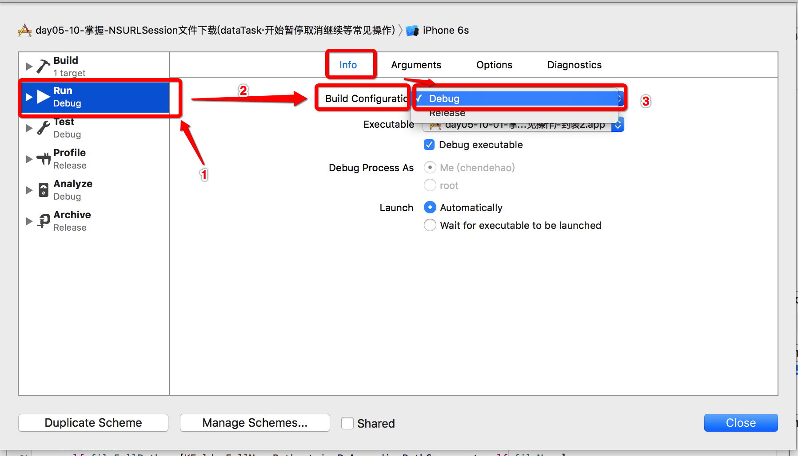
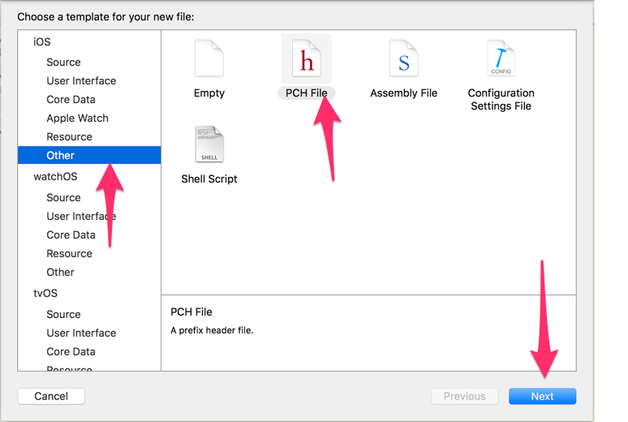
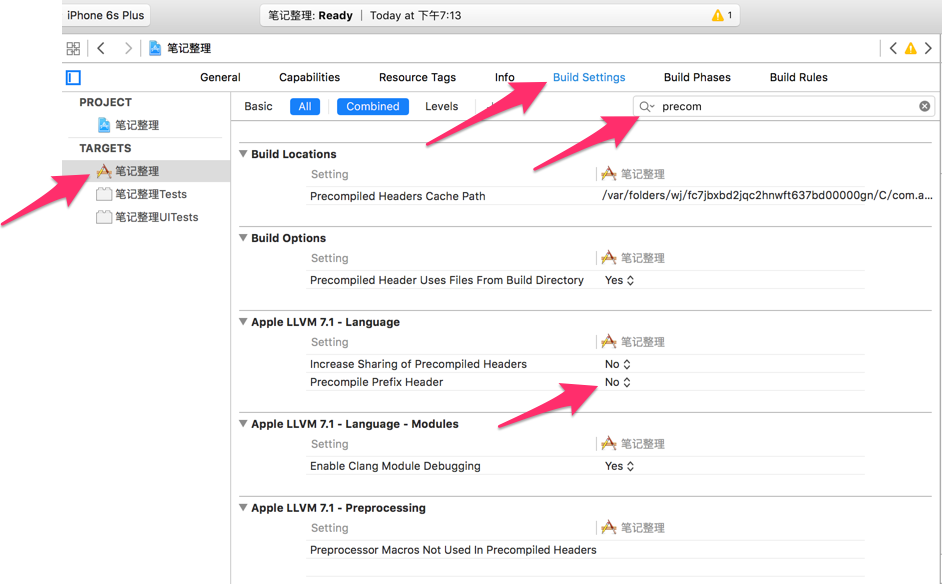
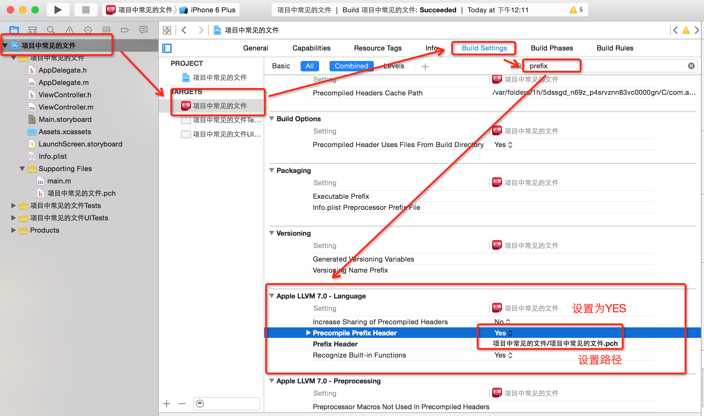
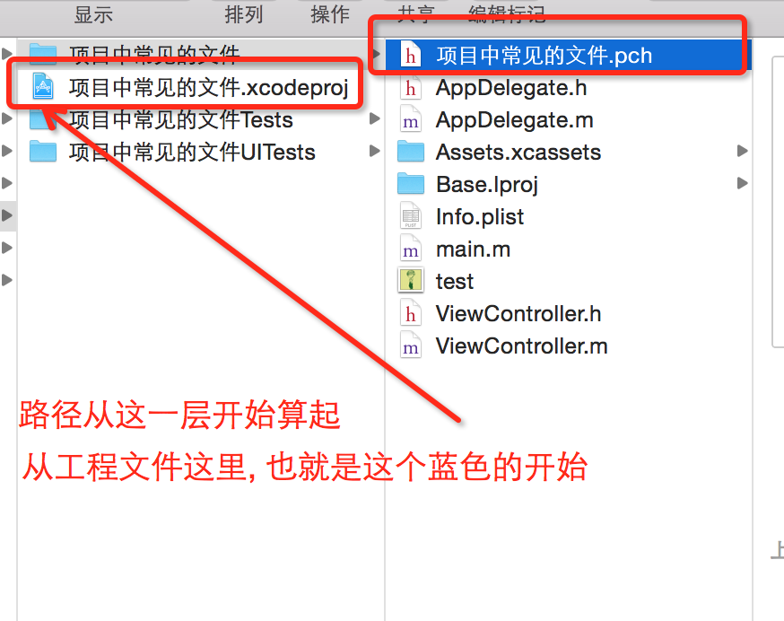

# 添加PCH文件

- **PCH文件**: 一般PCH的名称跟项目的名称相同.
- **PCH的作用**:
    - 只要在pch当中定义的东西, 会被整个应用程序共享.
    - PCH它是一个预编译文件,要告诉系统要提前编译它.要去做一些配置.
    - 存放一些公用的宏.系统的版本号的宏和一些屏幕的宏.
    - 存放一些公用的文件.分类的头文件
    - 存放一些自定义的 Log
    - 存放一些条件编译的内容

- **例如:**

    ```objc
    // 在宏当中,三个点...表示可变参数.
    // 在函数当中,表示可变参用:__VA_ARGS__
    // CDHLog(...) NSLog(__VA__ARGS__)

    // 自定义Log(自定义输出): 
    // 如果只想在调试阶段打印东西, 在编译阶段不打印某些内容, 
    // 则可以使用条件编译的宏来做, 如下
    #ifdef DEBUG // 调试阶段

    #define CDHLOG(...) NSLog(__VA_ARGS__)

    #else  // 其他阶段 如编译阶段

    #define CDHLOG(...)

    #endif
    ```

- **如何更改程序所处的阶段?如下:**

    
    

- 在xcode5当中,会自动生成一个pch文件,在Xcode6当中不会帮我们生成PCH文件.

- **在Xcode7中手动创建PCH文件与导入:**
- 创建PCH文件, 一般以工程项目名称命名
    
    
- 修改precompile Prefix Header选择为yes代表允许提前编译头文件(默认为NO)

    

- 在Buld Setting 当中找perfix 找到Precomplie prefix Header 为yes允许提前编译头文件(默认为NO)
    

- 设完这些后,再进行prefix Header的路径配置.路径从根层开始.(注意,这个路径要填写相对路径哦)
    