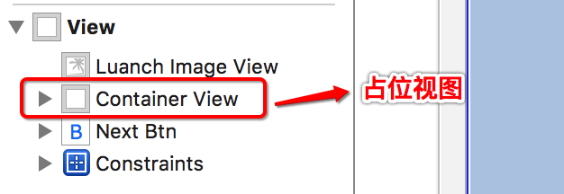

# 广告界面流程和搭建

- **程序一启动就显示广告界面 => 主框架界面**
- **广告界面是应该在哪里设置? 是在程序启动时设置, 还是程序启动完毕后再设置?**
    - 因为广告界面包含较多内容(控件及功能), 如果在程序启动时设置, 程序的好多环境还没有完善, 并且因此应该在程序完成后再设置广告界面.
    - 如果在程序启动时候做的设置广告界面不起作用

- **程序启动完成时进入广告界面, 为什么还能显示启动图片?**
    - 其实是一个假象, 程序启动完毕后进入广告界面,广告界面底层设置一个UIImageView来显示启动图片, 让用户有一个假象以为程序还在加载启动过程中, 因此用户会耐心等候程序加载, 这样用户体验更好一些.
    - 广告界面是一个功能模型, 应该新建一个AD类(MVC归档)来管理这个界面. 另外广告界面的内容比较固定, 所有使用xib来描述更加适合.

- **注意点: 当我们决定新建一个类并且用xib描述界面时, 应该在新建时勾选创建xib文件, 否则文件是不会被关联到对应的类, 需要手动绑定.**

---

##view的占位视图思想
- 广告界面中包含了3个控件, 一个是显示启动图片的imageView, 一个是显示广告的imageView, 一个是跳过按钮.
- 显示广告的imageView一开始是不确定的, 其尺寸大小由从服务器加载的数据来决定.那么可以imageView应该怎么设置?

- **广告ImageView可以获取到数据时加载到控制器的View上面吗?**
    - 不行, 最后添加的子控件会显示在最外层, 会把跳过按钮给覆盖
    - 这时还是应该按照广告界面的视图层级来布放子控制, 当一个控件一开始不能确定,需要从外界加载数据再确定其内容和frame时, 可以用一个UIView来替代它.当这个控件能够确定下来时, 把这个控件addSubView到UIView上, 这样就能保持视图的层级结构而做得子控件灵活加载的功能. 这个UIView可以称为占位视图, 或者容器.

  

- **总结: 当一个界面层次确定,但是具体内容不确定,可以使用占位视图思想**

---
 

##view的背景颜色透明, 文字不透明的效果
- 知识点: 当一个view有透明效果时,它的子控件也会跟着透明.
- **广告界面上的跳过按钮背景颜色是有透明效果, 能否直接设置button的alpha值实现?**
    - 不行, 这样文字也会有透明效果, 与示例程序效果不一样.

  
  
  
- **如何做到按钮的背景色透明而其文字不透明?**
    - 要想做一个view背景色透明而其子控件不透明, 就应该设置该view的backgroundColor的Opacity值.
