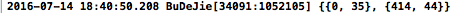

# "我的"界面


##1. 页面布局
- **设置导航条**

- **设置上面两个分组的cell**
    - 这里使用storyboard静态布局顶部的两个cell分组
    -  storyboard 一般用于静态单元格,以及多控制器
    -  关联一个storyboard, 创建的时候使用通过storyboard加载,
    -  **注意**: 要删除tableviewController 在创建的时候系统已经帮我们实现的数据源方法(0行.0组)


- **设置其他应用的流水布局**
    -  初始化tableview的footView, 在这里添加collectionView, 
    -  并设置数据源, 这里自定义collectionViewCell , 注册collectionView的 cell
    -  实现流水布局, 
    -  实现collectionView相应得数据源方法
    -  显示cell的内容


- **加载流水布局中的数据**
    - 发送请求 -> 查看接口文档 -> AFHTTPSessionManager...
    - 解析数据
        - 放回字典数组, 写成plist文件
        - 字典数组转换成模型
        - 刷新数据:**注意这里是定义collectionView属性的数据**

---
<br/>

##2.细节完善
- **问题1**
    - collectionView 高度 --> 根据cell行高
    - collectionCiew 不能滚动
- **解决1**
    - 在加载数据完成是计算总的行数, 即可计算出中的高度
    - 行数 = (总数 - 1) / 列数 + 1;(这个计算公式可以省略取余)
    - 高度 = 行数 \* 单个cell高度 + (行数 - 1) \* 行间距 (**注意:tableview的滚动范围是自动根据内容计算, 不需要我们自己手动管理, 如果是自己管理会有可能不准确**)
    - 这里在刷新数据之前collectionView中是没有内容的, 所有计算tableview自己计算出来的滚动范围和加载数据完成并且刷新数据之后collectionView有了内容的滚动范围是不一样的, 因此要重新给tableview的FootView重新设置(赋值)之后才会重新再次根据tableview中的内容计算滚动范围
- **问题2**
    - 处理数据, 将collectionView的最后一行不够满, 用空白的cell 填充
- **解决2**
    - 数据处理:最后一行用空白cell补全
    - 取模获取最后一行的个数, 计算出缺少的个数, 修改数据数据补全
- **问题3**
    - 静态cell的每一组有默认间距
- **解决3**
    - 如果是分组样式,默认每组都会有头部和尾部间距
    - 设置tableview组间距
- **问题4**
    - 第一行cell距离导航条高度太大
- **解决4**
    - 点击选中时打印frame, 可以知道是y太大(group样式默认35间距)

  ```objc
  #pragma mark - tableViewDelegate
  - (void)tableView:(UITableView *)tableView didSelectRowAtIndexPath:(NSIndexPath *)indexPath{

      UITableViewCell *cell = [tableView cellForRowAtIndexPath:indexPath];
      CDHLog(@"%@",NSStringFromCGRect(cell.frame));
  }
  ```
  

    - 修改frame的y值
    - 设置顶部滚动区域偏移量tableview.contentInset 属性即可修改tableviewcell的第一行cell距离导航条的间距


##3. 点击小格子进入新的界面
- **如何判断是网页:** 
    - 界面响应的时间
    - 根据服务器的数据


- **跳转界面**
    - 设置collectionView的代理方法, 实现选中cell是会调用的方法`collectionView: didSelectItemAtIndexPath:`
    - UIWebView:在当前应用打开
    - UIWebView没有这些功能,必须手动去实现,进度条做不了.(有也是假象)
    - safari:跳转到safari应用,离开当前应用
    - safari:自带很多功能,前进,后退,刷新,进度条,网址
    - 在当前应用打开网页,但是要有safari功能,自己去写
    - **iOS9开始有: SFSafariViewController**:在当前应用打开网页,跟safari同样一样
        - 第一步:导入`#import <SafariServices/SafariServices.h>`
        - 注意:modal出来的系统都帮我们做了很多事情:点击返回按钮时会自动销毁 modal出来的控制器,并且不用设置代理, 
        - 注意: 如果是push出来的, 则需要通过设置代理, 实现代理方法才能返回上一个界面

  ```objc
  CDHSquareItem *item = self.squares[indexPath.row];

  // 如果不包含 http 开头的这这不是跳转链接
  if (! [item.url containsString:@"http"]) return;

  NSURL *url = [NSURL URLWithString:item.url];
  // UIWebView:在当前应用打开
  // UIWebView没有这些功能,必须手动去实现,进度条做不了.
  // safari:跳转到safari应用,离开当前应用
  // safari:自带很多功能,前进,后退,刷新,进度条,网址
  ```
  ```objc
  // 方法一:
  // 在当前应用打开网页,但是要有safari功能,自己去写
  // iOS9: SFSafariViewController:在当前应用打开网页,跟safari同样一样
  // 第一步:导入#import <SafariServices/SafariServices.h>
  // 注意:modal 出来的系统都帮我们做了很多事情:点击返回按钮时会自动销毁 modal出来的控制器,并且不用设置代理,
  // 注意: 如果是push出来的, 则需要通过设置代理, 实现代理方法才能返回上一个界面

  SFSafariViewController *safariVc = [[SFSafariViewController alloc] initWithURL:url];
  [self presentViewController:safariVc animated:YES completion:nil];
  ```

    - **iOS8才有WKWebView:  **UIWebView升级版,监听进度条,数据缓存
        - 使用步骤(这里是自定义了控制器,在控制器创建爱你一个WebView)
        - 1.导入 WebKit框架
        - 创建WKWebView 的对象
        - 加载网页(注意: 注意不要挡住进度条, 用 insetSubView... 添加到父控件)
        - **注意: 这个属于不常用的框架苹果默认是不添加进来参与编译, 要手动添加框架**
        - **加载网页**
        - 进入框架可以搜索到进度条 estimatedProgress ,并且是有说明用KVO监听
        - 实现监听
        - 实现监听方法(只要监听到的属性有新值就会调用)
        - 监听完成一定要移除观察者
        - 添加进度条(注意: 到进度条不要被后面加载的视图挡住, 要定位 y = 64)
        - 进度为1.0 的时候要隐藏进度条

  ```objc
  // 方法二:
  // WKWebView: UIWebView 升级版 , 要监听进度条, 数据缓存, ios8才有
  CDHWebViewController *webVc = [[CDHWebViewController alloc] init];
  // 上面这句代码直接使用 alloc / init 写法, 会自己找到同名的 xib 加载控制器视图
  webVc.url = url;
  [self.navigationController pushViewController:webVc animated:YES];
  ```

  ```objc
  #import <UIKit/UIKit.h>
  @interface CDHWebViewController : UIViewController
  @property (nonatomic , strong) NSURL *url;
  @end
  ```

  ```objc
  #import "CDHWebViewController.h"
  #import <WebKit/WebKit.h>

  @interface CDHWebViewController ()
  @property (weak, nonatomic) IBOutlet UIProgressView *progressView;
  @property (nonatomic , weak) WKWebView *webView;

  @end

  @implementation CDHWebViewController

  - (void)viewDidLoad {
      [super viewDidLoad];
      self.view.frame = CDHScreenBounds;

      // 创建一个 webView
      WKWebView *webView = [[WKWebView alloc] initWithFrame:self.view.bounds];

      // 插入到导航条下面
      // [self.view insertSubview:webView atIndex:0];
      [self.view insertSubview:webView belowSubview:_progressView];
      // 引用数据
      _webView = webView;

      // 加载网页
      NSURLRequest *request = [NSURLRequest requestWithURL:_url];
      [webView loadRequest:request];

      // 使用 KVO 监听
      [webView addObserver:self forKeyPath:@"estimatedProgress" options:NSKeyValueObservingOptionNew context:nil];
  }

  // 实现监听方法
  - (void)observeValueForKeyPath:(NSString *)keyPath ofObject:(id)object change:(NSDictionary<NSString *,id> *)change context:(void *)context{

      _progressView.progress = _webView.estimatedProgress;
      _progressView.hidden = _progressView.progress >= 1.0;
  }

  // 移除监听者
  - (void)dealloc{
      [self.webView removeObserver:self forKeyPath:@"estimatedProgress"];

      // 注意 ARC 项目不需要在写下面这行代码, 系统已经帮我们这做了这个
      // 如果在写上就会报错
  //    [super dealloc];
  }
  ```


---
<br/>
