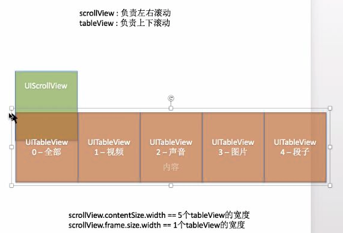

# "精华"控制器
- **先在"精华"控制器添加 UIScrollview**
- **再往"精华"控制器添加标题栏 UIView**

- **底层是UIScrollView, scrollview中五个tableview子控件**
    - scrollView的大小是手机屏的大小, 
    - scrollView.contentSize.width == 5 个tableview的宽度
        - contentSize限制滚动范围
    - scrollview.frame.size.width == 1个tableview的宽度
        - frame.width是限制可视范围 和 分页尺寸

  