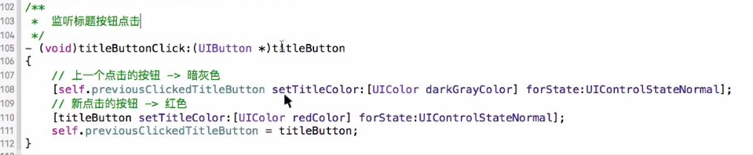

# 添加标题按钮

- **给标题栏添加按钮**
    - **注意: 这里的按钮是自定义按钮类型**

  ```objc
  // 给标题栏添加按钮
  NSArray *titleArray = @[@"全部",@"视频",@"声音",@"图片",@"段子"];
  NSInteger count = titleArray.count;
  CGFloat titlwWidth = titleView.CDH_width / count;
  for (NSInteger i = 0; i < count; ++i) {

      CDHTitleButton *titleButton = [[CDHTitleButton alloc] init];
      titleButton.tag = i;
      [titleView addSubview:titleButton];
      [titleButton setTitle:titleArray[i] forState:UIControlStateNormal];
      titleButton.frame = CGRectMake(i * titlwWidth, 0 , titlwWidth, titleView.CDH_height);
      // 监听按钮点击事件
      [titleButton addTarget:self action:@selector(clickTitleButton:) forControlEvents:UIControlEventTouchUpInside];
  }
  ```

-  **实现监听按钮点击事件的方法**
     - **注意: **代码的先后顺, 下面代码是有问题的, 如果对一个按钮连点 2次及以上就出问题了

  

    - 如下面代码顺序正确了, 连点多次也是没有问题了
 
  
  
- 在监听的时候恢复颜色和按钮初始化的颜色要一样, 这样就比较麻烦了, 这时候我们就可以一次性给按钮设置对应状态的颜色,只要给按钮修改状态, 状态修改,则会显示对应的颜色

  ```objc
  // 在自定义按钮中统一设置所有标题按钮各种状态的颜色
  - (instancetype)initWithFrame:(CGRect)frame{
      if ([super initWithFrame:frame]) {
          // 在这里统一设置字体颜色这字体的大小
          self.titleLabel.font = [UIFont systemFontOfSize:16];
          [self setTitleColor:[UIColor whiteColor] forState:UIControlStateNormal];
          [self setTitleColor:[UIColor redColor] forState:UIControlStateSelected];
      }
      return self;
  }
  ```

  ```objc
  /**
   *  监听标题按钮点击
   */
  - (void)titleButtonClick:(XMGTitleButton *)titleButton
  {
      // 修改按钮的状态
      // 上一个点击的按钮 -> 暗灰色
      self.previousClickedTitleButton.selected = NO;
      // 新点击的按钮 -> 红色
      titleButton.selected = YES;
      self.previousClickedTitleButton = titleButton;

      // 下划线
      [UIView animateWithDuration:0.25 animations:^{
          self.titleUnderline.xmg_width = titleButton.titleLabel.xmg_width + 10;
          self.titleUnderline.xmg_centerX = titleButton.xmg_centerX;
      }];
  }
  ```

- 注意: 如果使用选中状态, 还是能够接受事件, 这时候如果在点击, 就会有选中状态和高亮状态都设置了, 这时候就会显示 normal 的颜色了, 因此要自定按钮,将高亮状态取消(重写高亮状态的 get / set 方法,)即可

  ```objc
  /**
   *  不让按钮达到高亮状态
   */
  - (void)setHighlighted:(BOOL)highlighted {}
  ```

- 注意: 由于字体大小和状态的某些属性是一样的, 则这时候要在 init… 构造方法中写即可

  ```objc
  - (instancetype)initWithFrame:(CGRect)frame
  {
      if (self = [super initWithFrame:frame]) {
          self.titleLabel.font = [UIFont systemFontOfSize:16];
          // 文字颜色
          [self setTitleColor:[UIColor darkGrayColor] forState:UIControlStateNormal];
          [self setTitleColor:[UIColor redColor] forState:UIControlStateSelected];
      }
      return self;
  }
  ```