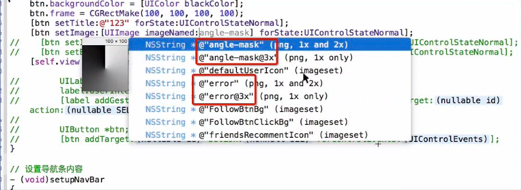
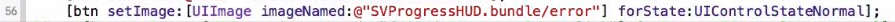

# 补充: 有关图片加载问题

## 1.图片是否在 Assets.xcassets中
- **注意: **这里显示出来的图片名字不是都能直接加载, 由于这里使用了图片插件, 也就会将整个工程文件下所有图片都扫描, 只有后面有显示imageset 才在 Assets.xcassets 中(并且是有效的)
- 而不在 Assets.xcassets 中的图片, 插件提示是不带有 imageset 后缀,

- 像这些不带有 imageSet 后缀的图片如果直接是在工程目录下, 没有被打包也是可以直接根据图片名称加载图片使用, 但如果该图片被打包到某个 bundle 中就要写清除这个图是在哪个 bundle 中, (…bundle/ 图片名称); 示例如下:
