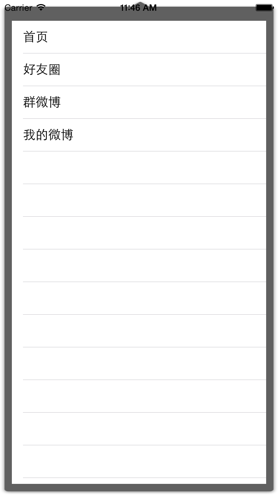

# Popup选项菜单

## 目标

* 点击标题按钮，弹出选项菜单

## 说明

* 为了让功能解藕，弹出表格实际上是一个视图控制器
* 而弹出动作可以利用 `UIPresentationController` 来实现

## 功能实现

### 基本功能实现

* 将素材中的 `Popover` 目录拖入 `Images.xcassets`
* 设置图片的切片


> 由于 Xcode 6.3 点击 `Show Slicing` 会闪退，直接在右侧工具栏设置即可

* 在 `Home` 目录中新建 `Popover` 目录
* 新建 `PopoverViewController` 继承自 `UIViewController`
* 在 Storyboard 中添加一个 `UIViewController`
* 界面布局


* 设置自定义类和 Storyboard 标识符


* 设置自定义 Cell 可重用标识符 `PopupCell`
* 设置表格的数据源为 `PopoverViewController`
* `PopoverViewController` 代码

```swift
/// 好友分组
lazy var friendGroup: [String] = {
    return ["首页", "好友圈", "群微博", "我的微博"];
    }()

// MARK: - Table view data source
func tableView(tableView: UITableView, numberOfRowsInSection section: Int) -> Int {
    return friendGroup.count;
}

func tableView(tableView: UITableView, cellForRowAtIndexPath indexPath: NSIndexPath) -> UITableViewCell {
    let cell = tableView.dequeueReusableCellWithIdentifier("PopupCell", forIndexPath: indexPath) as! UITableViewCell

    cell.textLabel?.text = friendGroup[indexPath.row]

    return cell
}
```

* 修改 `HomeTableViewController` 中标题按钮点击事件

```swift
///  点击标题按钮
@IBAction func titleBtnClick() {
    if !userLogon {
        return
    }

    titleButton.selected = !titleButton.selected

    let sb = UIStoryboard(name: "Home", bundle: nil)
    let popover = sb.instantiateViewControllerWithIdentifier("PopoverController") as! PopoverViewController
    presentViewController(popover, animated: true, completion: nil)
}
```

> 提示：使用 `Storyoard ID` 可以在 Storyboard 中设置独立的视图控制器

* 运行测试




### 使用 UIPresentationController 接管 Modal

#### 第1步：自定义 `UIPresentationController`

* 新建 `PopoverPresentationController` 继承自 `UIPresentationController`
* 重写 init 函数

```swift
class PopoverPresentationController: UIPresentationController {
    override init(presentedViewController: UIViewController!, presentingViewController: UIViewController!) {
        // presentedViewController 是要 Modal 展现的视图控制器
        super.init(presentedViewController: presentedViewController, presentingViewController: presentingViewController)
    }
}
```

#### 第2步：遵守 `UIViewControllerTransitioningDelegate`

* 在 `HomeTableViewController` 中添加 `UIViewControllerTransitioningDelegate` 扩展

```swift
extension HomeTableViewController: UIViewControllerTransitioningDelegate {

    func presentationControllerForPresentedViewController(presented: UIViewController, presentingViewController presenting: UIViewController!, sourceViewController source: UIViewController) -> UIPresentationController? {

        // 返回自定义展现控制器
        return PopoverPresentationController(presentedViewController: presented, presentingViewController: presenting)
    }
}
```

#### 第3步，修改 Modal 代码

```swift
let sb = UIStoryboard(name: "Home", bundle: nil)
let popover = sb.instantiateViewControllerWithIdentifier("PopoverController") as! PopoverViewController

// 设置转场动画代理
popover.transitioningDelegate = self
// 设置 Modal 展现样式
popover.modalPresentationStyle = UIModalPresentationStyle.Custom

presentViewController(popover, animated: true, completion: nil)
```

> 运行测试，使用视图层次结构查看前后两种 Modal 的实际运行效果

结论：

* 默认情况下，`Modal` 展现视图控制器会将之前的视图控制器移出
* 而使用 `UIPresentationController` 可以同时保留两个视图控制器的视图，从而能够达到弹窗的效果

> `UIPresentationController` 是 iOS 8.0 新推出的专门封装 Modal 转场动画的控制器

* `UIPresentationController` 的重要概念
    * `containerView` 容器视图
    * `presentedView()` Modal 展现的视图
    * `presentedViewController` Modal 展现的视图控制器

### 设置 Modal 控制器大小

* 在 `PopoverPresentationController` 中重写 `containerViewWillLayoutSubviews` 方法

```swift
///  容器视图将要布局子视图
override func containerViewWillLayoutSubviews() {
    super.containerViewWillLayoutSubviews()

    presentedView().frame = CGRectMake(100, 56, 200, 300)
}
```

> 运行测试

* 修改 `Home.Storyboard`
    * 取消表格分隔线
    * 设置 `表格` & `Cell` 的背景颜色为 `cleanColor`

> 下一目标 —— 点击空白位置关闭视图控制器

### 点击空白位置关闭视图控制器

* 定义遮罩视图属性

```swift
/// 遮罩视图
lazy var dummingView: UIView = {
    let v = UIView()
    v.backgroundColor = UIColor(white: 0, alpha: 0.2)

    return v
}()
```

* 在实例化函数中准备遮罩视图

```swift
override init(presentedViewController: UIViewController!, presentingViewController: UIViewController!) {
    // presentedViewController 是要 Modal 展现的视图控制器
    super.init(presentedViewController: presentedViewController, presentingViewController: presentingViewController)

    // 准备遮罩视图
    prepareDummingView()
}
```

* 准备遮罩视图

```swift
/// 遮罩视图
lazy var dummingView: UIView = {
    let v = UIView()
    v.backgroundColor = UIColor(white: 0, alpha: 0.2)

    let tap = UITapGestureRecognizer(target: self, action: "clickDummingView")
    v.addGestureRecognizer(tap)

    return v
}()

///  点击遮罩视图
func clickDummingView() {
    presentedViewController.dismissViewControllerAnimated(true, completion: nil)
}
```

> `init` 的时候，`containerView` 还没有被创建

* 在 `presentationTransitionWillBegin` 方法中添加遮罩视图
* 此方法是转场开始之前被调用，此时 `containerView` 已经建立

```swift
///  转场开始之前，插入遮罩视图
override func presentationTransitionWillBegin() {
    dummingView.frame = containerView.bounds
    containerView.insertSubview(dummingView, atIndex: 0)
}
```

> 运行测试

* 修改 `clickDumming()` 函数，关闭视图控制器

```swift
///  遮罩视图点击方法
func clickDumming() {
    println(__FUNCTION__)

    // 关闭 Modal 的控制器
    presentedViewController.dismissViewControllerAnimated(true, completion: nil)
}
```

> 下一目标 —— 自定义转场动画

### 自定义转场动画

* 在 `HomeTableViewController` 的 `UIViewControllerTransitioningDelegate` 实现以下方法，指定负责 `展现` 转场动画的对象

```swift
///  指定负责 `展现` 转场动画的对象
func animationControllerForPresentedController(presented: UIViewController, presentingController presenting: UIViewController, sourceController source: UIViewController) -> UIViewControllerAnimatedTransitioning? {
    return self
}
```

* 实现 `UIViewControllerAnimatedTransitioning` 协议方法

```swift
extension HomeTableViewController: UIViewControllerAnimatedTransitioning {

    ///  转场动画时间
    func transitionDuration(transitionContext: UIViewControllerContextTransitioning) -> NSTimeInterval {
        return 0.5
    }

    ///  自定义转场动画
    func animateTransition(transitionContext: UIViewControllerContextTransitioning) {

    }
}
```

> 运行测试，通过视图层次结构可以看到，一旦实现了以上代理方法，要展现视图的出现需要程序员负责

#### 转场上下文

* `transitionContext` 定义了转场时需要的元数据，比如在转场过程中所参与的视图控制器和视图的相关属性
* 重要属性
    * 来源视图
    * 来源视图控制器
    * 目标视图
    * 目标视图控制器
* 重要方法
    * `completeTransition` 通知转场动画完成

* 自定义转场动画方法

```swift
///  自定义转场动画
func animateTransition(transitionContext: UIViewControllerContextTransitioning) {

    let fromVC = transitionContext.viewControllerForKey(UITransitionContextFromViewControllerKey)
    let fromView = fromVC?.view
    let toVC = transitionContext.viewControllerForKey(UITransitionContextToViewControllerKey)

    println("fromVC \(fromVC) toVC \(toVC)")

    if let toView = toVC?.view {
        transitionContext.containerView().addSubview(toView)

        transitionContext.completeTransition(true)
    }
}
```

> 运行测试

#### dismiss 动画

* 在 `HomeTableViewController` 的 `UIViewControllerTransitioningDelegate` 实现以下方法，指定负责 `消失` 转场动画的对象

```swift
///  指定负责 `消失` 转场动画的对象
func animationControllerForDismissedController(dismissed: UIViewController) -> UIViewControllerAnimatedTransitioning? {
    return self
}
```

* 实现了此代理方法之后，同样会调用之前的 `animateTransition` 函数
* 为了更方便地区分是`展现`还是`消失`，可以定义一个属性记录
* 在 `HomeTableViewController` 中定义一个属性

```swift
// 是否展现标记
var isPresenting = false
```

* 在 `展现/消失` 代理函数中增加标记设置

```swift
///  指定负责 `展现` 转场动画的对象
func animationControllerForPresentedController(presented: UIViewController, presentingController presenting: UIViewController, sourceController source: UIViewController) -> UIViewControllerAnimatedTransitioning? {
    isPresenting = true

    return self
}

///  指定负责 `消失` 转场动画的对象
func animationControllerForDismissedController(dismissed: UIViewController) -> UIViewControllerAnimatedTransitioning? {
    isPresenting = false

    return self
}
```

* 处理动画函数

```swift
///  自定义转场动画
func animateTransition(transitionContext: UIViewControllerContextTransitioning) {

    if isPresenting {
        let toView = transitionContext.viewForKey(UITransitionContextToViewKey)!
        transitionContext.containerView().addSubview(toView)
    } else {
        let toView = transitionContext.viewForKey(UITransitionContextFromViewKey)!
        toView.removeFromSuperview()
    }

    transitionContext.completeTransition(true)
}
```

> 运行测试

* 添加动画代码

```swift
func animateTransition(transitionContext: UIViewControllerContextTransitioning) {

    if isPresented {
        let toView = transitionContext.viewForKey(UITransitionContextToViewKey)!
        transitionContext.containerView().addSubview(toView)
        toView.transform = CGAffineTransformMakeScale(1.0, 0)
        toView.layer.anchorPoint = CGPointMake(0.5, 0)

        UIView.animateWithDuration(transitionDuration(transitionContext),
            delay: 0,
            usingSpringWithDamping: 0.8,
            initialSpringVelocity: 5.0,
            options: nil,
            animations: {
                toView.transform = CGAffineTransformMakeScale(1.0, 1.0)
        }, completion: { (_) in
            toView.transform = CGAffineTransformIdentity
            transitionContext.completeTransition(true)
        })
    } else {
        let fromView = transitionContext.viewForKey(UITransitionContextFromViewKey)!
        fromView.removeFromSuperview()
        transitionContext.completeTransition(true)
    }
}
```

> 在本演练中，其实不加动画效果反而更好！有关 `UIPresentationController` 的使用，后续课程还会遇到

