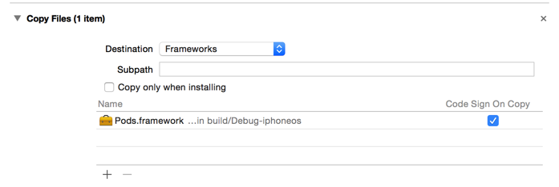

# 第三方框架

## 项目中使用到以下第三方框架

* `AFNetworking`
* `SDWebImage`
* `SVProgressHUD`

## Pod 安装

* git 备份
* 打开终端
* `$ cd` 进入项目目录
* 输入以下终端命令建立或编辑 `Podfile`

```bash
$ vim Podfile
```

* 输入以下内容

```
use_frameworks!
pod 'AFNetworking'
pod 'SDWebImage'
pod 'SVProgressHUD'
```

* `:wq` 保存退出

> 在 Swift 项目中，cocoapod 仅支持以 Framework 方式添加框架，因此需要在 Podfile 中添加 `use_frameworks!`

## 在终端提交添加的框架

```bash
# 将修改添加至暂存区
$ git add .

# 提交修改并且添加备注信息
$ git commit -m "添加第三方框架"

# 将修改推送到远程服务器
$ git push
```
## 真机调试设置


