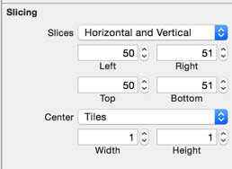
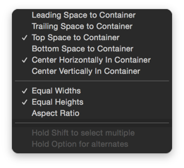

# 用户界面搭建

## 文件准备

* 新建 `QRCodeViewController.swift` & `QRCode.storyboard`
* 在 `Storyboard` 中添加 `UIViewController` 并且指定子类
* 在视图控制器上嵌入 UINavigationController


### 加载视图控制器

* 在 `HomeTableViewController` 中增加 `scanQRCode` 函数，显示 `QRCode` 控制器

```swift
///  显示扫描二维码界面
func scanQRCode() {
    let sb = UIStoryboard(name: "QRCode", bundle: nil)
    presentViewController(sb.instantiateInitialViewController()!, animated: true, completion: nil)
}
```

* 添加导航栏按钮监听方法

```swift
let btn = navigationItem.rightBarButtonItem?.customView as! UIButton
btn.addTarget(self, action: "scanQRCode", forControlEvents: UIControlEvents.TouchUpInside)
```

### 界面布局

* 添加素材
* 将 `Navigation Bar` 的 Style 设置为 `Black`
* 增加 `UITabBar`
    * 在之前版本中，分 `二维码扫描` 和 `条形码扫描` 两种方式

* 在屏幕中心添加扫描视图
    * 垂直居中
    * 水平居中
    * 宽度：300
    * 高度：300
    * 背景色：clearColor

* 在扫描视图内部添加`边框图像视图`，边框图片切片如下



## Tabbar选择切换

* TabBar 的 `Style` 修改为 `Black`
* 默认选中第一项

```swift
@IBOutlet weak var tabBar: UITabBar!

override func viewDidLoad() {
    super.viewDidLoad()

    tabBar.selectedItem = tabBar.items![0]
}
```

* 通过代理监听 Item 选中事件

```swift
func tabBar(tabBar: UITabBar, didSelectItem item: UITabBarItem!) {
    heightConstraint.constant = weightConstraint.constant * (item.tag == 1 ? 0.5 : 1)
}
```

## 冲击波动画

* 添加冲击波图片，并且设置相对于 `扫描视图` 的参照



* 实现冲击波动画

```swift
override func viewDidAppear(animated: Bool) {
    super.viewDidAppear(animated)

    scanAnimation()
}

///  冲击波动画
func scanAnimation() {
    // 停止图层动画
    scanImage.layer.removeAllAnimations()
    // 设定动画初始约束
    self.topScanConstraint.constant = -heightConstraint.constant
    // 更新视图布局
    self.view.layoutIfNeeded()

    // 开始动画
    UIView.animateWithDuration(2.0, animations: { () -> Void in
        self.topScanConstraint.constant = self.heightConstraint.constant
        UIView.setAnimationRepeatCount(MAXFLOAT)
        self.view.layoutIfNeeded()
    })
}

// MARK: - UITabBarDelegate
func tabBar(tabBar: UITabBar, didSelectItem item: UITabBarItem!) {
    heightConstraint.constant = weightConstraint.constant * (item.tag == 1 ? 0.5 : 1)

    scanAnimation()
}
```

> 注意：动画函数的前三句话非常重要！

### 细节处理

* 勾选扫描视图的 `Clip Subviews` 属性
* 修改 `冲击波` 初始 `Top` 约束数值 -300
