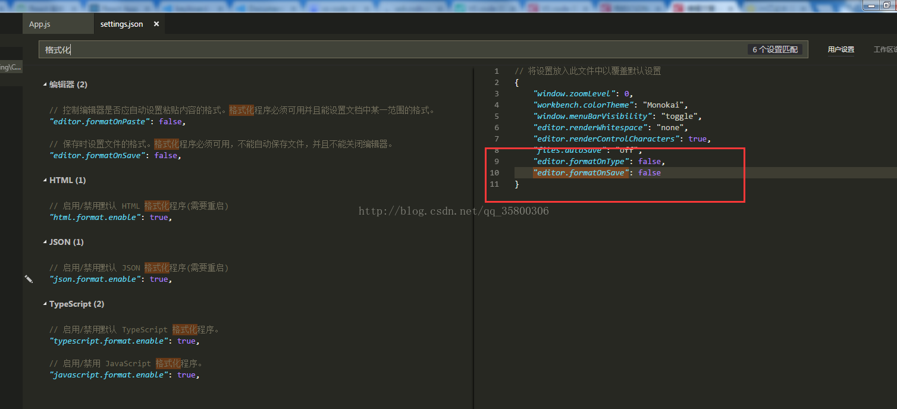
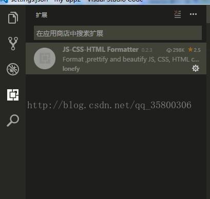
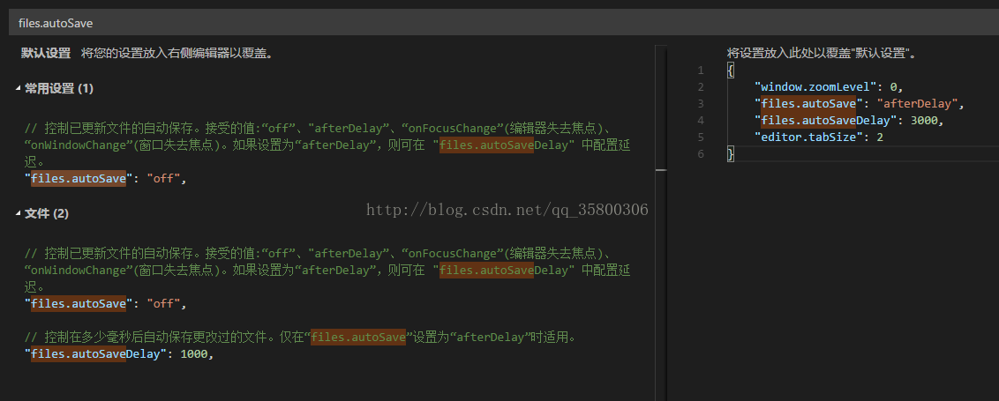

# 解决VS Code保存时候自动格式化

[BULL_DEBUG](https://www.jianshu.com/u/6ef96538b292)关注

0.1832018.03.18 11:36:04字数 255阅读 21,508

不知道从哪个版本起，VS code 保存会自动格式化。以前都是alt+shift+F格式化的，现在一保存就格式化，而且html什么全都乱了，react项目也没法写，悲伤的我难道要转webstorm嘛？如何解决呢，操作如下：

于是我找到设置，搜索关键字：“格式化”或者“保存”，然后配置了两个参数， "editor.formatOnType": false,和"editor.formatOnSave": false 重启，发现不管用，依然会自动格式化。

然后怎么解决呢？找到你的VScode扩展，可以按ctrl+shift+X调出扩展，然后把JS-CS-HTML Formatter这个插件禁用，就是下面图这样

然后重启，发现解决了吧！不会再保存时自动格式化，又可以开心的撸代码了~

**今天设置了下自动3s保存一次，配合Vue的热更新，美美的**

最近作为新员工入职了，这边前端组都用Vue，首先装git，node，vscode呀，项目拉下来跑跑，然鹅，由于设置了自动保存 默认1s保存一次，每次文件更改都会触发npm run dev，配合上eslint辣么严，简直了，忍了一天后，我改了3s保存一次，贴图如下：

